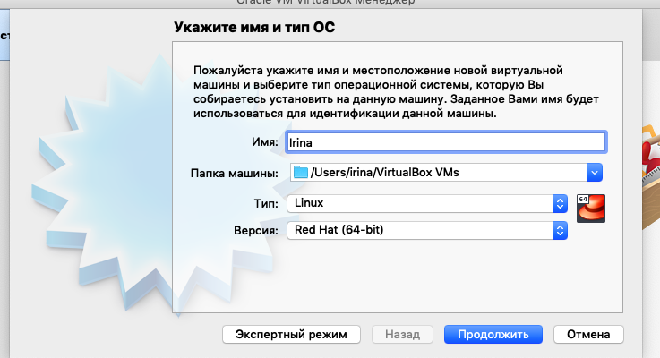
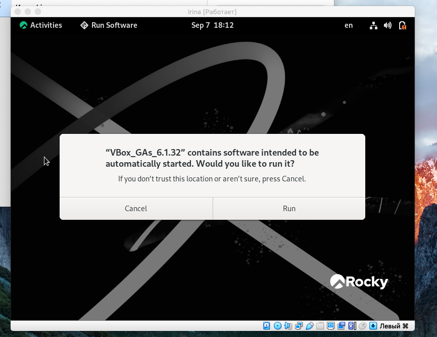

---
## Front matter
lang: ru-RU
title: Лабораторная работа №1
author: Лукьянова Ирина Владимировна
group: НФИбд-02-19
institute: RUDN University, Moscow, Russian Federation
date: 9 September 2022

## Formatting
toc: false
slide_level: 2
theme: metropolis
header-includes: 
 - \metroset{progressbar=frametitle,sectionpage=progressbar,numbering=fraction}
 - '\makeatletter'
 - '\beamer@ignorenonframefalse'
 - '\makeatother'
aspectratio: 43
section-titles: true
---

# **Цель лабораторной работы**

Цель работы - приобретение практических навыков установки операционной системы на виртуальную машину, настройка минимально необходимых для дальнейшей работы сервисов.

# **Задачи выполнения лабораторной работы**

1. Скачать и установить виртуальную машину и дистрибутив Rocky.
2. Настроить операционную систему и подключить образ гостевой ОС.
3. Проанализировать полученные результаты.

# **Выполнение лабораторной работы**

Создаем новую виртуальную машину. Для этого в VirtualBox выбераем "Машина" и "Создать".
Указываем имя виртуальной машины, тип операционной системы — Linux, RedHat.(рис. [-@fig:002])

{ #fig:002 width=70% }

# **Выполнение лабораторной работы**

{ #fig:016 width=70% }

# **Выполнение лабораторной работы**

На следующем этапе корректно перзапускаем виртуальную машину, при включении принимаем условия лицензии
В меню Устройства виртуальной машины подключаем образ диска дополнений гостевой ОС и снова перезагружаем машину (рис. [-@fig:017]).

{ #fig:017 width=70% }
  
# **Результаты выполнения лабораторной работы**

В ходе выполнения лабораторной работы:

- я познакомилась с VirtualBox;
- настроила операционную систему;
- подключила образ гостевой ОС.