---
# Front matter
title: "Лабораторная работа №1"
author: "Лукьянова Ирина Владимировна, НФИбд-02-19"

# Generic options
lang: ru-RU
toc-title: "Содержание"

# Bibliography
bibliography: bib/cite.bib
csl: pandoc/csl/gost-r-7-0-5-2008-numeric.csl

# Pdf output format
toc: true # Table of contents
toc_depth: 2
lof: true # List of figures
lot: true # List of tables
fontsize: 12pt
linestretch: 1.5
papersize: a4
documentclass: scrreprt
## I18n
polyglossia-lang:
  name: russian
  options:
	- spelling=modern
	- babelshorthands=true
polyglossia-otherlangs:
  name: english
### Fonts
mainfont: PT Serif
romanfont: PT Serif
sansfont: PT Sans
monofont: PT Mono
mainfontoptions: Ligatures=TeX
romanfontoptions: Ligatures=TeX
sansfontoptions: Ligatures=TeX,Scale=MatchLowercase
monofontoptions: Scale=MatchLowercase,Scale=0.9
## Biblatex
biblatex: true
biblio-style: "gost-numeric"
biblatexoptions:
  - parentracker=true
  - backend=biber
  - hyperref=auto
  - language=auto
  - autolang=other*
  - citestyle=gost-numeric
## Misc options
indent: true
header-includes:
  - \linepenalty=10 # the penalty added to the badness of each line within a paragraph (no associated penalty node) Increasing the value makes tex try to have fewer lines in the paragraph.
  - \interlinepenalty=0 # value of the penalty (node) added after each line of a paragraph.
  - \hyphenpenalty=50 # the penalty for line breaking at an automatically inserted hyphen
  - \exhyphenpenalty=50 # the penalty for line breaking at an explicit hyphen
  - \binoppenalty=700 # the penalty for breaking a line at a binary operator
  - \relpenalty=500 # the penalty for breaking a line at a relation
  - \clubpenalty=150 # extra penalty for breaking after first line of a paragraph
  - \widowpenalty=150 # extra penalty for breaking before last line of a paragraph
  - \displaywidowpenalty=50 # extra penalty for breaking before last line before a display math
  - \brokenpenalty=100 # extra penalty for page breaking after a hyphenated line
  - \predisplaypenalty=10000 # penalty for breaking before a display
  - \postdisplaypenalty=0 # penalty for breaking after a display
  - \floatingpenalty = 20000 # penalty for splitting an insertion (can only be split footnote in standard LaTeX)
  - \raggedbottom # or \flushbottom
  - \usepackage{float} # keep figures where there are in the text
  - \floatplacement{figure}{H} # keep figures where there are in the text
---

# **Цель работы**

Цель работы - приобретение практических навыков установки операционной системы на виртуальную машину, настройка минимально необходимых для дальнейшей работы сервисов.[^1]

# **Выполнение лабораторной работы**

Скачиваем и устанавливаем виртуальную машину и дистрибутив Rocky.

Далее через командную строку запускаме VirtualBox. Проверяем папку по умолчанию.(рис. [-@fig:001])

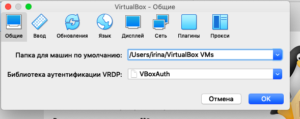{ #fig:001 width=70% }

Создаем новую виртуальную машину. Для этого в VirtualBox выбераем "Машина" и "Создать".
Указываем имя виртуальной машины, тип операционной системы — Linux, RedHat.(рис. [-@fig:002])

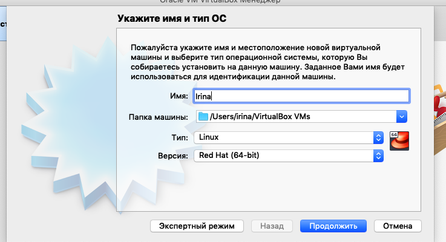{ #fig:002 width=70% }

Указываем размер основной памяти виртуальной машины (рис. [-@fig:003]) — 2048 МБ.

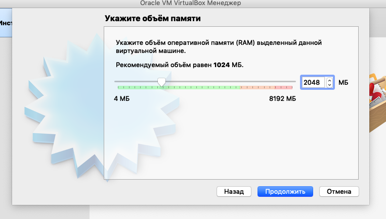{ #fig:003 width=70% }

Задаем конфигурацию жёсткого диска — загрузочный, VDI (BirtualBox Disk Image), динамический виртуальный диск (рис. [-@fig:004]), (рис. [-@fig:005]), (рис. [-@fig:006]).

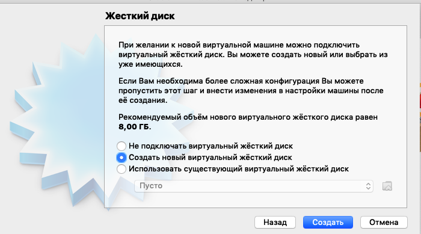{ #fig:004 width=70% }

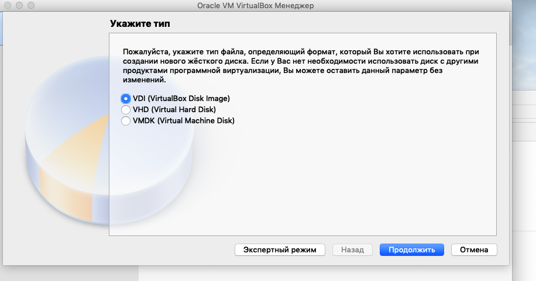{ #fig:005 width=70% }

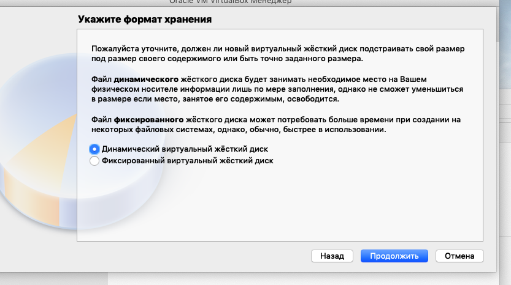{ #fig:006 width=70% }

Задаем размер диска — 40 ГБ (рис. [-@fig:007]).

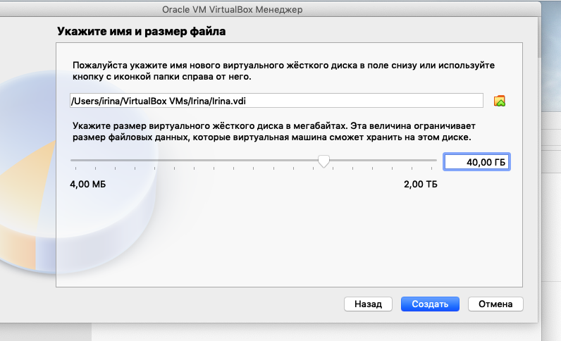{ #fig:007 width=70% }

После открываем Настройки, а в них Носители и добавляем новый привод оптических дисков и выберите образ операционной системы(рис. [-@fig:008]).

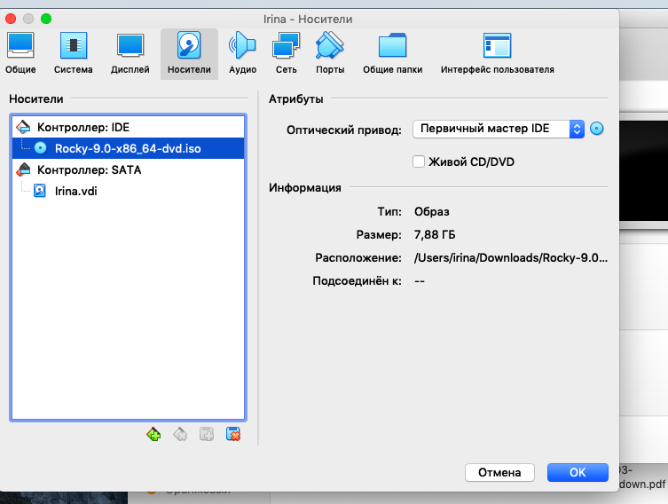{ #fig:008 width=70% }

Запускаем виртуальную машину, выыбираем English в качестве языка интерфейса (рис. [-@fig:009]) и переходим к настройкам установки операционной системы.

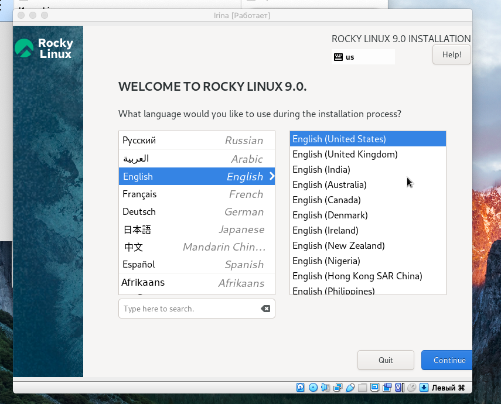{ #fig:009 width=70% }

В разделе выбора программ указываем в качестве базового окружения Server with GUI, а в качестве дополнения Development Tools (рис. [-@fig:010]).
После отключаем KDUMP (рис. [-@fig:011]).

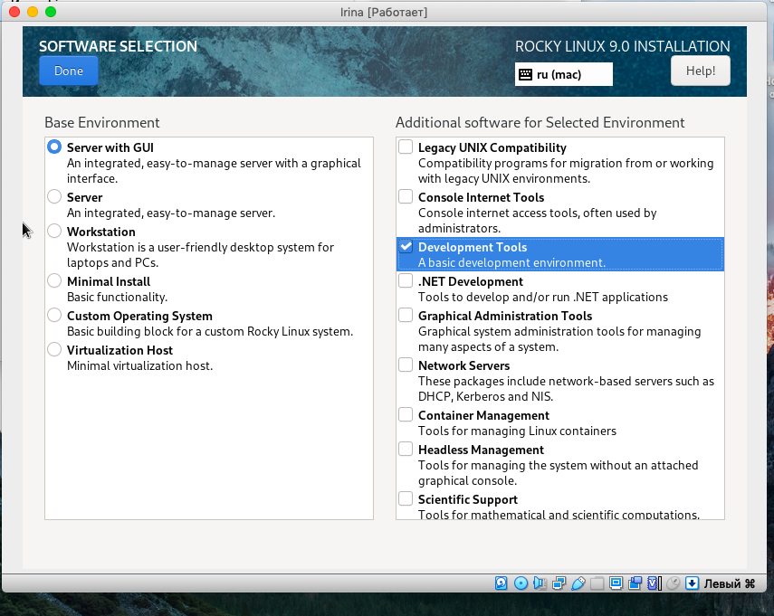{ #fig:010 width=70% }

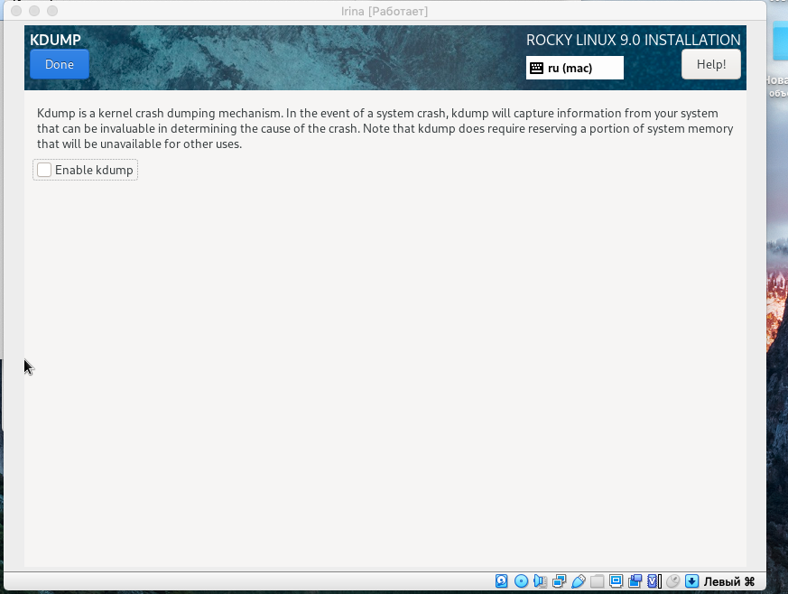{ #fig:011 width=70% }

Место установки ОС оставьте без изменения (рис. [-@fig:012]).

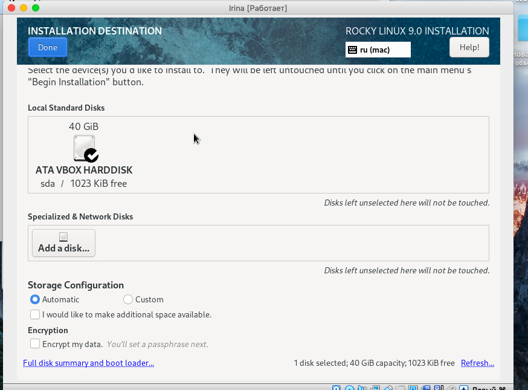{ #fig:012 width=70% }

Далее включаем сетевое соединение и в качестве имени узла - irina.localdomain (рис. [-@fig:013]).

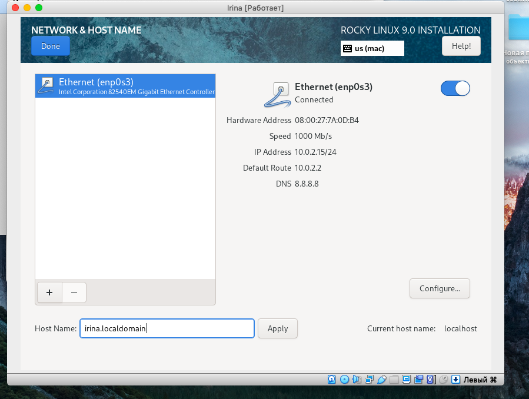{ #fig:013 width=70% }

После устанавливаем пароль для root и пользователя с правами администратора (рис. [-@fig:014]), (рис. [-@fig:015]), (рис. [-@fig:016]).

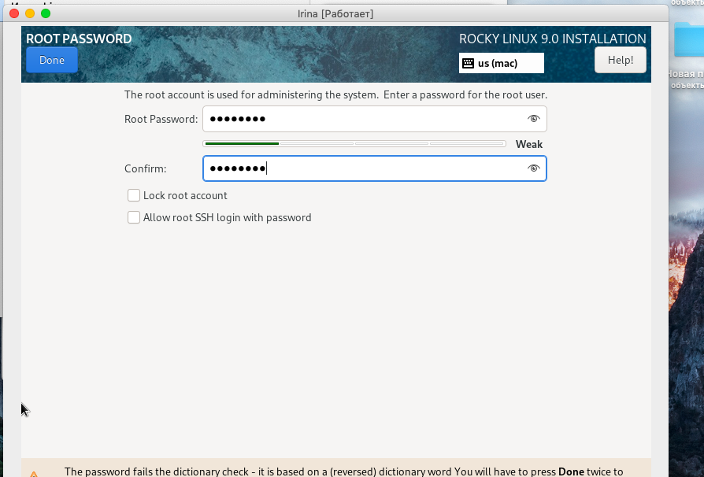{ #fig:014 width=70% }

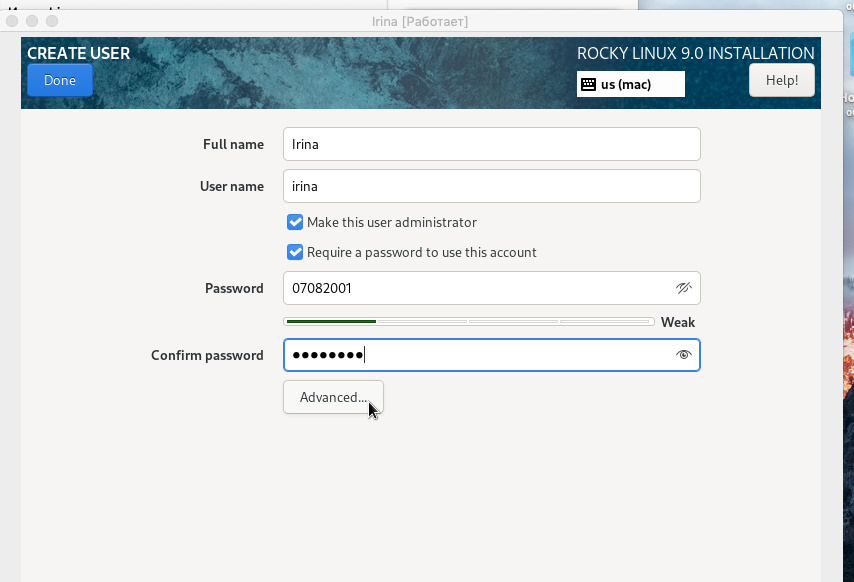{ #fig:015 width=70% }

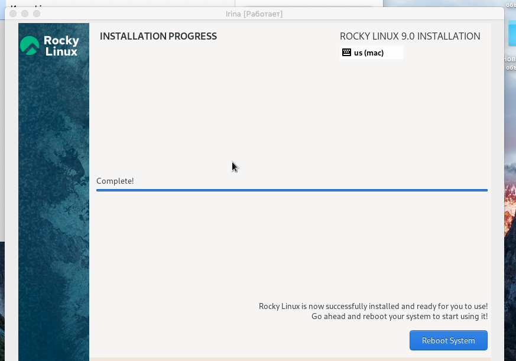{ #fig:016 width=70% }

На следующем этапе корректно перзапускаем виртуальную машину, при включении принимаем условия лицензии
В меню Устройства виртуальной машины подключаем образ диска дополнений гостевой ОС и снова перезагружаем машину (рис. [-@fig:017]).

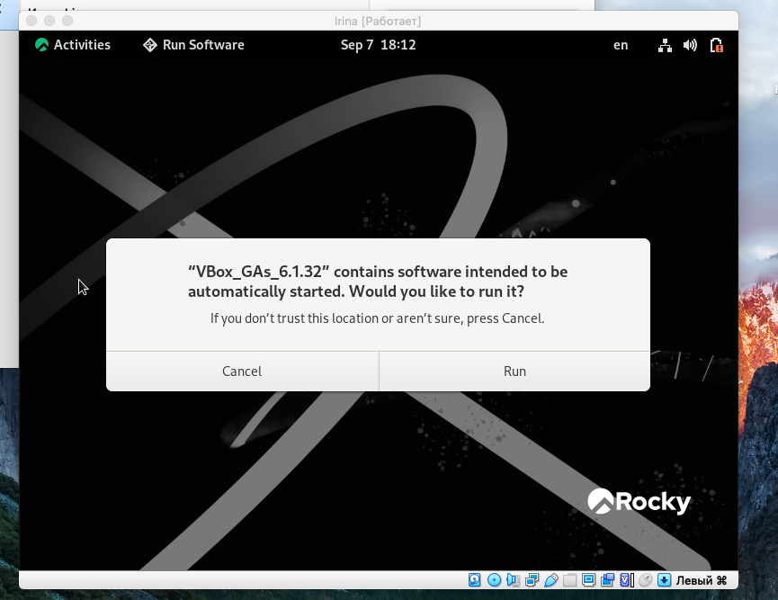{ #fig:017 width=70% }

# **Домашнее задание**

В окне терминала смотрим последовательность загрузки системы, выполнив команду dmesg и dmesg | less. (рис. [-@fig:019])

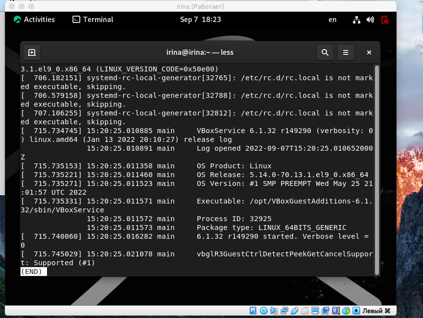{ #fig:019 width=70% }

После используем поиск с помощью grep: dmesg | grep -i "то, что ищем"
Получаем следующую информацию (рис. [-@fig:020]),(рис. [-@fig:021]),(рис. [-@fig:022]).

1. Версия ядра Linux (Linux version).
2. Частота процессора (Detected Mhz processor).
3. Модель процессора (CPU0).
4. Объем доступной оперативной памяти (Memory available).
5. Тип обнаруженного гипервизора (Hypervisor detected).
6. Тип файловой системы корневого раздела.
7. Последовательность монтирования файловых систем.

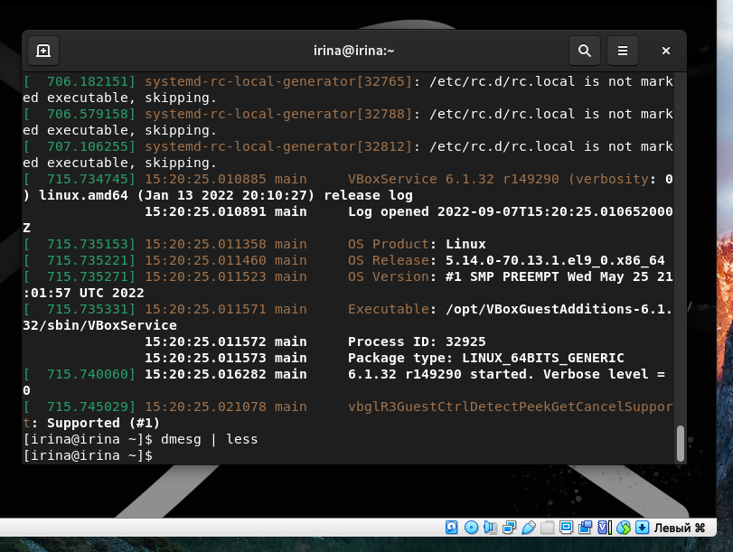{ #fig:020 width=70% }

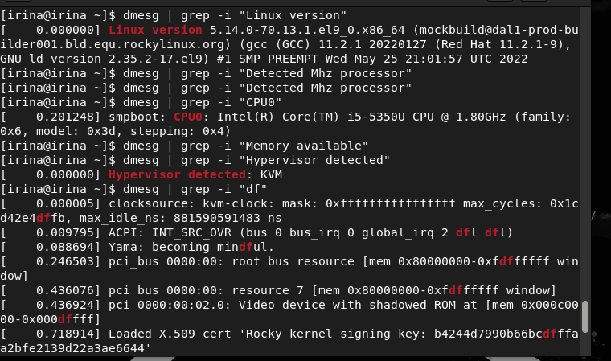{ #fig:021 width=70% }

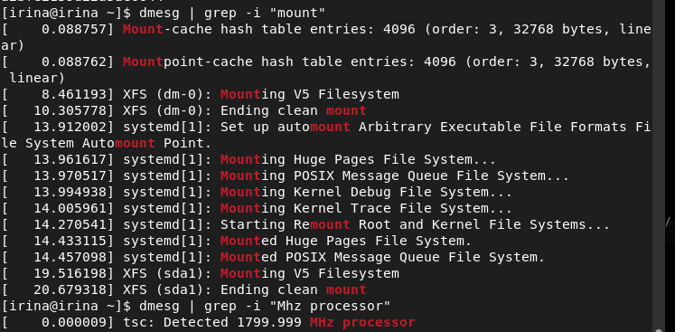{ #fig:022 width=70% }

# Выводы

В ходе выполнения данной лабораторной работы я приобрела практические навыки установки операционной системы на виртуальную машину, а также научилась устанавливать минимальные настройки, которые необходимы для дальнейшей работы сервисов.

# Контрольные вопросы

1. Какую информацию содержит учётная запись пользователя?
Логин и его пароль, иногда фотографию, а так же любые другие данные, которые пользователь сообщает о себе.
2. Укажите команды терминала и приведите примеры:

– для получения справки по команде; man
– для перемещения по файловой системе; cd
– для просмотра содержимого каталога; ls
– для определения объёма каталога; du
– для создания / удаления каталогов / файлов; mkdir/rmdir/rm – для задания определённых прав на файл / каталог; chmoв
– для просмотра истории команд. history

1. Что такое файловая система? Приведите примеры с краткой характеристикой.
Файловая система — часть операционной системы, обеспечивающая запись и чтение файлов на дисковых носителях.
Файловая система определяет логическую и физическую структуру файла, идентифик ацию и сопутствующие данные файла.
Пример: WinFS, Unix File System, Macintosh File System, JFS и другие.
4. Как посмотреть, какие файловые системы подмонтированы в ОС?
Посмотреть список всех смонтированных фаловых систем можно с помощью команды mount без параметров
5. Как удалить зависший процесс?
Команда kill (c опциями и идентификатором процесса)

# Список литературы

1. [Установка и конфигурация операционной системы на виртуальную машину. / Кулябов Д. С., Королькова А. В., Геворкян М. Н. - Москва: - 7 с.](https://esystem.rudn.ru/pluginfile.php/1651880/mod_folder/content/0/001-lab_virtualbox.pdf?forcedownload=1)
2. [Руководство по оформлению Markdown.](https://gist.github.com/Jekins/2bf2d0638163f1294637)

[^1]: Установка и конфигурация операционной системы на виртуальную машину.