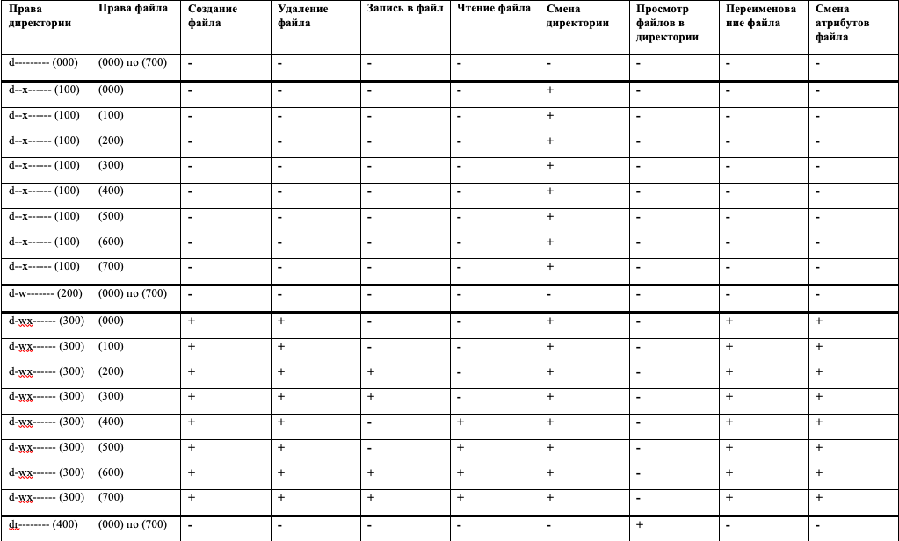
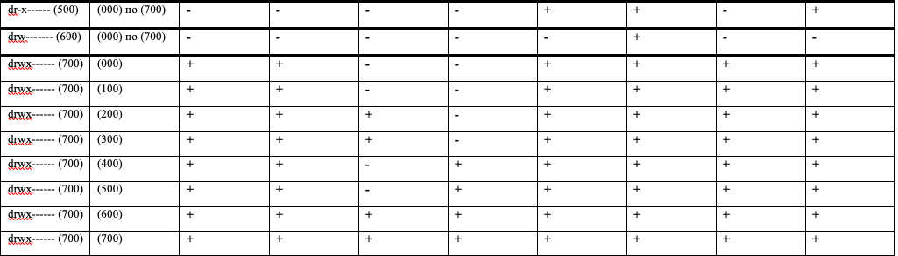

---
## Front matter
lang: ru-RU
title: Лабораторная работа №2
author: Лукьянова Ирина Владимировна
group: НФИбд-02-19
institute: RUDN University, Moscow, Russian Federation
date: 13 September 2022

## Formatting
toc: false
slide_level: 2
theme: metropolis
header-includes: 
 - \metroset{progressbar=frametitle,sectionpage=progressbar,numbering=fraction}
 - '\makeatletter'
 - '\beamer@ignorenonframefalse'
 - '\makeatother'
aspectratio: 43
section-titles: true
---

# **Цель лабораторной работы**

Получение практических навыков работы в консоли с атрибутами файлов, закрепление теоретических основ дискреционного разграничения доступа
в современных системах с открытым кодом на базе ОС Linux.

# **Задачи выполнения лабораторной работы**

1. Создать нового пользователя и установить пароль.
2. Создать поддирикторию и файл.
3. Научиться работать с атрибутами командой chmod.

# **Выполнение лабораторной работы**

В операционной системе создали учётную запись пользователя guest (использую учётную запись администратора): useradd guest (рис. [-@fig:001])

{ #fig:001 width=70% }

# **Выполнение лабораторной работы**

Уточняем имя пользователя, группу, а также группы, куда входит пользователь, командой id. Выведенные значения uid, gid и др. запоминаем.
Сравниваем вывод id с выводом команды groups.(рис. [-@fig:005]).

{ #fig:005 width=70% }

# **Выполнение лабораторной работы**

Создаем в домашней директории поддиректорию dir1 командой mkdir dir1(рис. [-@fig:011]).
Определяем командами ls -l и lsattr, какие права доступа и расширенные атрибуты были выставлены на директорию dir1.

{ #fig:011 width=70% }

Далее снимаем с директории dir1 все атрибуты командой chmod 000 dir1

# **Выполнение лабораторной работы**

На следующем этапе заполняем таблицу «Установленные права и разрешённые действия», выполняя действия от имени владельца директории,
определив опытным путём, какие операции разрешены, а какие нет.
Если операция разрешена, заносим в таблицу знак «+», если не разрешена, знак «-».(рис. [-@fig:014]).

{ #fig:014 width=70% }

# **Таблица 1**

{ #fig:015 width=40% }

# **Таблица 1 продолжение**

{ #fig:016 width=40% }

# **Таблица 2**

{ #fig:017 width=40% }

# **Результаты выполнения лабораторной работы**

В ходе выполнения лабораторной работы:

- я получила практические навыки работы в консоли с атрибутами файлов;
- закрепила теоретические основы дискреционного разграничения доступа в современных системах с открытым кодом на базе ОС Linux;
- закрепила материал заполнив таблицы.