---
# Front matter
title: "Лабораторная работа №2"
author: "Лукьянова Ирина Владимировна, НФИбд-02-19"

# Generic options
lang: ru-RU
toc-title: "Содержание"

# Bibliography
bibliography: bib/cite.bib
csl: pandoc/csl/gost-r-7-0-5-2008-numeric.csl

# Pdf output format
toc: true # Table of contents
toc_depth: 2
lof: true # List of figures
lot: true # List of tables
fontsize: 12pt
linestretch: 1.5
papersize: a4
documentclass: scrreprt
## I18n
polyglossia-lang:
  name: russian
  options:
	- spelling=modern
	- babelshorthands=true
polyglossia-otherlangs:
  name: english
### Fonts
mainfont: PT Serif
romanfont: PT Serif
sansfont: PT Sans
monofont: PT Mono
mainfontoptions: Ligatures=TeX
romanfontoptions: Ligatures=TeX
sansfontoptions: Ligatures=TeX,Scale=MatchLowercase
monofontoptions: Scale=MatchLowercase,Scale=0.9
## Biblatex
biblatex: true
biblio-style: "gost-numeric"
biblatexoptions:
  - parentracker=true
  - backend=biber
  - hyperref=auto
  - language=auto
  - autolang=other*
  - citestyle=gost-numeric
## Misc options
indent: true
header-includes:
  - \linepenalty=10 # the penalty added to the badness of each line within a paragraph (no associated penalty node) Increasing the value makes tex try to have fewer lines in the paragraph.
  - \interlinepenalty=0 # value of the penalty (node) added after each line of a paragraph.
  - \hyphenpenalty=50 # the penalty for line breaking at an automatically inserted hyphen
  - \exhyphenpenalty=50 # the penalty for line breaking at an explicit hyphen
  - \binoppenalty=700 # the penalty for breaking a line at a binary operator
  - \relpenalty=500 # the penalty for breaking a line at a relation
  - \clubpenalty=150 # extra penalty for breaking after first line of a paragraph
  - \widowpenalty=150 # extra penalty for breaking before last line of a paragraph
  - \displaywidowpenalty=50 # extra penalty for breaking before last line before a display math
  - \brokenpenalty=100 # extra penalty for page breaking after a hyphenated line
  - \predisplaypenalty=10000 # penalty for breaking before a display
  - \postdisplaypenalty=0 # penalty for breaking after a display
  - \floatingpenalty = 20000 # penalty for splitting an insertion (can only be split footnote in standard LaTeX)
  - \raggedbottom # or \flushbottom
  - \usepackage{float} # keep figures where there are in the text
  - \floatplacement{figure}{H} # keep figures where there are in the text
---

# **Цель работы**

Получение практических навыков работы в консоли с атрибутами файлов, закрепление теоретических основ дискреционного разграничения доступа
в современных системах с открытым кодом на базе ОС Linux.[^1]

# **Выполнение лабораторной работы**

В установленной при выполнении предыдущей лабораторной работы операционной системе создали учётную запись пользователя guest (использую учётную запись администратора): useradd guest (рис. [-@fig:001])

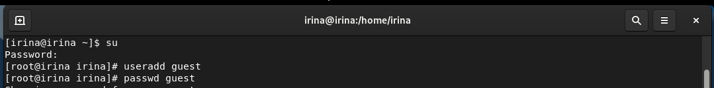{ #fig:001 width=70% }

Далее задаю пароль для пользователя guest (использую учётную запись администратора):
passwd guest.(рис. [-@fig:002])

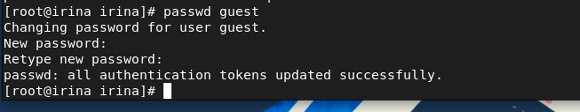{ #fig:002 width=70% }

Входим в систему от имени пользователя guest и вводим пароль.(рис. [-@fig:003])

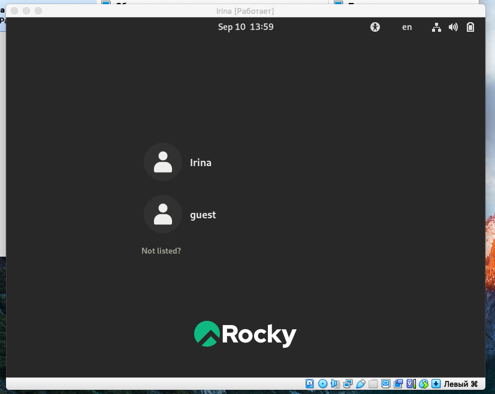{ #fig:003 width=70% }

Определяем директорию, в которой находимся, командой pwd.
Сравниваем её с приглашением командной строки. Она является домашней директорией.(рис. [-@fig:004])
И уточняем имя пользователя командой whoami.

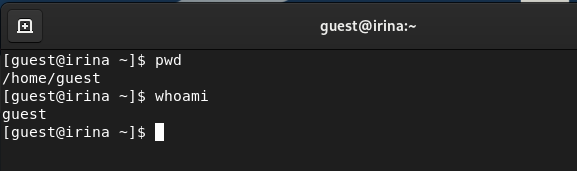{ #fig:004 width=70% }

Уточняем имя пользователя, группу, а также группы, куда входит пользователь, командой id. Выведенные значения uid, gid и др. запоминаем.
Сравниваем вывод id с выводом команды groups.(рис. [-@fig:005]).

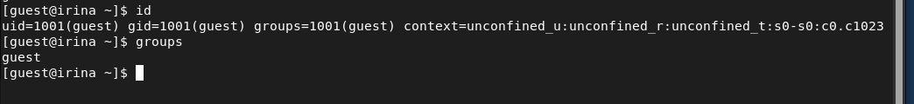{ #fig:005 width=70% }

Сравниваем полученную информацию об имени пользователя с данными, выводимыми в приглашении командной строки.

Смотрим файл/etc/passwd командой cat /etc/passwd (рис. [-@fig:006]) и ищем в нём свою учётную запись (рис. [-@fig:007]).
Определяем uid пользователя. Определяем gid пользователя. Сравниваем найденные значения с полученными в предыдущих пунктах.(рис. [-@fig:008])

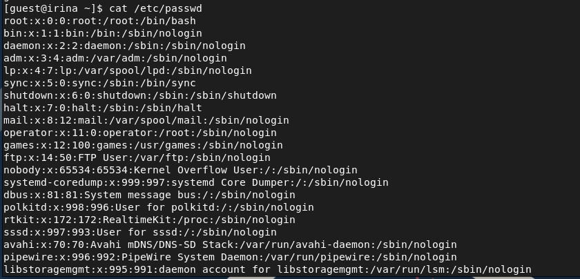{ #fig:006 width=70% }

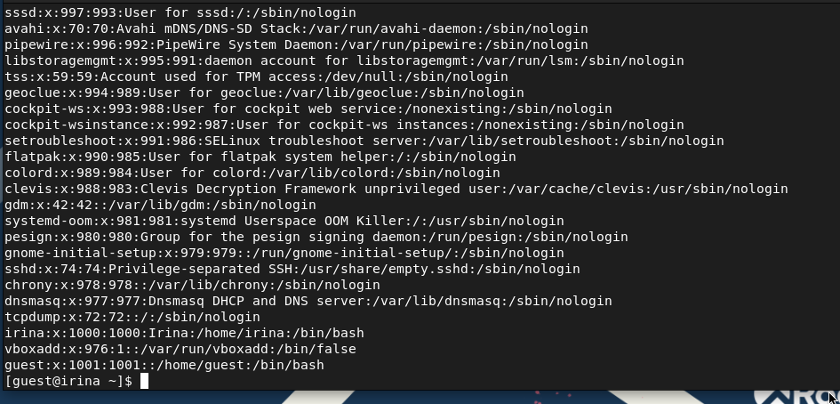{ #fig:007 width=70% }

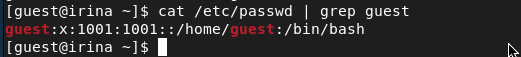{ #fig:008 width=70% }

Определяем существующие в системе директории командой ls -l /home/ (рис. [-@fig:009]).
Проверяем, какие расширенные атрибуты установлены на поддиректориях, находящихся в директории /home, командой:
lsattr /home(рис. [-@fig:010]).

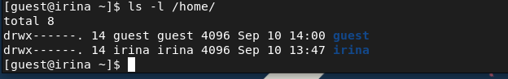{ #fig:009 width=70% }

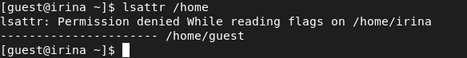{ #fig:010 width=70% }

Создаем в домашней директории поддиректорию dir1 командой mkdir dir1(рис. [-@fig:011]).
Определяем командами ls -l и lsattr, какие права доступа и расширенные атрибуты были выставлены на директорию dir1.

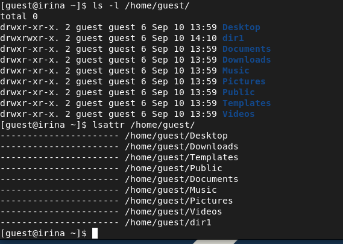{ #fig:011 width=70% }

Далее снимаем с директории dir1 все атрибуты командой chmod 000 dir1
и проверяем с её помощью правильность выполнения команды ls -l(рис. [-@fig:012]).

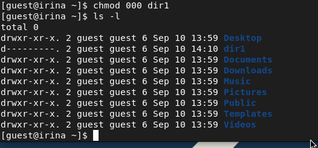{ #fig:012 width=70% }

После пытаемся создать в директории dir1 файл file1 командой
echo "test" > /home/guest/dir1/file1 (рис. [-@fig:013]).
Проверяем командой ls -l /home/guest/dir1 действительно ли файл file1 не находится внутри директории dir1.

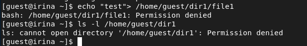{ #fig:013 width=70% }

На следующем этапе заполняем таблицу «Установленные права и разрешённые действия», выполняя действия от имени владельца директории,
определив опытным путём, какие операции разрешены, а какие нет.
Если операция разрешена, заносим в таблицу знак «+», если не разрешена, знак «-».(рис. [-@fig:014]).

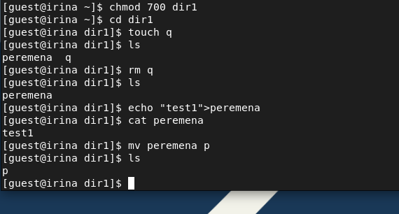{ #fig:014 width=70% }

На основании заполненной таблицы определяем минимально необходимые права для выполнения операций внутри директории dir1.

# **Таблица 1**

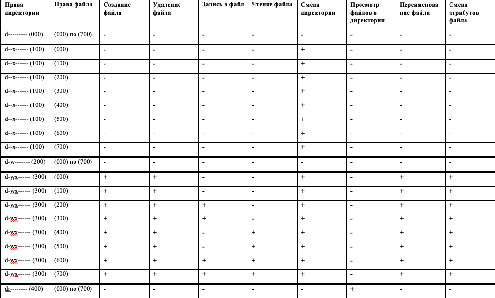{ #fig:015 width=70% }

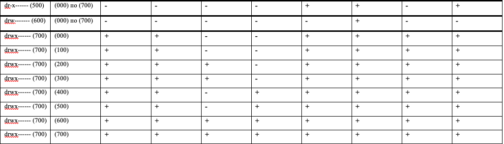{ #fig:016 width=70% }

# **Таблица 2**

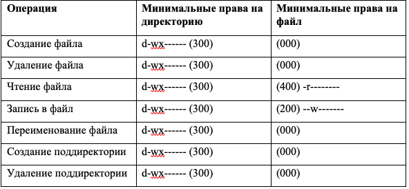{ #fig:017 width=70% }

# Выводы

В ходе выполнения данной лабораторной работы я получила практические навыки работы в консоли с атрибутами файлов, закрепила теоретические основы дискреционного разграничения доступа в современных системах с открытым кодом на базе ОС Linux.

# Список литературы

1. [Дискреционное разграничение прав в Linux. Основные атрибуты. / Кулябов Д. С., Королькова А. В., Геворкян М. Н. - Москва: - 7 с.](https://esystem.rudn.ru/pluginfile.php/1651883/mod_resource/content/6/002-lab_discret_attr.pdf)
2. [Руководство по оформлению Markdown.](https://gist.github.com/Jekins/2bf2d0638163f1294637)

[^1]: Дискреционное разграничение прав в Linux. Основные атрибуты.