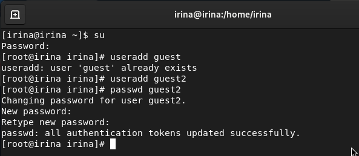
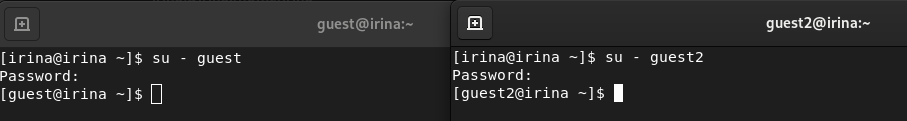
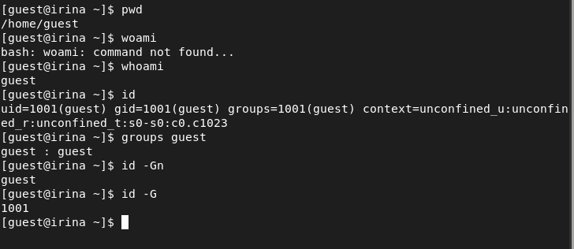
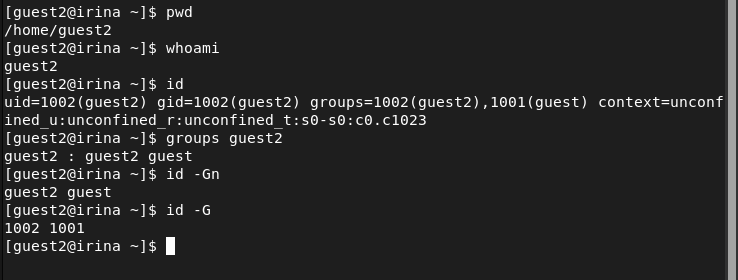
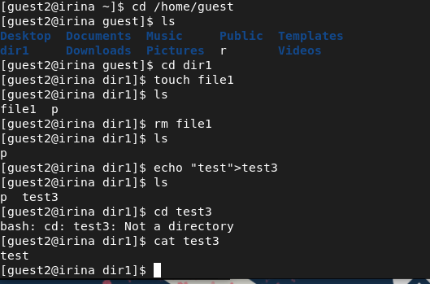
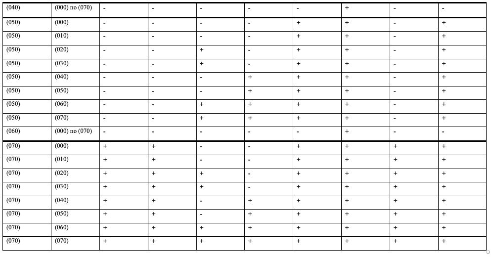
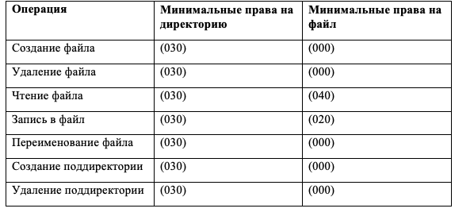

---
## Front matter
lang: ru-RU
title: Лабораторная работа №3
author: Лукьянова Ирина Владимировна
group: НФИбд-02-19
institute: RUDN University, Moscow, Russian Federation
date: 22 September 2022

## Formatting
toc: false
slide_level: 2
theme: metropolis
header-includes: 
 - \metroset{progressbar=frametitle,sectionpage=progressbar,numbering=fraction}
 - '\makeatletter'
 - '\beamer@ignorenonframefalse'
 - '\makeatother'
aspectratio: 43
section-titles: true
---

# **Цель лабораторной работы**

Получение практических навыков работы в консоли с атрибутами файлов для групп пользователей.

# **Задачи выполнения лабораторной работы**

1. Создать второго пользователя и установить пароль.
2. Научиться работать с группами и разными пользователями.
3. Научиться работать с атрибутами используя два пользователя.

# **Выполнение лабораторной работы**

В установленной при выполнении первой лабораторной работы операционной системе создали учётную запись пользователя guest (использую учётную запись администратора):
useradd guest (создали во второй лр, на скриншоте при создании выдает, что такая учетная запись уже есть)

Входим в систему от имени пользователя guest и вводим пароль.
Аналогично создаем вторую учетную запись guest2(рис. [-@fig:001])

{ #fig:001 width=70% }

# **Выполнение лабораторной работы**

Добавляем пользователя guest2 в группу guest:
gpasswd -a guest2 guest[-@fig:002])

{ #fig:002 width=70% }

# **Выполнение лабораторной работы**

Осуществим вход в систему от двух пользователей на двух разных консолях: guest на первой консоли и guest2 на второй консоли.[-@fig:003])

{ #fig:003 width=70% }

# **Выполнение лабораторной работы**

Далее уточняем имя вашего пользователя, его группу, кто входит в неё и к каким группам принадлежит он сам. Определяем командами groups guest и groups guest2, в какие группы входят пользователи guest и guest2. Сравниваем вывод команды groups с выводом команд id -Gn и id -G(рис. [-@fig:004]), (рис. [-@fig:005]).

{ #fig:004 width=70% }

{ #fig:005 width=70% }

# **Выполнение лабораторной работы**

На следующем этапе заполняем таблицу «Установленные права и разрешённые действия для групп», меняя атрибуты у директории dir1 и файла file1 от имени пользователя guest и делая проверку от пользователя guest2,
определяем опытным путём, какие операции разрешены, а какие нет.
Если операция разрешена, заносим в таблицу знак «+», если не разрешена, знак «-».(рис. [-@fig:006]).

{ #fig:006 width=70% }

# **Таблица 1**

{ #fig:007 width=70% }

# **Таблица 1 продолжение**

{ #fig:008 width=70% }

# **Таблица 2**

{ #fig:009 width=70% }

# **Результаты выполнения лабораторной работы**

В ходе выполнения лабораторной работы:

- я получила практические навыки работы в консоли с атрибутами файлов для групп пользователей;
- закрепила теоретические основы дискреционного разграничения доступа;
- закрепила материал заполнив таблицы.