---
# Front matter
title: "Лабораторная работа №3"
author: "Лукьянова Ирина Владимировна, НФИбд-02-19"

# Generic options
lang: ru-RU
toc-title: "Содержание"

# Bibliography
bibliography: bib/cite.bib
csl: pandoc/csl/gost-r-7-0-5-2008-numeric.csl

# Pdf output format
toc: true # Table of contents
toc_depth: 2
lof: true # List of figures
lot: true # List of tables
fontsize: 12pt
linestretch: 1.5
papersize: a4
documentclass: scrreprt
## I18n
polyglossia-lang:
  name: russian
  options:
	- spelling=modern
	- babelshorthands=true
polyglossia-otherlangs:
  name: english
### Fonts
mainfont: PT Serif
romanfont: PT Serif
sansfont: PT Sans
monofont: PT Mono
mainfontoptions: Ligatures=TeX
romanfontoptions: Ligatures=TeX
sansfontoptions: Ligatures=TeX,Scale=MatchLowercase
monofontoptions: Scale=MatchLowercase,Scale=0.9
## Biblatex
biblatex: true
biblio-style: "gost-numeric"
biblatexoptions:
  - parentracker=true
  - backend=biber
  - hyperref=auto
  - language=auto
  - autolang=other*
  - citestyle=gost-numeric
## Misc options
indent: true
header-includes:
  - \linepenalty=10 # the penalty added to the badness of each line within a paragraph (no associated penalty node) Increasing the value makes tex try to have fewer lines in the paragraph.
  - \interlinepenalty=0 # value of the penalty (node) added after each line of a paragraph.
  - \hyphenpenalty=50 # the penalty for line breaking at an automatically inserted hyphen
  - \exhyphenpenalty=50 # the penalty for line breaking at an explicit hyphen
  - \binoppenalty=700 # the penalty for breaking a line at a binary operator
  - \relpenalty=500 # the penalty for breaking a line at a relation
  - \clubpenalty=150 # extra penalty for breaking after first line of a paragraph
  - \widowpenalty=150 # extra penalty for breaking before last line of a paragraph
  - \displaywidowpenalty=50 # extra penalty for breaking before last line before a display math
  - \brokenpenalty=100 # extra penalty for page breaking after a hyphenated line
  - \predisplaypenalty=10000 # penalty for breaking before a display
  - \postdisplaypenalty=0 # penalty for breaking after a display
  - \floatingpenalty = 20000 # penalty for splitting an insertion (can only be split footnote in standard LaTeX)
  - \raggedbottom # or \flushbottom
  - \usepackage{float} # keep figures where there are in the text
  - \floatplacement{figure}{H} # keep figures where there are in the text
---

# **Цель работы**

Получение практических навыков работы в консоли с атрибутами файлов для групп пользователей.[^1]

# **Выполнение лабораторной работы**

В установленной при выполнении первой лабораторной работы операционной системе создали учётную запись пользователя guest (использую учётную запись администратора):
useradd guest (создали во второй лр, на скриншоте при создании выдает, что такая учетная запись уже есть)

Далее задаю пароль для входа под пользователя guest: passwd.

Входим в систему от имени пользователя guest и вводим пароль.
Аналогично создаем вторую учетную запись guest2(рис. [-@fig:001])

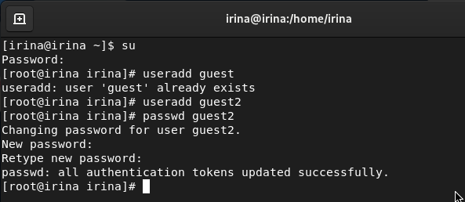{ #fig:001 width=70% }

Добавляем пользователя guest2 в группу guest:
gpasswd -a guest2 guest[-@fig:002])

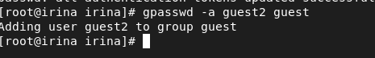{ #fig:002 width=70% }

Осуществим вход в систему от двух пользователей на двух разных консолях: guest на первой консоли и guest2 на второй консоли.[-@fig:003])

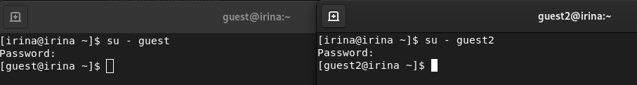{ #fig:003 width=70% }

Для обоих пользователей определяем директорию, в которой находимся, командой pwd.[-@fig:004])

{ #fig:004 width=70% }

Сравниваем её с приглашением командной строки. Она является домашней директорией. И уточняем имя пользователя командой whoami.

Далее уточняем имя вашего пользователя, его группу, кто входит в неё и к каким группам принадлежит он сам. Определяем командами groups guest и groups guest2, в какие группы входят пользователи guest и guest2. Сравниваем вывод команды groups с выводом команд id -Gn и id -G(рис. [-@fig:005]), (рис. [-@fig:006]).

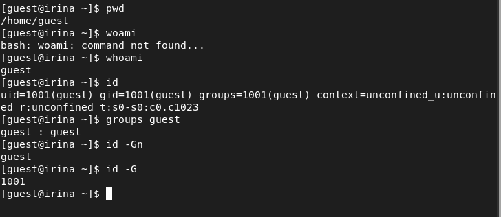{ #fig:005 width=70% }

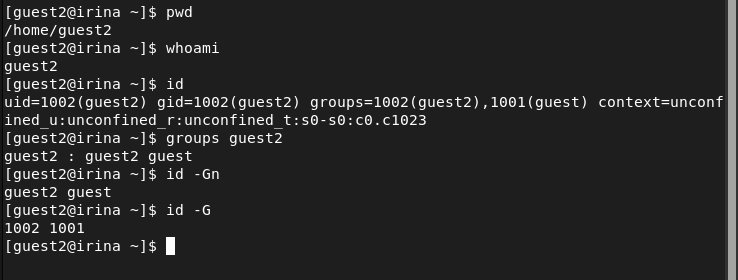{ #fig:006 width=70% }

Смотрим файл /etc/group командой cat /etc/group (рис. [-@fig:007]).

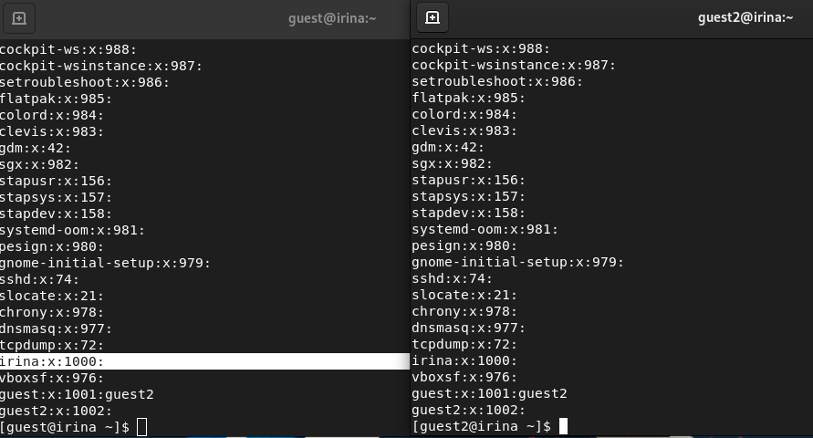{ #fig:007 width=70% }

От имени пользователя guest2 выполняем регистрацию пользователя guest2 в группе guest командой
newgrp guest(рис. [-@fig:008])

{ #fig:008 width=70% }

От имени пользователя guest изменяем права директории /home/guest, разрешив все действия для пользователей группы:
chmod g+rwx /home/guest.

От имени пользователz guest снимаем с директории /home/guest/dir1 все атрибуты командой chmod 000 dirl и проверяем правильность снятия атрибутов.(рис. [-@fig:009])

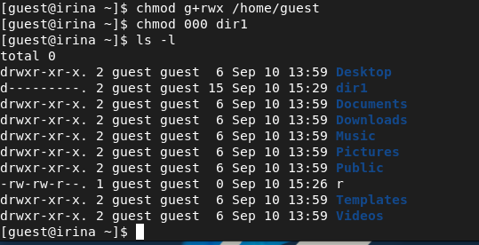{ #fig:009 width=70% }

На следующем этапе заполняем таблицу «Установленные права и разрешённые действия для групп», меняя атрибуты у директории dir1 и файла file1 от имени пользователя guest и делая проверку от пользователя guest2,
определяем опытным путём, какие операции разрешены, а какие нет.
Если операция разрешена, заносим в таблицу знак «+», если не разрешена, знак «-».(рис. [-@fig:010]), (рис. [-@fig:011]), (рис. [-@fig:012])

{ #fig:010 width=70% }

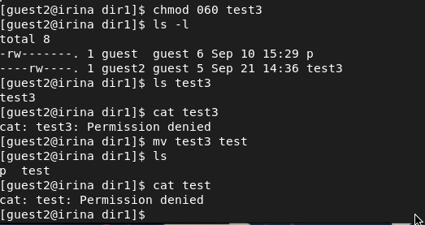{ #fig:011 width=70% }

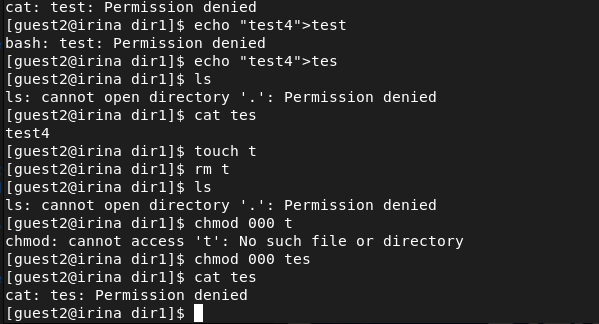{ #fig:012 width=70% }

На основании заполненной таблицы определяем минимально необходимые права для выполнения пользователем guest2 операций внутри директории dir1.

# **Таблица 1**

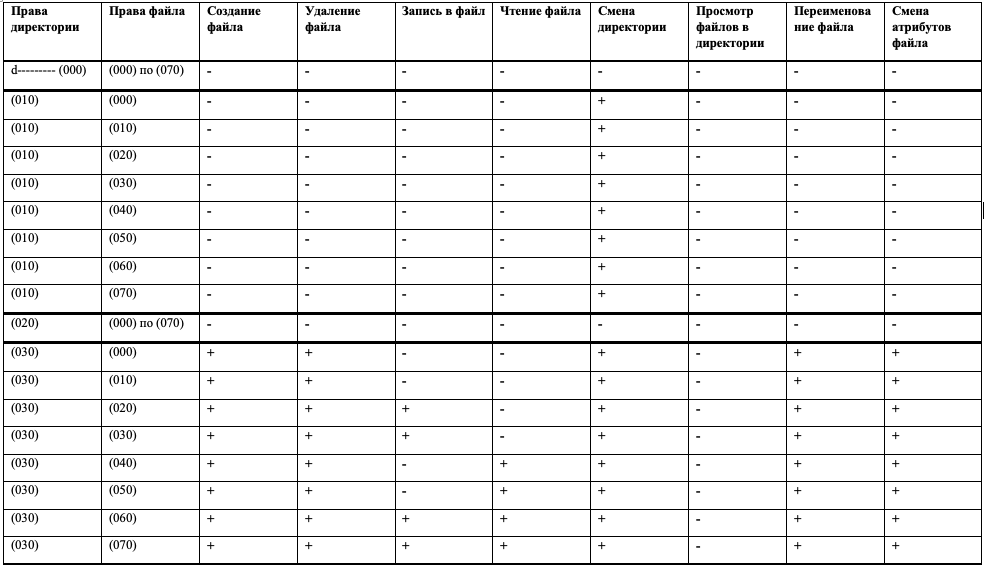{ #fig:013 width=70% }

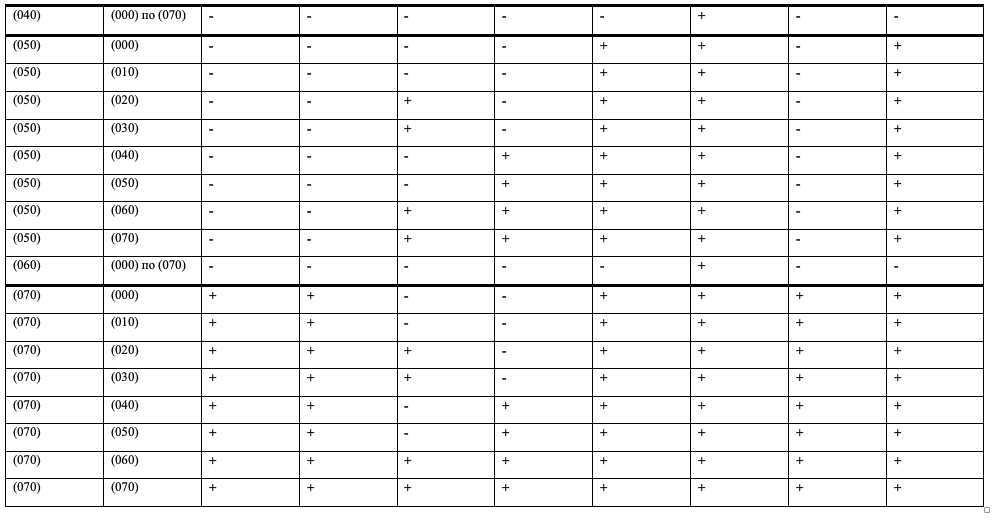{ #fig:014 width=70% }

# **Таблица 2**

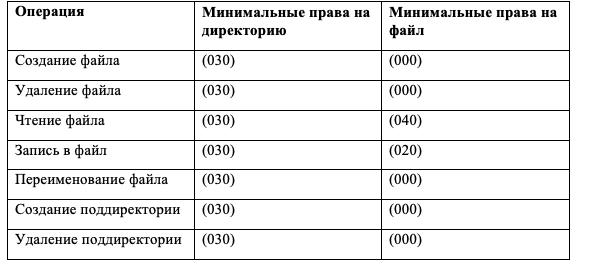{ #fig:015 width=70% }

# Выводы

В ходе выполнения данной лабораторной работы я получила практические навыки работы в консоли с атрибутами файлов для групп пользователей.

# Список литературы

1. [Дискреционное разграничение прав в Linux. Два пользователя. / Кулябов Д. С., Королькова А. В., Геворкян М. Н. - Москва: - 7 с.](https://esystem.rudn.ru/pluginfile.php/1651885/mod_resource/content/4/003-lab_discret_2users.pdf)
2. [Руководство по оформлению Markdown.](https://gist.github.com/Jekins/2bf2d0638163f1294637)

[^1]: Дискреционное разграничение прав в Linux. Два пользователя.