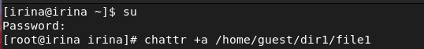
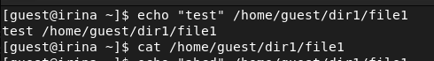

---
## Front matter
lang: ru-RU
title: Лабораторная работа №4
author: Лукьянова Ирина Владимировна
group: НФИбд-02-19
institute: RUDN University, Moscow, Russian Federation
date: 22 September 2022

## Formatting
toc: false
slide_level: 2
theme: metropolis
header-includes: 
 - \metroset{progressbar=frametitle,sectionpage=progressbar,numbering=fraction}
 - '\makeatletter'
 - '\beamer@ignorenonframefalse'
 - '\makeatother'
aspectratio: 43
section-titles: true
---

# **Цель лабораторной работы**

Получение практических навыков работы в консоли с расширеннми атрибутами файлов.

# **Задачи выполнения лабораторной работы**

1. Повысить навыки использования интерфейса командой строки.
2. Повторить навыки работы с разными пользователями.
3. Научиться работать с расширенными атрибутами.

# **Выполнение лабораторной работы**

От имени пользователя guest определяем расширенные атрибуты файла /home/guest/dir1/file1 командой lsattr /home/guest/dir1/file1(рис. [-@fig:001])

{ #fig:001 width=70% }

Устанавливаем командой chmod 600 file1 на файл file1 права, разрешающие чтение и запись для владельца файла.

# **Выполнение лабораторной работы**

Заходим на другую консоль с правами администратора и пробуем установить расширенный атрибут a на файл /home/guest/dir1/file1 от имени суперпользователя: chattr +a /home/guest/dir1/file1 (рис. [-@fig:002])

{ #fig:002 width=70% }

# **Выполнение лабораторной работы**

Выполняем дозапись в файл file1 слова «test» командой echo "test" /home/guest/dir1/file1
После этого выполняем чтение файла file1 командой cat /home/guest/dir1/file1(рис. [-@fig:003]).

{ #fig:003 width=70% }

# **Выполнение лабораторной работы**

Снимаем расширенный атрибут с файла /home/guest/dirl/file1 от имени суперпользователя командой chattr -a /home/guest/dir1/file1
После повторяем операции, которые ранее не удавалось выполнить.(рис. [-@fig:009]), рис. [-@fig:010]))

{ #fig:009 width=70% }

{ #fig:010 width=70% }

# **Выполнение лабораторной работы**

На следующем этапе повторяем все действия по шагам, заменив атрибут «a» атрибутом «i». (рис. [-@fig:013])

{ #fig:013 width=70% }

# **Результаты выполнения лабораторной работы**

В ходе выполнения лабораторной работы я:

- повысила навыки использования интерфейса командой строки;
- повторила навыки работы с разными пользователями;
- научилась работать с расширенными атрибутами.