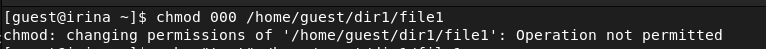

---
# Front matter
title: "Лабораторная работа №4"
author: "Лукьянова Ирина Владимировна, НФИбд-02-19"

# Generic options
lang: ru-RU
toc-title: "Содержание"

# Bibliography
bibliography: bib/cite.bib
csl: pandoc/csl/gost-r-7-0-5-2008-numeric.csl

# Pdf output format
toc: true # Table of contents
toc_depth: 2
lof: true # List of figures
lot: true # List of tables
fontsize: 12pt
linestretch: 1.5
papersize: a4
documentclass: scrreprt
## I18n
polyglossia-lang:
  name: russian
  options:
	- spelling=modern
	- babelshorthands=true
polyglossia-otherlangs:
  name: english
### Fonts
mainfont: PT Serif
romanfont: PT Serif
sansfont: PT Sans
monofont: PT Mono
mainfontoptions: Ligatures=TeX
romanfontoptions: Ligatures=TeX
sansfontoptions: Ligatures=TeX,Scale=MatchLowercase
monofontoptions: Scale=MatchLowercase,Scale=0.9
## Biblatex
biblatex: true
biblio-style: "gost-numeric"
biblatexoptions:
  - parentracker=true
  - backend=biber
  - hyperref=auto
  - language=auto
  - autolang=other*
  - citestyle=gost-numeric
## Misc options
indent: true
header-includes:
  - \linepenalty=10 # the penalty added to the badness of each line within a paragraph (no associated penalty node) Increasing the value makes tex try to have fewer lines in the paragraph.
  - \interlinepenalty=0 # value of the penalty (node) added after each line of a paragraph.
  - \hyphenpenalty=50 # the penalty for line breaking at an automatically inserted hyphen
  - \exhyphenpenalty=50 # the penalty for line breaking at an explicit hyphen
  - \binoppenalty=700 # the penalty for breaking a line at a binary operator
  - \relpenalty=500 # the penalty for breaking a line at a relation
  - \clubpenalty=150 # extra penalty for breaking after first line of a paragraph
  - \widowpenalty=150 # extra penalty for breaking before last line of a paragraph
  - \displaywidowpenalty=50 # extra penalty for breaking before last line before a display math
  - \brokenpenalty=100 # extra penalty for page breaking after a hyphenated line
  - \predisplaypenalty=10000 # penalty for breaking before a display
  - \postdisplaypenalty=0 # penalty for breaking after a display
  - \floatingpenalty = 20000 # penalty for splitting an insertion (can only be split footnote in standard LaTeX)
  - \raggedbottom # or \flushbottom
  - \usepackage{float} # keep figures where there are in the text
  - \floatplacement{figure}{H} # keep figures where there are in the text
---

# **Цель работы**

Получение практических навыков работы в консоли с расширеннми атрибутами файлов.[^1]

# **Выполнение лабораторной работы**

От имени пользователя guest определяем расширенные атрибуты файла /home/guest/dir1/file1 командой lsattr /home/guest/dir1/file1(рис. [-@fig:001])

{ #fig:001 width=70% }

Устанавливаем командой chmod 600 file1 на файл file1 права, разрешающие чтение и запись для владельца файла.[-@fig:002])

{ #fig:002 width=70% }

Пробуем установить на файл /home/guest/dir1/file1 расширенный атрибут a от имени пользователя guest:
chattr +a /home/guest/dir1/file1
В ответ мы получаем отказ от выполнения операции.[-@fig:003])

{ #fig:003 width=70% }

Заходим на другую консоль с правами администратора и пробуем установить расширенный атрибут a на файл /home/guest/dir1/file1 от имени суперпользователя: chattr +a /home/guest/dir1/file1[-@fig:004])

{ #fig:004 width=70% }

От пользователя guest проверяем правильность установления атрибута:
lsattr /home/guest/dir1/file1 (рис. [-@fig:005])

{ #fig:005 width=70% }  

Выполняем дозапись в файл file1 слова «test» командой echo "test" /home/guest/dir1/file1
После этого выполняем чтение файла file1 командой cat /home/guest/dir1/file1(рис. [-@fig:006]).

{ #fig:006 width=70% }

Пробуем удалить файл file1 либо стереть имеющуюся в нём информацию командой echo "abcd" > /home/guest/dirl/file1
После пробуем переименовать файл.(рис. [-@fig:007]).

{ #fig:007 width=70% }

Пробуем с помощью команды chmod 000 file1 установить на файл file1 права, запрещающие чтение и запись для владельца файла.
Удалось ли вам успешно выполнить указанные команды? Не все команды удалось выполнить успешно. (рис. [-@fig:008])

{ #fig:008 width=70% }

Снимаем расширенный атрибут с файла /home/guest/dirl/file1 от имени суперпользователя командой chattr -a /home/guest/dir1/file1
После повторяем операции, которые ранее не удавалось выполнить.(рис. [-@fig:009]), рис. [-@fig:010]), (рис. [-@fig:011]))

{ #fig:009 width=70% }

{ #fig:010 width=70% }

{ #fig:011 width=70% }

Повторяем все действия по шагам, заменив атрибут «a» атрибутом «i». (рис. [-@fig:012]), (рис. [-@fig:013]), (рис. [-@fig:014], (рис. [-@fig:015])

{ #fig:012 width=70% }

{ #fig:013 width=70% }

{ #fig:014 width=70% }

{ #fig:015 width=70% }

# Выводы

В ходе выполнения данной лабораторной работы я повысила свои навыки использования интерфейса командой строки (CLI), познакомились на примерах с тем, как используются расширенные атрибуты при разграничении доступа.

# Список литературы

1. [Дискреционное разграничение прав в Linux. Расширенные атрибуты. / Кулябов Д. С., Королькова А. В., Геворкян М. Н. - Москва: - 7 с.](https://esystem.rudn.ru/pluginfile.php/1651887/mod_resource/content/3/004-lab_discret_extattr.pdf)
2. [Руководство по оформлению Markdown.](https://gist.github.com/Jekins/2bf2d0638163f1294637)

[^1]: Дискреционное разграничение прав в Linux. Расширенные атрибуты.