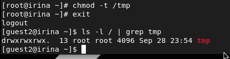
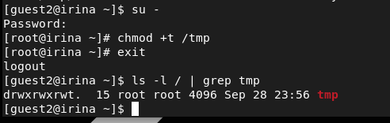

---
## Front matter
lang: ru-RU
title: Лабораторная работа №5
author: Лукьянова Ирина Владимировна
group: НФИбд-02-19
institute: RUDN University, Moscow, Russian Federation
date: 30 September 2022

## Formatting
toc: false
slide_level: 2
theme: metropolis
header-includes: 
 - \metroset{progressbar=frametitle,sectionpage=progressbar,numbering=fraction}
 - '\makeatletter'
 - '\beamer@ignorenonframefalse'
 - '\makeatother'
aspectratio: 43
section-titles: true
---

# **Цель лабораторной работы**

Изучение механизмов изменения идентификаторов, применения SetUID- и Sticky-битов. Получение практических навыков работы в консоли с дополнительными атрибутами. Рассмотрение работы механизма смены идентификатора процессов пользователей, а также влияние бита Sticky на запись и удаление файлов.

# **Задачи выполнения лабораторной работы**

1. Повысить навыки использования интерфейса командой строки.
2. Повторить навыки работы с разными пользователями.
3. Научиться работать с SetUID- и Sticky-битов.

# **Выполнение лабораторной работы**

От имени суперпользователя устанавливаем gcc командой yum install gcc(рис. [-@fig:001])

{ #fig:001 width=70% }

Отключаем систему запретов до очередной перезагрузки системы командой setenforce 0. После этого команда getenforce выводит Permissive.

# **Выполнение лабораторной работы**

От имени суперпользователя выполняем команды:(рис. [-@fig:002])

{ #fig:002 width=70% }

# **Выполнение лабораторной работы**

Повышаем свои права до суперпользователя и выполняем после этого команду, снимающую атрибут t (Sticky-бит) с директории /tmp:(рис. [-@fig:003])

{ #fig:003 width=70% }

# **Выполнение лабораторной работы**

Покидаем режим суперпользователя командой exit и от пользователя guest2 проверяем, что атрибута t у директории /tmp нет:(рис. [-@fig:004])

{ #fig:004 width=70% }

# **Выполнение лабораторной работы**

Повышаем свои права до суперпользователя и возвращаем атрибут t на директорию /tmp: (рис. [-@fig:005])

{ #fig:005 width=70% }

# **Результаты выполнения лабораторной работы**

В ходе выполнения лабораторной работы я изучила механизмы изменения идентификаторов и применения SetUID- и Sticky-битов. Получила практические навыки работы в консоли с дополнительными атрибутами. Рассмотрела работы механизма смены идентификатора процессов пользователей, а также влияние бита Sticky на запись и удаление файлов.
