---
# Front matter
title: "Лабораторная работа №5"
author: "Лукьянова Ирина Владимировна, НФИбд-02-19"

# Generic options
lang: ru-RU
toc-title: "Содержание"

# Bibliography
bibliography: bib/cite.bib
csl: pandoc/csl/gost-r-7-0-5-2008-numeric.csl

# Pdf output format
toc: true # Table of contents
toc_depth: 2
lof: true # List of figures
lot: true # List of tables
fontsize: 12pt
linestretch: 1.5
papersize: a4
documentclass: scrreprt
## I18n
polyglossia-lang:
  name: russian
  options:
	- spelling=modern
	- babelshorthands=true
polyglossia-otherlangs:
  name: english
### Fonts
mainfont: PT Serif
romanfont: PT Serif
sansfont: PT Sans
monofont: PT Mono
mainfontoptions: Ligatures=TeX
romanfontoptions: Ligatures=TeX
sansfontoptions: Ligatures=TeX,Scale=MatchLowercase
monofontoptions: Scale=MatchLowercase,Scale=0.9
## Biblatex
biblatex: true
biblio-style: "gost-numeric"
biblatexoptions:
  - parentracker=true
  - backend=biber
  - hyperref=auto
  - language=auto
  - autolang=other*
  - citestyle=gost-numeric
## Misc options
indent: true
header-includes:
  - \linepenalty=10 # the penalty added to the badness of each line within a paragraph (no associated penalty node) Increasing the value makes tex try to have fewer lines in the paragraph.
  - \interlinepenalty=0 # value of the penalty (node) added after each line of a paragraph.
  - \hyphenpenalty=50 # the penalty for line breaking at an automatically inserted hyphen
  - \exhyphenpenalty=50 # the penalty for line breaking at an explicit hyphen
  - \binoppenalty=700 # the penalty for breaking a line at a binary operator
  - \relpenalty=500 # the penalty for breaking a line at a relation
  - \clubpenalty=150 # extra penalty for breaking after first line of a paragraph
  - \widowpenalty=150 # extra penalty for breaking before last line of a paragraph
  - \displaywidowpenalty=50 # extra penalty for breaking before last line before a display math
  - \brokenpenalty=100 # extra penalty for page breaking after a hyphenated line
  - \predisplaypenalty=10000 # penalty for breaking before a display
  - \postdisplaypenalty=0 # penalty for breaking after a display
  - \floatingpenalty = 20000 # penalty for splitting an insertion (can only be split footnote in standard LaTeX)
  - \raggedbottom # or \flushbottom
  - \usepackage{float} # keep figures where there are in the text
  - \floatplacement{figure}{H} # keep figures where there are in the text
---

# **Цель работы**

Изучение механизмов изменения идентификаторов, применения SetUID- и Sticky-битов. Получение практических навыков работы в консоли с дополнительными атрибутами. Рассмотрение работы механизма смены идентификатора процессов пользователей, а также влияние бита Sticky на запись и удаление файлов.[^1]

# **Выполнение лабораторной работы**

От имени суперпользователя устанавливаем gcc командой yum install gcc(рис. [-@fig:001])

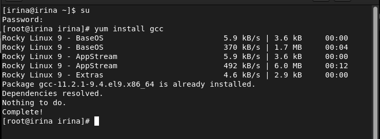{ #fig:001 width=70% }

Отключаем систему запретов до очередной перезагрузки системы командой setenforce 0. После этого команда getenforce выводит Permissive.(рис. [-@fig:002])

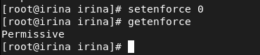{ #fig:002 width=70% }

Компилятор языка С называется gcc. Компилятор языка С++ называется g++ и запускается с параметрами почти так же, как gcc.
Проверяем это следующими командами:(рис. [-@fig:003])

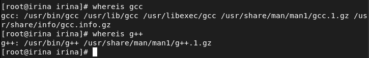{ #fig:003 width=70% }

Входим в систему от имени пользователя guest и создаем программу simpleid.c:(рис. [-@fig:004]), (рис. [-@fig:005])

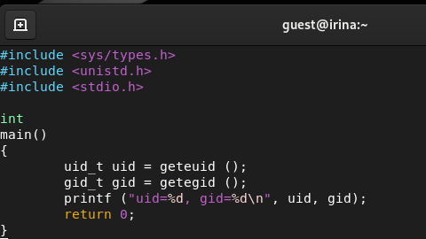{ #fig:004 width=70% }

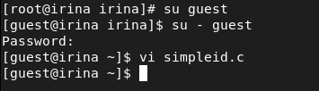{ #fig:005 width=70% }  

Компилируем и выполняем программу simpleid. После выполняем программу id.(рис. [-@fig:006]).

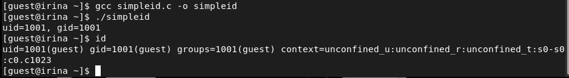{ #fig:006 width=70% }

Усложняем программу simpleid2.c, добавив вывод действительных идентификаторов.(рис. [-@fig:007]).

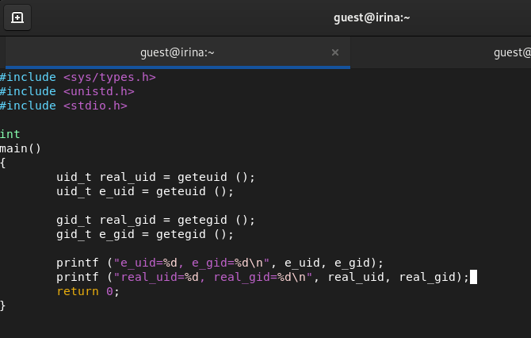{ #fig:007 width=70% }

Компилируем и запускаем simpleid2.c. (рис. [-@fig:008])

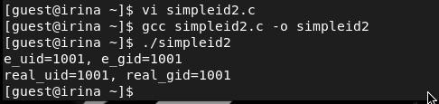{ #fig:008 width=70% }

От имени суперпользователя выполняем команды:(рис. [-@fig:009])

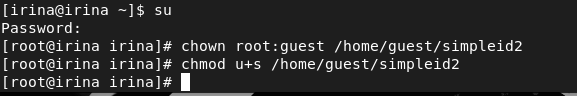{ #fig:009 width=70% }

Используйте sudo или повысьте временно свои права с помощью su.
Поясните, что делают эти команды.
Команда sudo позволяет пользователям выполнять указанные программы с административными привилегиями без ввода пароля суперпользователя root.

Выполняем проверку правильности установки новых атрибутов и смены
владельца файла simpleid2. После запускаем simpleid2 и id(рис. [-@fig:010])

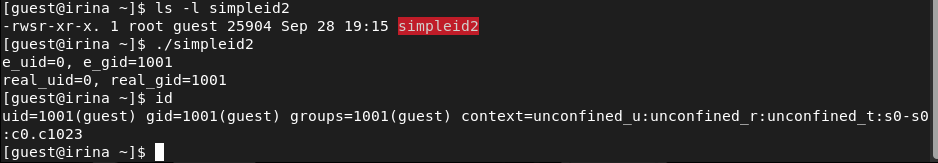{ #fig:010 width=70% }

Проделываем тоже самое относительно SetGID-бита.(рис. [-@fig:011])

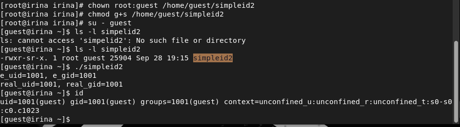{ #fig:011 width=70% }

Создаем программу readfile.c(рис. [-@fig:012])

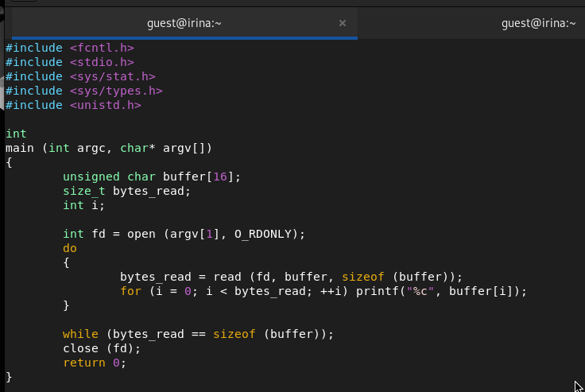{ #fig:012 width=70% }

Компилируем эту программу(рис. [-@fig:013])
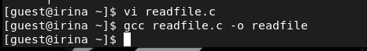{ #fig:013 width=70% }

Сменим владельца у файла readfile.c и изменим права так, чтобы только суперпользователь мог прочитать его, a guest не мог.(рис. [-@fig:014])

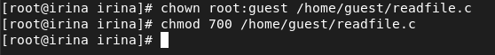{ #fig:014 width=70% }

Проверяем, что пользователь guest не может прочитать файл readfile.c.(рис. [-@fig:015])
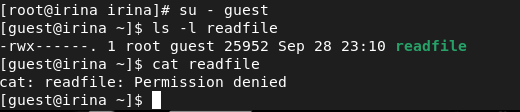{ #fig:015 width=70% }

Сменим у программы readfile владельца и установим SetU’D-бит.(рис. [-@fig:016])

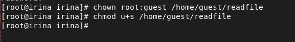{ #fig:016 width=70% }

Проверяем, может ли программа readfile прочитать файл readfile.c (рис. [-@fig:017])

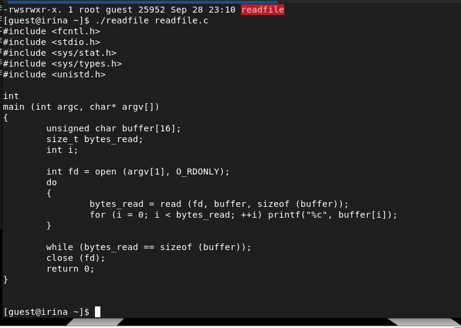{ #fig:017 width=70% }

Проверяем, может ли программа readfile прочитать файл /etc/shadow (рис. [-@fig:018])

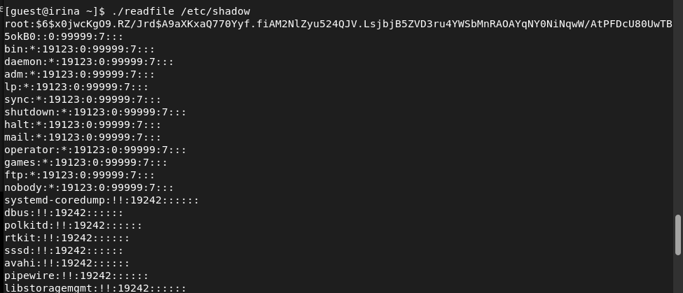{ #fig:018 width=70% }

## **Исследование Sticky-бита**

Выясняем, установлен ли атрибут Sticky на директории /tmp.
После от имени пользователя guest создаем файл file01.txt в директории /tmp со словом test.

Смотрим атрибуты у созданного файла и разрешаем чтение и запись для категории пользователей «все остальные». (рис. [-@fig:019]), (рис. [-@fig:020])

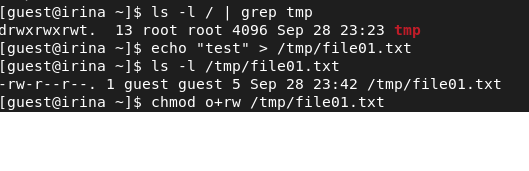{ #fig:019 width=70% }

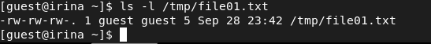{ #fig:020 width=70% }

От пользователя guest2 (не являющегося владельцем) пробуем прочитать файл /tmp/file01.txt
Далее от пользователя guest2 пробуем дозаписать в файл /tmp/file01.txt слово test2 и проверяем содержимое файла(рис. [-@fig:021])

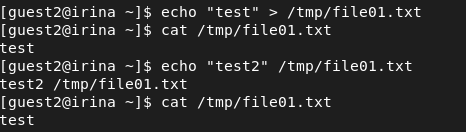{ #fig:021 width=70% }

От пользователя guest2 пробуем записать в файл /tmp/file01.txt
слово test3, стерев при этом всю имеющуюся в файле информацию и проверяем содержимое файла.(рис. [-@fig:022])

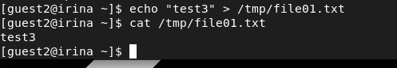{ #fig:022 width=70% }

От пользователя guest2 пробуем удалить файл /tmp/file01.txt(рис. [-@fig:023])

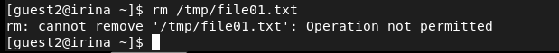{ #fig:023 width=70% }

Повышаем свои права до суперпользователя и выполняем после этого команду, снимающую атрибут t (Sticky-бит) с директории /tmp:(рис. [-@fig:024])

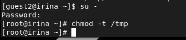{ #fig:024 width=70% }

Покидаем режим суперпользователя командой exit и от пользователя guest2 проверяем, что атрибута t у директории /tmp нет:(рис. [-@fig:025])

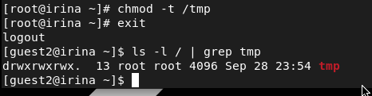{ #fig:025 width=70% }

Повторяем предыдущие шаги.(рис. [-@fig:026])

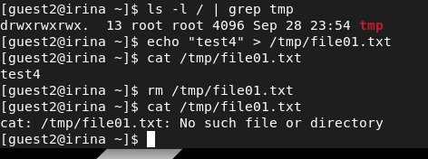{ #fig:026 width=70% }

Удалось ли вам удалить файл от имени пользователя, не являющегося
его владельцем? Да, удалось. (рис. [-@fig:027])

{ #fig:027 width=70% }

Повышаем свои права до суперпользователя и возвращаем атрибут t на директорию /tmp: (рис. [-@fig:028])

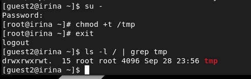{ #fig:028 width=70% }

# Выводы

В ходе выполнения данной лабораторной работы я изучила механизмы изменения идентификаторов и применения SetUID- и Sticky-битов. Получила практические навыки работы в консоли с дополнительными атрибутами. Рассмотрела работы механизма смены идентификатора процессов пользователей, а также влияние бита Sticky на запись и удаление файлов.

# Список литературы

1. [Дискреционное разграничение прав в Linux. Исследование влияния дополнительных атрибутов. / Кулябов Д. С., Королькова А. В., Геворкян М. Н. - Москва: - 7 с.](https://esystem.rudn.ru/pluginfile.php/1651889/mod_resource/content/2/005-lab_discret_sticky.pdf)
2. [Руководство по оформлению Markdown.](https://gist.github.com/Jekins/2bf2d0638163f1294637)

[^1]: Дискреционное разграничение прав в Linux. Исследование влияния дополнительных атрибутов.