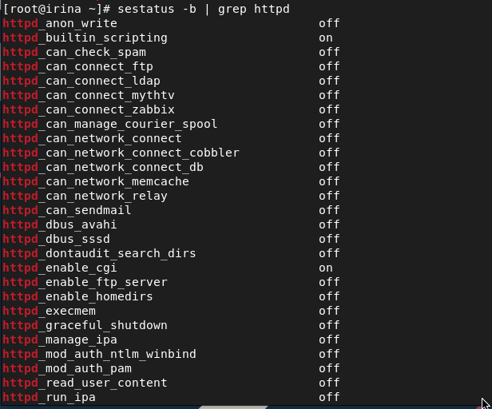
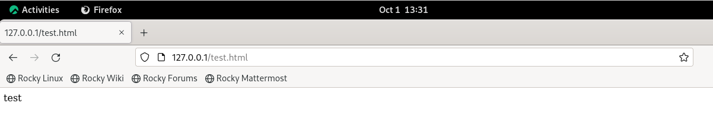

---
## Front matter
lang: ru-RU
title: Лабораторная работа №6
author: Лукьянова Ирина Владимировна
group: НФИбд-02-19
institute: RUDN University, Moscow, Russian Federation
date: 5 October 2022

## Formatting
toc: false
slide_level: 2
theme: metropolis
header-includes: 
 - \metroset{progressbar=frametitle,sectionpage=progressbar,numbering=fraction}
 - '\makeatletter'
 - '\beamer@ignorenonframefalse'
 - '\makeatother'
aspectratio: 43
section-titles: true
---

# **Цель лабораторной работы**

Развить навыки администрирования ОС Linux. Получить первое практическое знакомство с технологией SELinux. Проверить работу SELinx на практике совместно с веб-сервером Apache.

# **Задачи выполнения лабораторной работы**

1. Повысить навыки использования интерфейса командой строки.
2. Научиться работать с веб-сервером Apache.
3. Научиться работать с SELinux.

# **Выполнение лабораторной работы**

Обращаемся с помощью браузера к веб-серверу, запущенному на компьютере, и смотрим, что последний работает: (рис. [-@fig:001])

{ #fig:001 width=70% }

# **Выполнение лабораторной работы**

Смотрим текущее состояние переключателей SELinux для Apache. Обращаем внимание, что многие из них находятся в положении «off». (рис. [-@fig:002])

{ #fig:002 width=70% }

# **Выполнение лабораторной работы**

Смотрим статистику по политике,также Определяем множество пользователей, ролей, типов. (рис. [-@fig:003]).

Пользователей = 8, ролей = 14, типов = 4995

{ #fig:003 width=70% }

# **Выполнение лабораторной работы**

От имени суперпользователя создаем файл html-файл /var/www/html/test.html

Обращаемся к файлу через веб-сервер, введя в браузере адрес http://127.0.0.1/test.html. Смотрим, что файл был успешно отображён. (рис. [-@fig:004])

{ #fig:004 width=70% }

# **Выполнение лабораторной работы**

Меняем контекст файла /var/www/html/test.html с httpd_sys_content_t на samba_share_t

Пробуем ещё раз получить доступ к файлу через веб-сервер, введя в
браузере адрес http://127.0.0.1/test.html. Получаем сообщение об ошибке(рис. [-@fig:005])

{ #fig:005 width=70% }

# **Выполнение лабораторной работы**

Исправляем конфигурационный файл apache, вернув Listen 80. (рис. [-@fig:006])

{ #fig:006 width=70% }

# **Выполнение лабораторной работы**

Пытаемся удалить привязку http_port_t к 81 порту: (рис. [-@fig:007])

{ #fig:007 width=70% }

Удаляем файл /var/www/html/test.html

# **Результаты выполнения лабораторной работы**

В ходе выполнения данной лабораторной работы я развила навыки администрирования ОС Linux. Получила первое практическое знакомство с технологией SELinux. Проверила работу SELinx на практике совместно с веб-сервером Apache.
