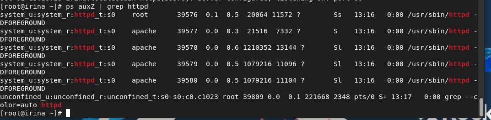
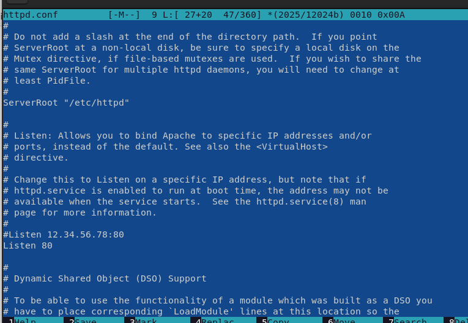
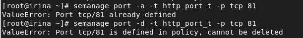

---
# Front matter
title: "Лабораторная работа №6"
author: "Лукьянова Ирина Владимировна, НФИбд-02-19"

# Generic options
lang: ru-RU
toc-title: "Содержание"

# Bibliography
bibliography: bib/cite.bib
csl: pandoc/csl/gost-r-7-0-5-2008-numeric.csl

# Pdf output format
toc: true # Table of contents
toc_depth: 2
lof: true # List of figures
lot: true # List of tables
fontsize: 12pt
linestretch: 1.5
papersize: a4
documentclass: scrreprt
## I18n
polyglossia-lang:
  name: russian
  options:
	- spelling=modern
	- babelshorthands=true
polyglossia-otherlangs:
  name: english
### Fonts
mainfont: PT Serif
romanfont: PT Serif
sansfont: PT Sans
monofont: PT Mono
mainfontoptions: Ligatures=TeX
romanfontoptions: Ligatures=TeX
sansfontoptions: Ligatures=TeX,Scale=MatchLowercase
monofontoptions: Scale=MatchLowercase,Scale=0.9
## Biblatex
biblatex: true
biblio-style: "gost-numeric"
biblatexoptions:
  - parentracker=true
  - backend=biber
  - hyperref=auto
  - language=auto
  - autolang=other*
  - citestyle=gost-numeric
## Misc options
indent: true
header-includes:
  - \linepenalty=10 # the penalty added to the badness of each line within a paragraph (no associated penalty node) Increasing the value makes tex try to have fewer lines in the paragraph.
  - \interlinepenalty=0 # value of the penalty (node) added after each line of a paragraph.
  - \hyphenpenalty=50 # the penalty for line breaking at an automatically inserted hyphen
  - \exhyphenpenalty=50 # the penalty for line breaking at an explicit hyphen
  - \binoppenalty=700 # the penalty for breaking a line at a binary operator
  - \relpenalty=500 # the penalty for breaking a line at a relation
  - \clubpenalty=150 # extra penalty for breaking after first line of a paragraph
  - \widowpenalty=150 # extra penalty for breaking before last line of a paragraph
  - \displaywidowpenalty=50 # extra penalty for breaking before last line before a display math
  - \brokenpenalty=100 # extra penalty for page breaking after a hyphenated line
  - \predisplaypenalty=10000 # penalty for breaking before a display
  - \postdisplaypenalty=0 # penalty for breaking after a display
  - \floatingpenalty = 20000 # penalty for splitting an insertion (can only be split footnote in standard LaTeX)
  - \raggedbottom # or \flushbottom
  - \usepackage{float} # keep figures where there are in the text
  - \floatplacement{figure}{H} # keep figures where there are in the text
---

# **Цель работы**

Развить навыки администрирования ОС Linux. Получить первое практическое знакомство с технологией SELinux. Проверить работу SELinx на практике совместно с веб-сервером Apache.[^1]

# **Выполнение лабораторной работы**

От имени суперпользователя устанавливаем необходимые пакеты, задаем параметр ServerName и отключаем пакетный фильтр.(рис. [-@fig:001])

{ #fig:001 width=70% }

Входим в систему с полученными учётными данными и смотрим, что SELinux работает в режиме enforcing политики targeted с помощью команд getenforce и sestatus.(рис. [-@fig:002])

{ #fig:002 width=70% }

Обращаемся с помощью браузера к веб-серверу, запущенному на компьютере, и смотрим, что последний работает: (рис. [-@fig:003])

{ #fig:003 width=70% }

Находим веб-сервер Apache в списке процессов, определяем его контекст безопасности:(рис. [-@fig:004])

{ #fig:004 width=70% }

Смотрим текущее состояние переключателей SELinux для Apache. Обращаем внимание, что многие из них находятся в положении «off».(рис. [-@fig:005])

{ #fig:005 width=70% }  

Смотрим статистику по политике,также Определяем множество пользователей, ролей, типов.(рис. [-@fig:006]).

Пользователей = 8, ролей = 14, типов = 4995

{ #fig:006 width=70% }

Определяем тип файлов и поддиректорий, находящихся в директории /var/www.(рис. [-@fig:007]).

{ #fig:007 width=70% }

Определяем тип файлов, находящихся в директории /var/www/html (рис. [-@fig:008])

{ #fig:008 width=70% }

От имени суперпользователя создаем файл html-файл /var/www/html/test.html следующего содержания:(рис. [-@fig:009])

{ #fig:009 width=70% }

Проверяем контекст созданного файла.(рис. [-@fig:010])

{ #fig:010 width=70% }

Обращаемся к файлу через веб-сервер, введя в браузере адрес http://127.0.0.1/test.html. Смотрим, что файл был успешно отображён.(рис. [-@fig:011])

{ #fig:011 width=70% }

Изучаем справку man httpd_selinux, проверяем контекст файла командой ls -Z /var/www/html/test.html(рис. [-@fig:012])

{ #fig:012 width=70% }

Меняем контекст файла /var/www/html/test.html с httpd_sys_content_t на samba_share_t:(рис. [-@fig:013])

{ #fig:013 width=70% }

Пробуем ещё раз получить доступ к файлу через веб-сервер, введя в
браузере адрес http://127.0.0.1/test.html. Получаем сообщение об ошибке(рис. [-@fig:014])

{ #fig:014 width=70% }

Смотрим log-файлы веб-сервера Apache. Также смотрим системный лог-файл:(рис. [-@fig:015]), (рис. [-@fig:016])

{ #fig:015 width=70% }

{ #fig:016 width=70% }

Пробуем запустить веб-сервер Apache на прослушивание ТСР-порта 81 (рис. [-@fig:017])

{ #fig:017 width=70% }

Выполняем перезапуск веб-сервера Apache. Произошёл сбой? Нет(рис. [-@fig:018])

{ #fig:018 width=70% }

Анализируем лог-файлы. (рис. [-@fig:019]), (рис. [-@fig:020])

{ #fig:019 width=70% }

{ #fig:020 width=70% }

Выполняем команду semanage port -a -t http_port_t -р tcp 81
После этого проверяем список портов (рис. [-@fig:021])

{ #fig:021 width=70% }

Пробуем запустить веб-сервер Apache ещё раз и возвращаем контекст httpd_sys_cоntent__t к файлу /var/www/html/test.html(рис. [-@fig:022])

{ #fig:022 width=70% }

Возвращаем контекст и получаем доступ к файлу через веб-сервер, введя в браузере адрес http://127.0.0.1:81/test.html.
Теперь увидим содержимое файла — слово «test». (рис. [-@fig:023])

{ #fig:023 width=70% }

Исправляем обратно конфигурационный файл apache, вернув Listen 80.(рис. [-@fig:024])

{ #fig:024 width=70% }

Пытаемся удалить привязку http_port_t к 81 порту: (рис. [-@fig:025])

{ #fig:025 width=70% }

Удаляем файл /var/www/html/test.html:(рис. [-@fig:026])

{ #fig:026 width=70% }

# Выводы

В ходе выполнения данной лабораторной работы я развила навыки администрирования ОС Linux. Получила первое практическое знакомство с технологией SELinux. Проверила работу SELinx на практике совместно с веб-сервером Apache.

# Список литературы

1. [Мандатное разграничение прав в Linux. / Кулябов Д. С., Королькова А. В., Геворкян М. Н. - Москва: - 7 с.](https://esystem.rudn.ru/pluginfile.php/1651891/mod_resource/content/2/006-lab_selinux.pdf)
2. [Руководство по оформлению Markdown.](https://gist.github.com/Jekins/2bf2d0638163f1294637)

[^1]: Мандатное разграничение прав в Linux.
