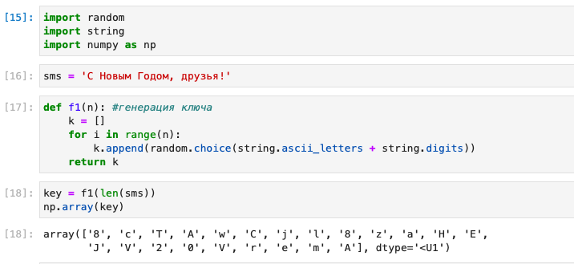
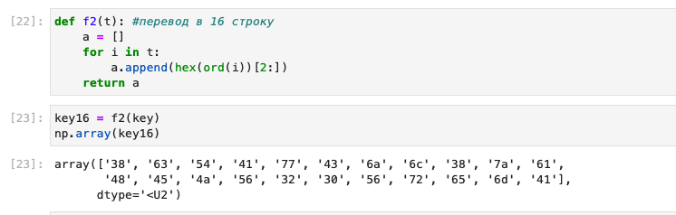
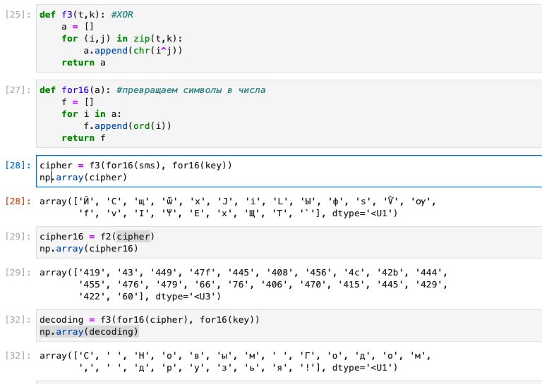
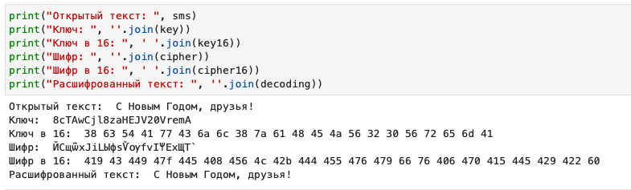
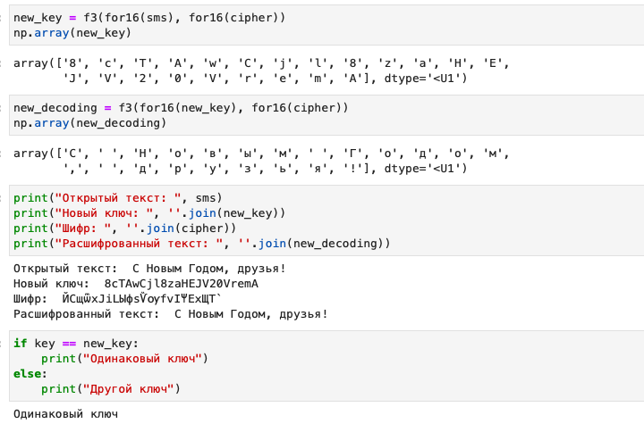

---
## Front matter
lang: ru-RU
title: Лабораторная работа №7
author: Лукьянова Ирина Владимировна
group: НФИбд-02-19
institute: RUDN University, Moscow, Russian Federation
date: 10 October 2022

## Formatting
toc: false
slide_level: 2
theme: metropolis
header-includes: 
 - \metroset{progressbar=frametitle,sectionpage=progressbar,numbering=fraction}
 - '\makeatletter'
 - '\beamer@ignorenonframefalse'
 - '\makeatother'
aspectratio: 43
section-titles: true
---

# **Цель лабораторной работы**

Освоить на практике применение режима однократного гаммирования.

# **Задачи выполнения лабораторной работы**

Нужно подобрать ключ, чтобы получить сообщение «С Новым Годом, друзья!». Требуется разработать приложение, позволяющее шифровать и дешифровать данные в режиме однократного гаммирования. Приложение должно:

1. Определить вид шифротекста при известном ключе и известном открытом тексте.
2. Определить ключ, с помощью которого шифротекст может быть преоб- разован в некоторый фрагмент текста, представляющий собой один из возможных вариантов прочтения открытого текста.

# **Выполнение лабораторной работы**

Добавляем необходимые библиотеки и создаем функцию генерации ключа.(рис. [-@fig:001])

{ #fig:001 width=70% }

# **Выполнение лабораторной работы**

Создаем функцию перевода в 16 строку и переводим ключ, с помощью этой функции.(рис. [-@fig:002])

{ #fig:002 width=70% }

# **Выполнение лабораторной работы**

Создаем функцию сложения по модулю 2 (XOR) для нее нам нужна еще одна функция, которая переводит наши символы в числа. (рис. [-@fig:003])

{ #fig:003 width=70% }

# **Выполнение лабораторной работы**

В итоге получаем следующие данные: (рис. [-@fig:004])

{ #fig:004 width=70% }

# **Выполнение лабораторной работы**

После мы создаем новый ключ, используя открытый текст и шифр и расшифровываем сообщение с новым ключом: (рис. [-@fig:005])

{ #fig:005 width=70% }

В завершении сравниваем ключи и убеждаемся в правильности найденного нового ключа.

# **Результаты выполнения лабораторной работы**

В ходе выполнения данной лабораторной работы я освоила на практике применение режима однократного гаммирования.
