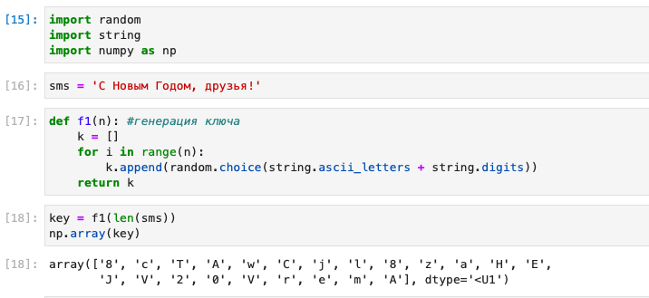
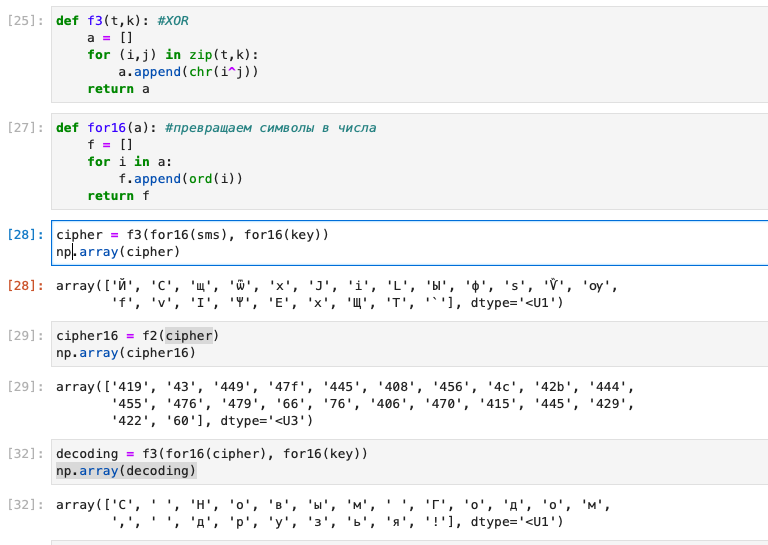
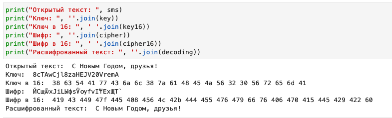

---
# Front matter
title: "Лабораторная работа №7"
author: "Лукьянова Ирина Владимировна, НФИбд-02-19"

# Generic options
lang: ru-RU
toc-title: "Содержание"

# Bibliography
bibliography: bib/cite.bib
csl: pandoc/csl/gost-r-7-0-5-2008-numeric.csl

# Pdf output format
toc: true # Table of contents
toc_depth: 2
lof: true # List of figures
lot: true # List of tables
fontsize: 12pt
linestretch: 1.5
papersize: a4
documentclass: scrreprt
## I18n
polyglossia-lang:
  name: russian
  options:
	- spelling=modern
	- babelshorthands=true
polyglossia-otherlangs:
  name: english
### Fonts
mainfont: PT Serif
romanfont: PT Serif
sansfont: PT Sans
monofont: PT Mono
mainfontoptions: Ligatures=TeX
romanfontoptions: Ligatures=TeX
sansfontoptions: Ligatures=TeX,Scale=MatchLowercase
monofontoptions: Scale=MatchLowercase,Scale=0.9
## Biblatex
biblatex: true
biblio-style: "gost-numeric"
biblatexoptions:
  - parentracker=true
  - backend=biber
  - hyperref=auto
  - language=auto
  - autolang=other*
  - citestyle=gost-numeric
## Misc options
indent: true
header-includes:
  - \linepenalty=10 # the penalty added to the badness of each line within a paragraph (no associated penalty node) Increasing the value makes tex try to have fewer lines in the paragraph.
  - \interlinepenalty=0 # value of the penalty (node) added after each line of a paragraph.
  - \hyphenpenalty=50 # the penalty for line breaking at an automatically inserted hyphen
  - \exhyphenpenalty=50 # the penalty for line breaking at an explicit hyphen
  - \binoppenalty=700 # the penalty for breaking a line at a binary operator
  - \relpenalty=500 # the penalty for breaking a line at a relation
  - \clubpenalty=150 # extra penalty for breaking after first line of a paragraph
  - \widowpenalty=150 # extra penalty for breaking before last line of a paragraph
  - \displaywidowpenalty=50 # extra penalty for breaking before last line before a display math
  - \brokenpenalty=100 # extra penalty for page breaking after a hyphenated line
  - \predisplaypenalty=10000 # penalty for breaking before a display
  - \postdisplaypenalty=0 # penalty for breaking after a display
  - \floatingpenalty = 20000 # penalty for splitting an insertion (can only be split footnote in standard LaTeX)
  - \raggedbottom # or \flushbottom
  - \usepackage{float} # keep figures where there are in the text
  - \floatplacement{figure}{H} # keep figures where there are in the text
---

# **Цель работы**

Освоить на практике применение режима однократного гаммирования.[^1]

# **Теоретические сведения**

Нужно подобрать ключ, чтобы получить сообщение «С Новым Годом, друзья!». Требуется разработать приложение, позволяющее шифровать и дешифровать данные в режиме однократного гаммирования. Приложение должно:

1. Определить вид шифротекста при известном ключе и известном открытом тексте.
2. Определить ключ, с помощью которого шифротекст может быть преоб- разован в некоторый фрагмент текста, представляющий собой один из возможных вариантов прочтения открытого текста.

# **Выполнение лабораторной работы**

Добавляем необходимые библиотеки и создаем функцию генерации ключа.(рис. [-@fig:001])

{ #fig:001 width=70% }

Создаем функцию перевода в 16 строку и переводим ключ, с помощью этой функции.(рис. [-@fig:002])

{ #fig:002 width=70% }

Создаем функцию сложения по модулю 2 (XOR) для нее нам нужна еще одна функция, которая переводит наши символы в числа. (рис. [-@fig:003])

{ #fig:003 width=70% }

В итоге получаем следующие данные: (рис. [-@fig:004])

{ #fig:004 width=70% }

После мы создаем новый ключ, используя открытый текст и шифр и расшифровываем сообщение с новым ключом: (рис. [-@fig:005])

{ #fig:005 width=70% }

В завершении сравниваем ключи и убеждаемся в правильности найденного нового ключа.

# **Контрольные вопросы**

1. Поясните смысл однократного гаммирования.
Гаммирование — это наложение (снятие) на открытые (зашифрованные) данные последовательности элементов других данных, полученной с помощью некоторого криптографического алгоритма, для получения зашифрованных (открытых) данных.

2. Перечислите недостатки однократного гаммирования.
Ключ одного размера с сообщением, что является уязвимостью.

3. Перечислите преимущества однократного гаммирования.
Стойкость и легкость в использоавании.

4. Почему длина открытого текста должна совпадать с длиной ключа?
Каждый символ текста попарно складывается с символом ключа. Следовательно шифротекст получится той же длины.

5. Какая операция используется в режиме однократного гаммирования,назовите её особенности? Сложение по модулю 2 (ХOR). Каждая пара двоичных знаков заменяется одним двоичным знаком шифрованного текста в соответствии с принятым алгоритмом;

6. Как по открытому тексту и ключу получить шифротекст?
Сложить по модулю 2 символы открытого текста и ключа.

7. Как по открытому тексту и шифротексту получить ключ?
Сложить по модулю 2 символы открытого текста и шифротекста.

8. В чем заключаются необходимые и достаточные условия абсолютной стойкости шифра? полная случайность ключа; равенство длин ключа и открытого текста; однократное использование ключа.

# Выводы

В ходе выполнения данной лабораторной работы я освоила на практике применение режима однократного гаммирования.

# Список литературы

1. [Элементы криптографии. Однократное гаммирование. / Кулябов Д. С., Королькова А. В., Геворкян М. Н. - Москва: - 7 с.](https://esystem.rudn.ru/pluginfile.php/1651893/mod_resource/content/2/007-lab_crypto-gamma.pdf)
2. [Руководство по оформлению Markdown.](https://gist.github.com/Jekins/2bf2d0638163f1294637)

[^1]: Элементы криптографии. Однократное гаммирование.
