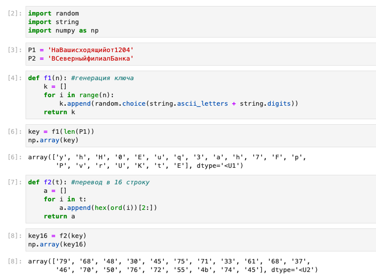
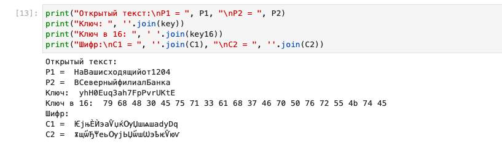
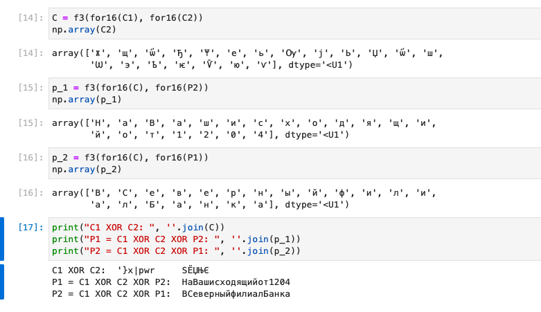

---
## Front matter
lang: ru-RU
title: Лабораторная работа №8
author: Лукьянова Ирина Владимировна
group: НФИбд-02-19
institute: RUDN University, Moscow, Russian Federation
date: 10 October 2022

## Formatting
toc: false
slide_level: 2
theme: metropolis
header-includes: 
 - \metroset{progressbar=frametitle,sectionpage=progressbar,numbering=fraction}
 - '\makeatletter'
 - '\beamer@ignorenonframefalse'
 - '\makeatother'
aspectratio: 43
section-titles: true
---

# **Цель лабораторной работы**

Освоить на практике применение режима однократного гаммирования на примере кодирования различных исходных текстов одним ключом.

# **Задачи выполнения лабораторной работы**

Два текста кодируются одним ключом (однократное гаммирование). Требуется не зная ключа и не стремясь его определить, прочитать оба текста. Необходимо разработать приложение, позволяющее шифровать и дешифровать тексты P1 и P2 в режиме однократного гаммирования.
Приложение должно определить вид шифротекстов C1 и C2 обоих текстов P1 и P2 при известном ключе;
Необходимо определить и выразить аналитически способ, при котором злоумышленник может прочитать оба текста, не зная ключа и не стремясь его определить.

# **Выполнение лабораторной работы**

Добавляем необходимые библиотеки и создаем функцию генерации ключа.
Затем создаем функцию перевода в 16 строку и переводим ключ, с помощью этой функции(рис. [-@fig:001])

{ #fig:001 width=70% }

# **Выполнение лабораторной работы**

Создаем функцию сложения по модулю 2 (XOR) для нее нам нужна еще одна функция, которая переводит наши символы в числа.(рис. [-@fig:002])

{ #fig:002 width=70% }

# **Выполнение лабораторной работы**

В итоге получаем следующие данные: (рис. [-@fig:003])

{ #fig:003 width=70% }

Далее мы используем сложение по модулю 2 между шифротекстами, после повторяем операцию с одним из открытых текстов. В итоге получаем второй расшифрованный текст.
Данные операции также действуют и для второго текста, что я и демонстрирую на следующем слайде.

# **Выполнение лабораторной работы**

Мы используем уже написанные функции для того, чтобы расшифровать текст без ключа: (рис. [-@fig:004])

{ #fig:004 width=70% }

# **Результаты выполнения лабораторной работы**

В ходе выполнения данной лабораторной работы я освоила на практике применение режима однократного гаммирования на примере кодирования различных исходных текстов одним ключом.
