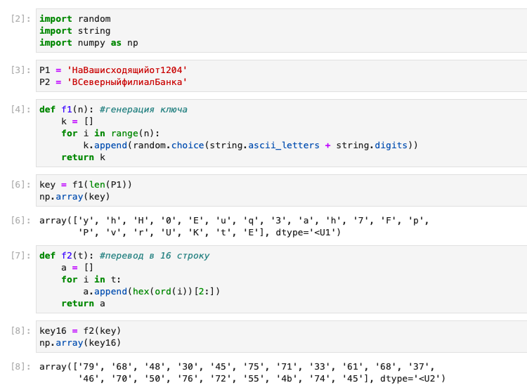
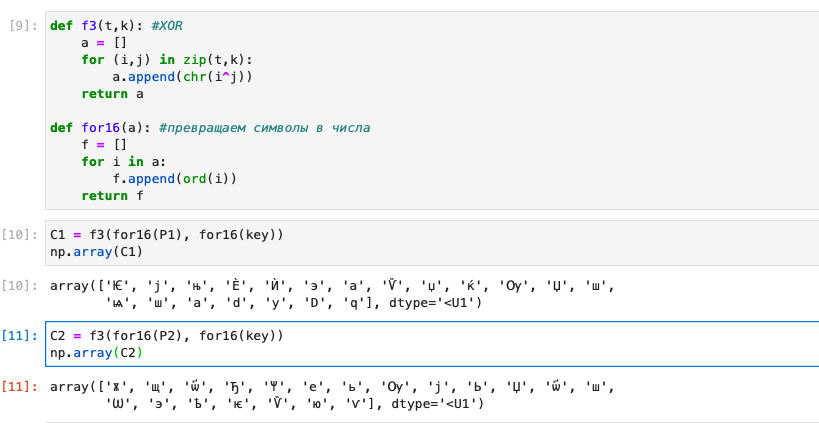
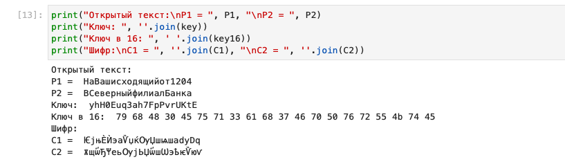
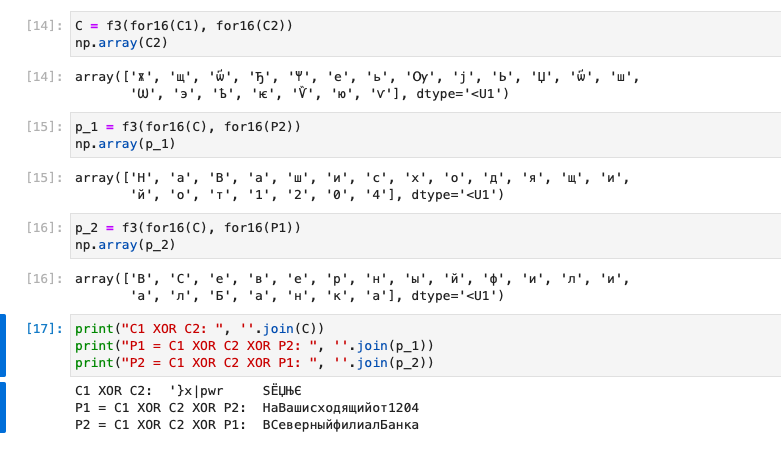

---
# Front matter
title: "Лабораторная работа №8"
author: "Лукьянова Ирина Владимировна, НФИбд-02-19"

# Generic options
lang: ru-RU
toc-title: "Содержание"

# Bibliography
bibliography: bib/cite.bib
csl: pandoc/csl/gost-r-7-0-5-2008-numeric.csl

# Pdf output format
toc: true # Table of contents
toc_depth: 2
lof: true # List of figures
lot: true # List of tables
fontsize: 12pt
linestretch: 1.5
papersize: a4
documentclass: scrreprt
## I18n
polyglossia-lang:
  name: russian
  options:
	- spelling=modern
	- babelshorthands=true
polyglossia-otherlangs:
  name: english
### Fonts
mainfont: PT Serif
romanfont: PT Serif
sansfont: PT Sans
monofont: PT Mono
mainfontoptions: Ligatures=TeX
romanfontoptions: Ligatures=TeX
sansfontoptions: Ligatures=TeX,Scale=MatchLowercase
monofontoptions: Scale=MatchLowercase,Scale=0.9
## Biblatex
biblatex: true
biblio-style: "gost-numeric"
biblatexoptions:
  - parentracker=true
  - backend=biber
  - hyperref=auto
  - language=auto
  - autolang=other*
  - citestyle=gost-numeric
## Misc options
indent: true
header-includes:
  - \linepenalty=10 # the penalty added to the badness of each line within a paragraph (no associated penalty node) Increasing the value makes tex try to have fewer lines in the paragraph.
  - \interlinepenalty=0 # value of the penalty (node) added after each line of a paragraph.
  - \hyphenpenalty=50 # the penalty for line breaking at an automatically inserted hyphen
  - \exhyphenpenalty=50 # the penalty for line breaking at an explicit hyphen
  - \binoppenalty=700 # the penalty for breaking a line at a binary operator
  - \relpenalty=500 # the penalty for breaking a line at a relation
  - \clubpenalty=150 # extra penalty for breaking after first line of a paragraph
  - \widowpenalty=150 # extra penalty for breaking before last line of a paragraph
  - \displaywidowpenalty=50 # extra penalty for breaking before last line before a display math
  - \brokenpenalty=100 # extra penalty for page breaking after a hyphenated line
  - \predisplaypenalty=10000 # penalty for breaking before a display
  - \postdisplaypenalty=0 # penalty for breaking after a display
  - \floatingpenalty = 20000 # penalty for splitting an insertion (can only be split footnote in standard LaTeX)
  - \raggedbottom # or \flushbottom
  - \usepackage{float} # keep figures where there are in the text
  - \floatplacement{figure}{H} # keep figures where there are in the text
---

# **Цель работы**

Освоить на практике применение режима однократного гаммирования на примере кодирования различных исходных текстов одним ключом.[^1]

# **Теоретические сведения**

Два текста кодируются одним ключом (однократное гаммирование). Требуется не зная ключа и не стремясь его определить, прочитать оба текста. Необходимо разработать приложение, позволяющее шифровать и дешифровать тексты P1 и P2 в режиме однократного гаммирования.
Приложение должно определить вид шифротекстов C1 и C2 обоих текстов P1 и P2 при известном ключе;
Необходимо определить и выразить аналитически способ, при котором злоумышленник может прочитать оба текста, не зная ключа и не стремясь его определить.

# **Выполнение лабораторной работы**

Добавляем необходимые библиотеки и создаем функцию генерации ключа.
Затем создаем функцию перевода в 16 строку и переводим ключ, с помощью этой функции(рис. [-@fig:001])

{ #fig:001 width=70% }

Создаем функцию сложения по модулю 2 (XOR) для нее нам нужна еще одна функция, которая переводит наши символы в числа.(рис. [-@fig:002])

{ #fig:002 width=70% }

В итоге получаем следующие данные: (рис. [-@fig:003])

{ #fig:003 width=70% }

Далее мы используем уже написанные функции для того, чтобы расшифровать текст без ключа: (рис. [-@fig:004])

{ #fig:004 width=70% }

Для этого мы используем сложение по модулю 2 между шифротекстами, далее повторяем операцию с одним из открытых текстов. В итоге получаем второй расшифрованный текст.
Данные операции также действуют и для второго текста, что я и демонстрирую на рисунке (рис. [-@fig:004]).

# **Контрольные вопросы**

1. Как, зная один из текстов (P1 или P2), определить другой, не зная при этом ключа?
Сложить по модулю 2 оба шифротекста и известный второй текст. В результате получим расшифрованный первый текст, аналогично и для второго текста.

2. Что будет при повторном использовании ключа при шифровании текста?
Если оба текста зашифрованы одним ключом, то злоумышленнику легче их взломать.

3. Как реализуется режим шифрования однократного гаммирования одним ключом двух открытых текстов?
Оба открытхих текста шифруются одним ключом.

4. Перечислите недостатки шифрования одним ключом двух открытых текстов.
Большая вероятность взлома.

5. Перечислите преимущества шифрования одним ключом двух открытых текстов.
Используется всего один ключ, что, к сожалению, является больше недостатком, чем преимуществом.

# Выводы

В ходе выполнения данной лабораторной работы я освоила на практике применение режима однократного гаммирования на примере кодирования различных исходных текстов одним ключом.

# Список литературы

1. [Элементы криптографии. Шифрование (кодирование) различных исходных текстов одним ключом. / Кулябов Д. С., Королькова А. В., Геворкян М. Н. - Москва: - 7 с.](https://esystem.rudn.ru/pluginfile.php/1651895/mod_resource/content/2/008-lab_crypto-key.pdf)
2. [Руководство по оформлению Markdown.](https://gist.github.com/Jekins/2bf2d0638163f1294637)

[^1]: Элементы криптографии. Шифрование (кодирование) различных исходных текстов одним ключом.
