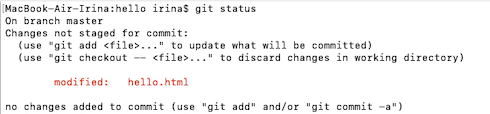
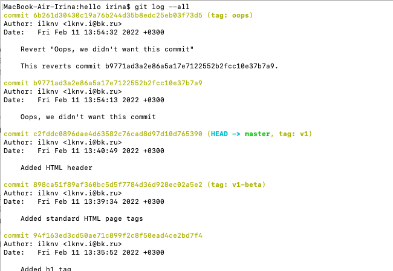
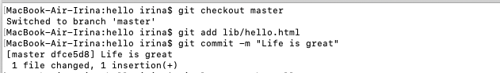
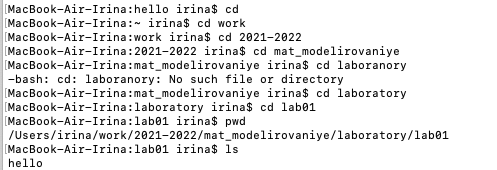

---
# Front matter
title: "Лабораторная работа №1"
author: "Лукьянова Ирина Владимировна, НФИбд-02-19"

# Generic options
lang: ru-RU
toc-title: "Содержание"

# Bibliography
bibliography: bib/cite.bib
csl: pandoc/csl/gost-r-7-0-5-2008-numeric.csl

# Pdf output format
toc: true # Table of contents
toc_depth: 2
lof: true # List of figures
lot: true # List of tables
fontsize: 12pt
linestretch: 1.5
papersize: a4
documentclass: scrreprt
## I18n
polyglossia-lang:
  name: russian
  options:
	- spelling=modern
	- babelshorthands=true
polyglossia-otherlangs:
  name: english
### Fonts
mainfont: PT Serif
romanfont: PT Serif
sansfont: PT Sans
monofont: PT Mono
mainfontoptions: Ligatures=TeX
romanfontoptions: Ligatures=TeX
sansfontoptions: Ligatures=TeX,Scale=MatchLowercase
monofontoptions: Scale=MatchLowercase,Scale=0.9
## Biblatex
biblatex: true
biblio-style: "gost-numeric"
biblatexoptions:
  - parentracker=true
  - backend=biber
  - hyperref=auto
  - language=auto
  - autolang=other*
  - citestyle=gost-numeric
## Misc options
indent: true
header-includes:
  - \linepenalty=10 # the penalty added to the badness of each line within a paragraph (no associated penalty node) Increasing the value makes tex try to have fewer lines in the paragraph.
  - \interlinepenalty=0 # value of the penalty (node) added after each line of a paragraph.
  - \hyphenpenalty=50 # the penalty for line breaking at an automatically inserted hyphen
  - \exhyphenpenalty=50 # the penalty for line breaking at an explicit hyphen
  - \binoppenalty=700 # the penalty for breaking a line at a binary operator
  - \relpenalty=500 # the penalty for breaking a line at a relation
  - \clubpenalty=150 # extra penalty for breaking after first line of a paragraph
  - \widowpenalty=150 # extra penalty for breaking before last line of a paragraph
  - \displaywidowpenalty=50 # extra penalty for breaking before last line before a display math
  - \brokenpenalty=100 # extra penalty for page breaking after a hyphenated line
  - \predisplaypenalty=10000 # penalty for breaking before a display
  - \postdisplaypenalty=0 # penalty for breaking after a display
  - \floatingpenalty = 20000 # penalty for splitting an insertion (can only be split footnote in standard LaTeX)
  - \raggedbottom # or \flushbottom
  - \usepackage{float} # keep figures where there are in the text
  - \floatplacement{figure}{H} # keep figures where there are in the text
---
# **Цель работы**

Цель работы - познакомиться с системой управления версиями Git, изучить ее команды, а также применить приоберетнные знания на практике.

# **Теоретическое введение**

Git — абсолютный лидер среди современных систем управления версиями. Это развитый проект с активной поддержкой и открытым исходным кодом.

Проект был создан Линусом Торвальдсом для управления разработкой ядра Linux, первая версия выпущена 7 апреля 2005 года.

Система используется множеством профессиональных разработчиков программного обеспечения. Она превосходно работает под управлением различных операционных систем и может применяться со множеством интегрированных сред разработки (IDE).

# **Выполнение лабораторной работы**

***1.1 Подготовка***

**1.1.1 Установка имени и электронной почты**

    Выполняем следующие команды:
{ #fig:001 width=70% }

**1.1.2 Параметры установки окончаний строк**

    Выполняем следующие команды:
{ #fig:002 width=70% }

**1.1.3 Установка отображения unicode**

    Устанавливаем соответствующий флаг:
{ #fig:003 width=70% }

***1.2 Создание проекта***

**1.2.1 Создайте страницу «Hello,World»**

    Начинаем работу в пустом рабочем каталоге с создания пустого каталога 
    с именем hello, затем создаем файл с именем hello.html.
{ #fig:004 width=70% }

**1.2.2 Создание репозитория**

    Выполняем команду git init, чтобы создать git репозиторий из этого каталога.
{ #fig:005 width=70% }

**1.2.3 Добавление файла в репозиторий**

    Добавляем файл в репозиторий.
{ #fig:006 width=70% }

**1.2.4 Проверка состояние репозитория**

    Выполняем команду git status,чтобы проверить текущее состояние репозитория.
{ #fig:007 width=70% }

***1.3 Внесение изменений***

**1.3.1 Измените страницу «Hello,World»**

    Добавляем HTML-теги к нашему приветствию. 
    После проверяем состояние рабочего каталога.
{ #fig:008 width=70% }

**1.4 Индексация изменений**

    Теперь выполняем команду git, чтобы проиндексировать изменения. Проверяем состояние.
{ #fig:009 width=70% }

**1.4.1 Коммит изменений**

    Делаем коммит и после проверяем состояние. Мы увидим, что откроется редактор.
    В первой строке я ввожу комментарий: «Added h1 tag». Сохраняю файл и выхожу. 
    После еще раз проверяю состояние.
{ #fig:010 width=70% }

**1.4.2 Добавьте стандартные теги страницы**

    Изменим страницу «Hello, World», чтобы она содержала стандартные теги html и body.
    Добавляем это изменение в индекс git. После добавляем заголовки HTML 
    (секцию head) к странице «Hello, World» и проверяем текущий статус:
    Делаем коммит проиндексированного изменения, а затем еще раз проверяем состояние.
{ #fig:011 width=70% }

    Теперь добавляю второе изменение в индекс, а затем снова проверяю состояние.
    В итоге второе изменение было проиндексировано и я выполняю коммит.
{ #fig:012 width=70% }

**1.4.3 История**

    Получим список произведенных изменений:
{ #fig:013 width=70% }

{ #fig:014 width=70% }

**1.4.4 Получение старых версий**

    Получаем хэши предыдущих версий
    Изучаем данные лога и находим хэш для первого коммита. 
    Затем проверяем содержимое файла hello.html.
    Возвращаемся к последней версии в ветке master.
{ #fig:015 width=70% }

{ #fig:016 width=70% }

{ #fig:017 width=70% }

**1.4.5 Создание тегов версий**

    Назавем текущую версию страницы hello первой (v1) и создаем тег.
     Создадим тег для версии, которая идет перед текущей версией и назовем его v1-beta.
{ #fig:018 width=70% }

**1.4.6 Переключение по имени тега**

    Переключаемся между двумя отмеченными версиями.
{ #fig:019 width=70% }

**1.4.7 Просмотр тегов с помощью команды tag**

    Просматриваем,какие теги доступны и теги в логе.
{ #fig:020 width=70% }

***1.5 Отмена локальных изменений (до индексации)***

**1.5.1 Переключитесь на ветку master**

    Проверяем, что находимся на последнем коммите ветки master
{ #fig:021 width=70% }

**1.5.2 Измените hello.html**

    Добавим в файл hello.html нежелательный комментарий.
>This is a bad comment.  We want to revert it.

**1.5.3 Проверьте состояние**

    Проверяем состояние рабочего каталога.
{ #fig:022 width=70%}

**1.5.4 Отмена изменений в рабочем каталоге**

    Переключаем версию файла hello.html в репозитории.
{ #fig:023 width=70%}

***1.6 Отмена проиндексированных изменений (перед коммитом)***

**1.6.1 Измените файл и проиндексируйте изменения**

    Вносим изменение в файл hello.html в виде нежелательного комментария.
>This is an unwanted but staged comment.

**1.6.2 Проверьте состояние**

    Проиндексируем изменение и проверяем состояние нежелательного изменения. 
    После сбрасываем буферную зону к HEAD.
{ #fig:024 width=70%}

**1.6.4 Переключитесь на версию коммита**

{ #fig:025 width=70%}

***1.7 Отмена коммитов***

**1.7.1 Отмена коммитов**

    Отменим коммит путем создания нового коммита, отменяющего нежелательные изменения.

**1.7.2 Измените файл и сделайте коммит**

    Изменяем файл hello.html.
{ #fig:026 width=70%}

**1.7.3 Сделайте коммит с новыми изменениями, отменяющими предыдущие**

    Чтобы отменить коммит, нам необходимо сделать коммит, который удаляет изменения, 
    сохраненные нежелательным коммитом.
{ #fig:027 width=70%}

**1.7.4 Проверьте лог**

    Проверка лога показывает нежелательные и отмененные коммиты в наш репозиторий.
{ #fig:028 width=70%}

***1.8 Удаление коммиттов из ветки***

**1.8.1 Команда git reset**

git reset:

+ перепишет текущую ветку, чтобы она указывала на нужный коммит;
+ опционально сбросит буферную зону для соответствия с указанным коммитом;
+ опционально сбросит рабочий каталог для соответствия с указанным коммитом.
  
**1.8.2 Проверьте нашу историю**

    Делаем быструю проверку нашей истории коммитов.
{ #fig:029 width=70%}

**1.8.3 Для начала отметьте эту ветку**

    Отметим последний коммит тегом, чтобы потом можно было его найти.
{ #fig:030 width=70%}

**1.8.4 Сброс коммитов к предшествующим коммиту Oops**

    Видим, что коммит с тегом «v1» является коммитом, предшествующим ошибочному коммиту. 
    Сбросим ветку до этой точки.
{ #fig:031 width=70%}

**1.8.5 Ничего никогда не теряется**

    Посмотрим на все коммиты. Видим, что ошибочные коммиты не исчезли. 
{ #fig:032 width=70%}

***1.9 Удаление тега oops***

**1.9.1 Удаление тега oops**

    Удалим тег и коммиты сборщиком мусора. 
    Тег «oops» больше не будет отображаться в репозитории.
{ #fig:033 width=70%}

***1.10 Внесение изменений в коммиты***

**1.10.1 Измените страницу, а затем сделайте коммит**

    Добавляем в страницу комментарий свою фамилию и делаем коммит.
{ #fig:034 width=70%}

    Далее обновляем страницу hello, включив в нее email .

**1.10.3 Измените предыдущий коммит**

    Изменяем предыдущий коммит, включив в него адрес электронной почты.
{ #fig:035 width=70%}

**1.10.4 Просмотр истории**

{ #fig:036 width=70%}

***1.11 Перемещение файлов***

**1.11.1 Переместите файл hello.html в каталог lib**

    Переносим страницу в каталог lib.
{ #fig:037 width=70%}

**1.12.1 Коммит в новый каталог**

    Делаем коммит перемещения:
{ #fig:038 width=70%}

**1.13.1 Добавление index.html**

    Добавляем файл и делаем коммит.
{ #fig:039 width=70%}

***1.14 Git внутри: Каталог.git***

**1.14.1 Каталог .git**

    Это каталог, в котором хранится вся информация git.
{ #fig:040 width=70%}

**1.14.2 База данных объектов**

    Это набор каталогов, имена которых состоят из 2 символов.
{ #fig:041 width=70%}

**1.14.3 Углубляемся в базу данных объектов**

    Видим файлы с именами из 38 символов. Это файлы, содержащие объекты, 
    хранящиеся в git. Они сжаты и закодированы.
{ #fig:042 width=70%}

**1.14.4 Config File**

    Это файл конфигурации, создающийся для каждого конкретного проекта.
{ #fig:043 width=70%}

**1.14.5 Ветки и теги**

    Каждый файл соответствует тегу,ранее созданному с помощью команды git tag.
{ #fig:044 width=70%}

**1.14.6 Файл HEAD**

    Файл HEAD содержит ссылку на текущую ветку.
{ #fig:045 width=70%}

***1.15 Работа непосредственно с объектами git***

**1.15.1 Поиск последнего коммита**

    Эта команда показывает нам последний коммит в репозиторий.
{ #fig:046 width=70%}

**1.15.2 Вывод последнего коммита с помощью SHA1 хэша**

{ #fig:047 width=70%}

**1.15.4 Поиск дерева и вывод каталога lib**

{ #fig:048 width=70%}

**1.15.5 Вывод файла hello.html**

{ #fig:049 width=70%}

**1.15.6 Исследуйте самостоятельно**

    Исследуем git репозиторий самостоятельно. После найдем оригинальный файл hello.html.
{ #fig:050 width=70%}

{ #fig:051 width=70%}

***1.16 Создание ветки***

Сделаем  hello world более выразительным.

**1.16.1 Создайте ветку**

Назовем новую ветку «style».

**1.16.2 Добавьте файл стилей style.css**

{ #fig:052 width=70%}

**1.16.3 Измените основную страницу**

    Обновим файл hello.html, чтобы использовать стили style.css.
{ #fig:053 width=70%}

**1.16.4 Измените index.html**

    Обновим файл index.html, чтобы он тоже использовал style.css
{ #fig:054 width=70%}

***1.17 Навигация по веткам***

    Теперь в проекте есть две ветки:
{ #fig:055 width=70%}

**1.17.1 Переключение на ветку master**

{ #fig:056 width=70%}

**1.17.2 Вернемся к ветке style**

{ #fig:057 width=70%}

***1.18 Изменения в ветке master***

***1.19 Сделайте коммит изменений README.md в ветку master.***

    Создали файл README в ветке master и сделали коммит изменений.
{ #fig:058 width=70%}

**1.19.2 Просмотрите текущие ветки**

    Теперь у нас в репозитории есть две отличающиеся ветки.
{ #fig:059 width=70%}

***1.20 Слияние***

**1.20.1 Слияние веток**

    Слияние переносит изменения из двух веток в одну. 
    Вернемся к ветке style и сольем master с style.
{ #fig:060 width=70%}

***1.21 Создание конфликта***

**1.21.1 Вернитесь в master и создайте конфликт**

    Внесем изменения и выполним следующие команды:
{ #fig:061 width=70%}

**1.21.2 Просмотр веток**

    Последнее изменение в master конфликтует с некоторыми изменениями в style. 
    На следующем шаге мы решим этот конфликт.
{ #fig:062 width=70%}

***1.22 Разрешение конфликтов***

**1.22.1 Слияние master с веткой style**

    Объединим style ее с новой веткой master.
{ #fig:063 width=70%}

    Если откроем lib/hello.html, то увидим:
{ #fig:064 width=70%}

**1.22.2 Решение конфликта**

    Вручную изменяем lib/hello.html.
{ #fig:065 width=70%}

**1.22.3 Сделайте коммит решения конфликта**

{ #fig:066 width=70%}

**1.22.4 Перебазирование как альтернатива слиянию**

Используем команду reset для возврата веток к предыдущему состоянию.

***1.23 Сброс ветки style***

**1.23.1 Сброс ветки style**

    Найдем последний коммит перед слиянием. После сбросим ветку style к этому коммиту.
{ #fig:067 width=70%}

    Проверяем ветку.
{ #fig:068 width=70%}

**1.24.1 Сброс ветки master**

{ #fig:069 width=70%}

{ #fig:070 width=70%}

***1.25 Перебазирование***

    Используем команду rebase вместо команды merge.
{ #fig:071 width=70%}

***1.26 Слияние в ветку master***

Сольем изменения style в ветку master.

**1.26.1 Слияние style в master**

{ #fig:072 width=70%}

**1.26.2 Просмотрите логи**

    Теперь можно увидеть, что ветки style и master идентичны.
{ #fig:073 width=70%}

***1.27 Клонирование репозиториев***

**1.27.1 Перейдите в рабочий каталог**

{ #fig:074 width=70%}

**1.27.2 Создайте клон репозитория hello**

    Сделаем клон репозитория hello.
{ #fig:075 width=70%}

***1.28 Просмотр клонированного репозитория***

**1.28.1 Давайте взглянем на клонированный репозиторий.**

    Увидим список всех файлов на верхнем уровне оригинального репозитория.
{ #fig:076 width=70%}

**1.28.2 Просмотрите историю репозитория**

    Увидим список всех коммитов в новый репозиторий.
{ #fig:077 width=70%}

**1.28.3 Удаленные ветки**

    Увидим ветку master (HEAD) в списке истории, а также  ветки со странными именами.

***1.29 Что такое origin?***

{ #fig:078 width=70%}

***1.30 Удаленные ветки***

    Посмотрим на ветки, доступные в нашем клонированном репозитории.
{ #fig:079 width=70%}

**1.30.1 Список удаленных веток**

    Посмотрим все ветки
{ #fig:080 width=70%}

***1.31 Изменение оригинального репозитория***

**1.31.1 Внесите изменения в оригинальный репозиторий hello**

    Вносим следующие изменения в файл README.md:
>Файл README.md
>This is the Hello World example from the git tutorial.
    Добавим это изменение и сделаем коммит.
{ #fig:081 width=70%}

**1.31.2 Извлечение изменений**

    Извлечем изменения из удаленного репозитория.
{ #fig:082 width=70%}

**1.31.3 Проверьте README.md**

    Мы можем увидеть, что клонированный файл не изменился.
{ #fig:083 width=70%}

***1.32 Слияние извлеченных изменений***

**1.32.1 Слейте извлеченные изменения в локальную ветку master**

{ #fig:084 width=70%}

**1.32.2 Еще раз проверьте файл README.md**

{ #fig:085 width=70%}

***1.33 Добавление ветки наблюдения***

**1.33.1 Добавьте локальную ветку, которая отслеживает удаленную ветку**

    Теперь мы можем видеть ветку style в списке веток и логе.
{ #fig:086 width=70%}

***1.35 Создайте чистый репозиторий***

{ #fig:087 width=70%}

***1.36 Добавление удаленного репозитория***

    Добавляем репозиторий hello.git к нашему оригинальному репозиторию.
{ #fig:088 width=70%}

***1.37 Отправка изменений***

    Отредактируем файл README.md и сделаем коммит. После отправим изменения в общий репозиторий.
{ #fig:089 width=70%}

***1.38 Извлечение общих изменений***

    Извлечем изменения из общего репозитория.
{ #fig:090 width=70%}

# Выводы

В ходе выполнения данной лабораторной работы я подробно ознакомилась с системой управления версиями Git, изучила ее команды, а также проработала приобретенные навыки на практике.

# Список литературы

1. Кулябов, Д.С. Работа с Git / Д.С.Кулябов. - Москва: - 31 с.
2. Scott Chacon, Ben Straub Pro Git /Scott Chacon, Ben Straub - USA: - 456 c.
