---
# Front matter
title: "Лабораторная работа №2"
author: "Лукьянова Ирина Владимировна, НФИбд-02-19"

# Generic options
lang: ru-RU
toc-title: "Содержание"

# Bibliography
bibliography: bib/cite.bib
csl: pandoc/csl/gost-r-7-0-5-2008-numeric.csl

# Pdf output format
toc: true # Table of contents
toc_depth: 2
lof: true # List of figures
lot: true # List of tables
fontsize: 12pt
linestretch: 1.5
papersize: a4
documentclass: scrreprt
## I18n
polyglossia-lang:
  name: russian
  options:
	- spelling=modern
	- babelshorthands=true
polyglossia-otherlangs:
  name: english
### Fonts
mainfont: PT Serif
romanfont: PT Serif
sansfont: PT Sans
monofont: PT Mono
mainfontoptions: Ligatures=TeX
romanfontoptions: Ligatures=TeX
sansfontoptions: Ligatures=TeX,Scale=MatchLowercase
monofontoptions: Scale=MatchLowercase,Scale=0.9
## Biblatex
biblatex: true
biblio-style: "gost-numeric"
biblatexoptions:
  - parentracker=true
  - backend=biber
  - hyperref=auto
  - language=auto
  - autolang=other*
  - citestyle=gost-numeric
## Misc options
indent: true
header-includes:
  - \linepenalty=10 # the penalty added to the badness of each line within a paragraph (no associated penalty node) Increasing the value makes tex try to have fewer lines in the paragraph.
  - \interlinepenalty=0 # value of the penalty (node) added after each line of a paragraph.
  - \hyphenpenalty=50 # the penalty for line breaking at an automatically inserted hyphen
  - \exhyphenpenalty=50 # the penalty for line breaking at an explicit hyphen
  - \binoppenalty=700 # the penalty for breaking a line at a binary operator
  - \relpenalty=500 # the penalty for breaking a line at a relation
  - \clubpenalty=150 # extra penalty for breaking after first line of a paragraph
  - \widowpenalty=150 # extra penalty for breaking before last line of a paragraph
  - \displaywidowpenalty=50 # extra penalty for breaking before last line before a display math
  - \brokenpenalty=100 # extra penalty for page breaking after a hyphenated line
  - \predisplaypenalty=10000 # penalty for breaking before a display
  - \postdisplaypenalty=0 # penalty for breaking after a display
  - \floatingpenalty = 20000 # penalty for splitting an insertion (can only be split footnote in standard LaTeX)
  - \raggedbottom # or \flushbottom
  - \usepackage{float} # keep figures where there are in the text
  - \floatplacement{figure}{H} # keep figures where there are in the text
---

# **Цель работы**

Цель работы - познакомиться с пакетом прикладных математических программ Scilab, изучить ее команды, а также решить задачу о погоне, построив математическую модель.

# **Задание**

**Вариант 40**

На море в тумане катер береговой охраны преследует лодку браконьеров. Через определенный промежуток времени туман рассеивается, и лодка обнаруживается на расстоянии 15,5 км от катера. Затем лодка снова скрывается в тумане и уходит прямолинейно в неизвестном направлении. Известно, что скорость катера в 3,5 раза больше скорости браконьерской лодки. [^1]

# **Теоретическое введение**

Задаем место нахождения лодки браконьеров в
момент обнаружения и место нахождения катера береговой охраны
относительно лодки браконьеров в момент обнаружения лодки. (рис.[-@fig:001])

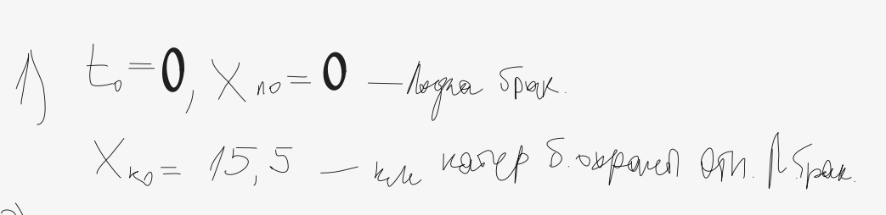{ #fig:001 width=70% }

Введем полярные координаты. Считаем, что полюс - это точка обнаружения лодки браконьеров, а полярная ось r проходит через точку
нахождения катера береговой охраны.

Чтобы найти расстояние x (расстояние после которого катер начнет двигаться вокруг полюса), необходимо составить уравнение.
(рис. [-@fig:002])

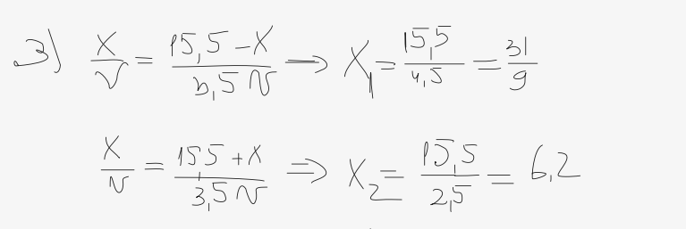{ #fig:002 width=70% }

После мы должны найти v - тангенциальную скорость, получим:
(рис. [-@fig:003])

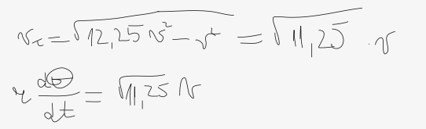{ #fig:003 width=70% }

Решение исходной задачи сводится к решению системы из двух дифференциальных уравнений с начальными условиями:(рис. [-@fig:004])

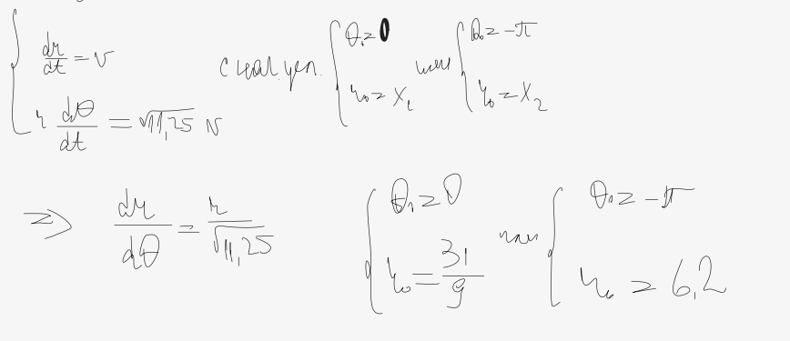{ #fig:004 width=70% }

# **Выполнение лабораторной работы**

1. Записываем уравнение, описывающее движение катера, с начальными условиями для двух случаев.
2. Постройте траекторию движения катера и лодки для двух случаев.
3. Найдите точку пересечения траектории катера и лодки[^1]

**Начнем с первого случая:**

1. Записываем начальное расстояние от лодки до катера:(рис. [-@fig:005])

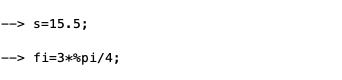{ #fig:005 width=70% }

2. Далее прописываем функцию, описывающую движение катера береговой охраны:(рис. [-@fig:006])

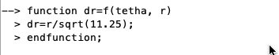{ #fig:006 width=70% }

3. Указываем начальные условия:(рис. [-@fig:007])

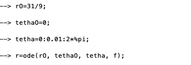{ #fig:007 width=70% }

4. Далее прописываем функцию, описывающую движение лодки браконьеров:(рис. [-@fig:008])

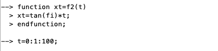{ #fig:008 width=70% }

5. После строим траектории движения лодки и катера:(рис. [-@fig:009])

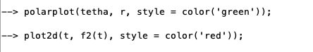{ #fig:009 width=70% }

(рис. [-@fig:010])

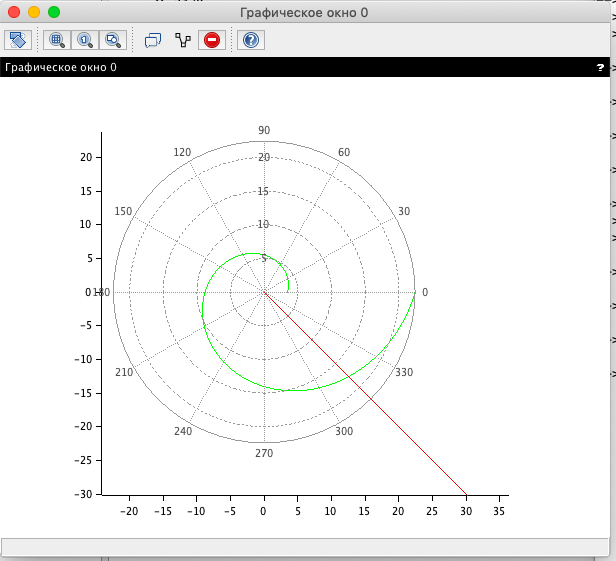{ #fig:010 width=70% }

6. Смотрим точку пересечения траекторий:(рис. [-@fig:011])

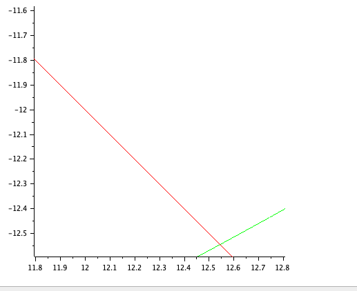{ #fig:011 width=70% }

**Рассмотрим второй случай:**

Единственное, что нам надо изменить в нашей программе - это начальные условия:(рис. [-@fig:012])

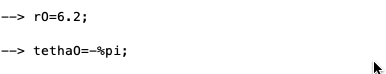{ #fig:012 width=70% }

Далее аналогично проделываем работу из первого случая, строим траектории движения лодки и катера:(рис. [-@fig:013])

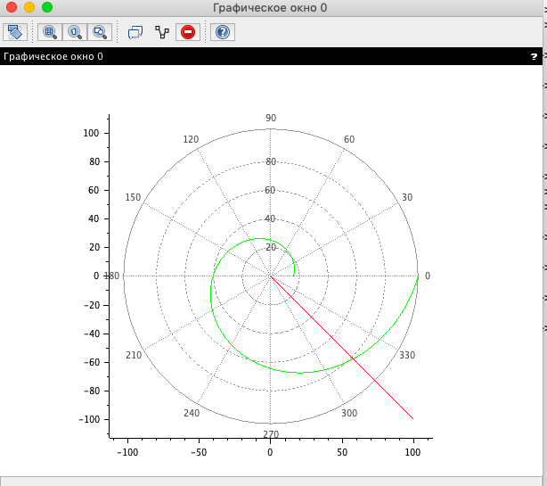{ #fig:013 width=70% }

Смотрим точку пересечения траекторий:(рис. [-@fig:014])

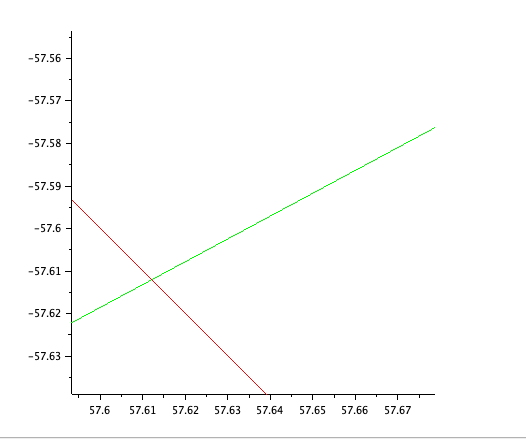{ #fig:014 width=70% }

# Выводы

В ходе выполнения данной лабораторной работы я подробно ознакомилась с пакетом прикладных математических программ Scilab, изучила ее команды, а также а также научилась решать задачу о погоне, также смогла построить математическую модель.

# Список литературы

1. [Кулябов, Д.С. Задача о погоне / Д.С.Кулябов. - Москва: - 4 с.](https://esystem.rudn.ru/pluginfile.php/1343881/mod_resource/content/2/Лабораторная%20работа%20№%201.pdf)
2. [Руководство по оформлению Markdown.](https://gist.github.com/Jekins/2bf2d0638163f1294637)

[^1]: Кулябов, Д.С. Задача о погоне.
