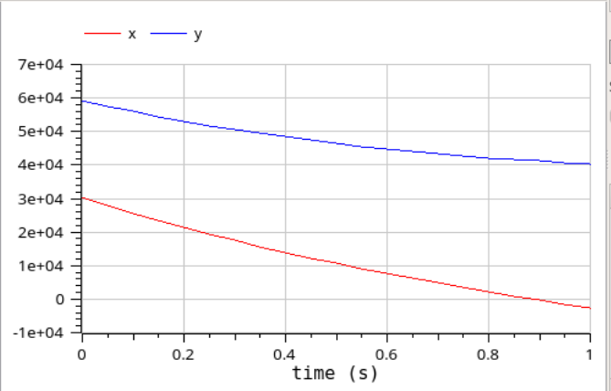
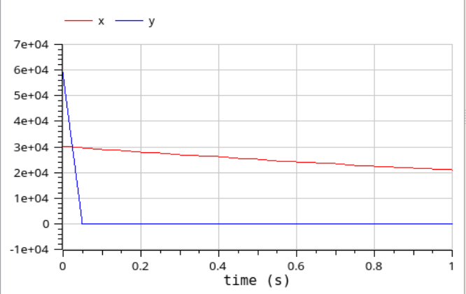

---
## Front matter
lang: ru-RU
title: Лабораторная работа №3
author: Лукьянова Ирина Владимировна
group: НФИбд-02-19
institute: RUDN University, Moscow, Russian Federation
date: 25 February 2022

## Formatting
toc: false
slide_level: 2
theme: metropolis
header-includes: 
 - \metroset{progressbar=frametitle,sectionpage=progressbar,numbering=fraction}
 - '\makeatletter'
 - '\beamer@ignorenonframefalse'
 - '\makeatother'
aspectratio: 43
section-titles: true
---
# **Прагматика выполнения лабораторной работы**

Мы рассмотрим некоторые простейшие модели боевых действий – модели Ланчестера. В противоборстве могут принимать участие как регулярные войска, так и партизанские отряды. В общем случае главной характеристикой соперников являются численности сторон. Если в какой-то момент времени одна из численностей обращается в нуль, то данная сторона считается проигравшей (при условии, что численность другой стороны в данный момент положительна). Для этого мы построим симуляции боев и сравним графики двух случаев.

# **Цель лабораторной работы**

Цель работы - познакомиться с программным обеспечением OpenModelica, изучить команды, научиться создавать симуляции, а также построить модель боевых действий.

# **Задачи выполнения лабораторной работы**

- записать начальные данные и задать коэффициенты эффективности армий;
- получить систему, описывающую противостояние между регулярными войсками X и Y;
- поменять коэффициенты эффективности армий для второго случая;
- записать систему, описывающую ведение боевых действий с участием регулярных войск и партизанских отрядов;
- посмотреть симуляции моделей и сравнить их.

# **Результаты выполнения лабораторной работы**

В ходе выполнения лабораторной работы:

- я ознакомилась с программным обеспечением OpenModelica;
- научилась использовать его команды;
- научилась создавать симуляции;
- построила модель боевых действий для двух случаев.

# **Модель боевых действий №1**

{ #fig:006 width=70% }

# **Модель боевых действий №2**

{ #fig:009 width=70% }
