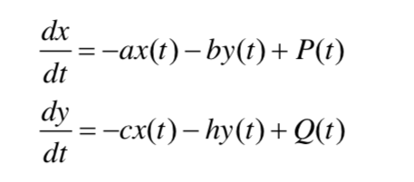
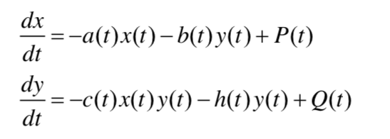
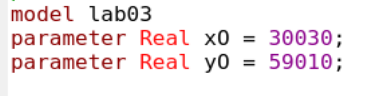
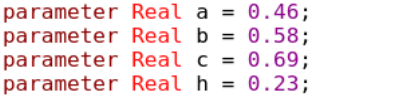
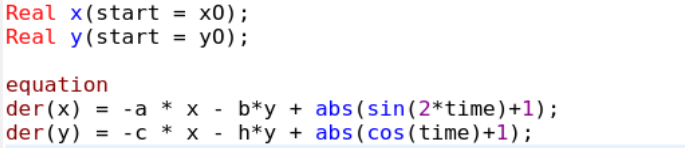
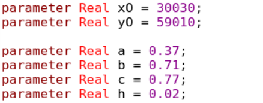
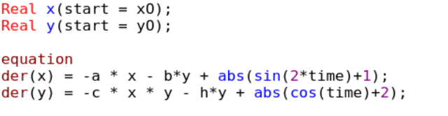

---
# Front matter
title: "Лабораторная работа №3"
author: "Лукьянова Ирина Владимировна, НФИбд-02-19"

# Generic options
lang: ru-RU
toc-title: "Содержание"

# Bibliography
bibliography: bib/cite.bib
csl: pandoc/csl/gost-r-7-0-5-2008-numeric.csl

# Pdf output format
toc: true # Table of contents
toc_depth: 2
lof: true # List of figures
lot: true # List of tables
fontsize: 12pt
linestretch: 1.5
papersize: a4
documentclass: scrreprt
## I18n
polyglossia-lang:
  name: russian
  options:
	- spelling=modern
	- babelshorthands=true
polyglossia-otherlangs:
  name: english
### Fonts
mainfont: PT Serif
romanfont: PT Serif
sansfont: PT Sans
monofont: PT Mono
mainfontoptions: Ligatures=TeX
romanfontoptions: Ligatures=TeX
sansfontoptions: Ligatures=TeX,Scale=MatchLowercase
monofontoptions: Scale=MatchLowercase,Scale=0.9
## Biblatex
biblatex: true
biblio-style: "gost-numeric"
biblatexoptions:
  - parentracker=true
  - backend=biber
  - hyperref=auto
  - language=auto
  - autolang=other*
  - citestyle=gost-numeric
## Misc options
indent: true
header-includes:
  - \linepenalty=10 # the penalty added to the badness of each line within a paragraph (no associated penalty node) Increasing the value makes tex try to have fewer lines in the paragraph.
  - \interlinepenalty=0 # value of the penalty (node) added after each line of a paragraph.
  - \hyphenpenalty=50 # the penalty for line breaking at an automatically inserted hyphen
  - \exhyphenpenalty=50 # the penalty for line breaking at an explicit hyphen
  - \binoppenalty=700 # the penalty for breaking a line at a binary operator
  - \relpenalty=500 # the penalty for breaking a line at a relation
  - \clubpenalty=150 # extra penalty for breaking after first line of a paragraph
  - \widowpenalty=150 # extra penalty for breaking before last line of a paragraph
  - \displaywidowpenalty=50 # extra penalty for breaking before last line before a display math
  - \brokenpenalty=100 # extra penalty for page breaking after a hyphenated line
  - \predisplaypenalty=10000 # penalty for breaking before a display
  - \postdisplaypenalty=0 # penalty for breaking after a display
  - \floatingpenalty = 20000 # penalty for splitting an insertion (can only be split footnote in standard LaTeX)
  - \raggedbottom # or \flushbottom
  - \usepackage{float} # keep figures where there are in the text
  - \floatplacement{figure}{H} # keep figures where there are in the text
---

# **Цель работы**

Цель работы - познакомиться с программным обеспечением OpenModelica, изучить команды, научиться создавать симуляции, а также построить модель боевых действий.

# **Задание**

**Вариант 40**

Между страной Х и страной У идет война. Численность состава войск исчисляется от начала войны, и являются временными функциями x(t) и y(t). В
начальный момент времени страна Х имеет армию численностью 30 030 человек, а в распоряжении страны У армия численностью в 59 010 человек. Для упрощения модели считаем, что коэффициенты a,b,c,h постоянны. Также считаем P(t) и Q(t) непрерывные функции. Нам нужно построить графики изменения численности войск армии Х и армии У. [^1]

# **Теоретическое введение**

Нам нужно рассмотреть 2 модели боя для того, чтобы построить симуляции.

1. Модель боевых действий между регулярными войсками, которая описывается следующим образом:(рис.[-@fig:001])

{ #fig:001 width=70% }

2. Модель боевых действий с участием регулярных войск и партизанских отрядов:(рис. [-@fig:002])

{ #fig:002 width=70% }

Благодаря этим данным, мы можем приступить к выполнению лабораторной работы.

# **Выполнение лабораторной работы**

1. Запишем начальные данные и зададим коэффициенты эффективности армий.
2. Получим систему, описывающую противостояние между регулярными войсками X и Y.
3. Поменяем коэффициенты эффективности армий для второго случая.
4. Запишем систему, описывающую ведение боевых действий с участием регулярных войск и партизанских отрядов.
5. Посмотрим симуляции моделей и сравним их.

**Начнем с первой системы, которая описывает противостояние между регулярными войсками:**

1. Записываем начальные условия: численность первой и второй армии.(рис. [-@fig:003])

{ #fig:003 width=70% }

2. Далее прописываем коэффициенты, описывающие эффективность боевых действий и константы, характеризующие степень влияния различных факторов на потери:(рис. [-@fig:004])

{ #fig:004 width=70% }

3. Записсываем систему дифференциальных уравнений:(рис. [-@fig:005])

{ #fig:005 width=70% }

4. Далее строим график решений, задавая время и число интервалов:(рис. [-@fig:006])

{ #fig:006 width=70% }

**Рассмотрим вторую систему, которая описывает ведение боевых действий с участием регулярных войск и партизанских отрядов:**

Единственное, что нам надо изменить в нашей программе - это константы и коэффициенты:(рис. [-@fig:007])

{ #fig:007 width=70% }

Далее аналогично проделываем работу для второй системы:(рис. [-@fig:008])

{ #fig:008 width=70% }

Строим график решений:(рис. [-@fig:009])

{ #fig:009 width=70% }

# Выводы

В ходе выполнения данной лабораторной работы я подробно ознакомилась с программным обеспечением OpenModelica, изучила его команды, научилась создавать симуляции, а также смогла построить модель боевых действий.

# Список литературы

1. [Кулябов, Д.С. Модель боевых действий / Д.С.Кулябов. - Москва: - 7 с.](https://esystem.rudn.ru/pluginfile.php/1343885/mod_resource/content/2/Лабораторная%20работа%20№%202.pdf)
2. [Руководство по оформлению Markdown.](https://gist.github.com/Jekins/2bf2d0638163f1294637)

[^1]: Кулябов, Д.С. Модель боевых действий.
