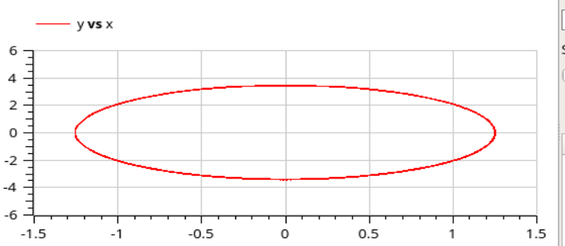
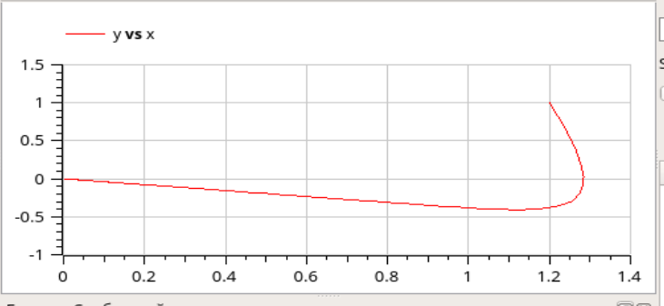
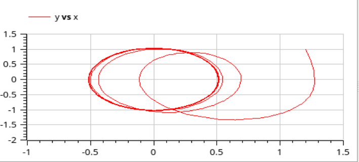

---
## Front matter
lang: ru-RU
title: Лабораторная работа №4
author: Лукьянова Ирина Владимировна
group: НФИбд-02-19
institute: RUDN University, Moscow, Russian Federation
date: 3 March 2022

## Formatting
toc: false
slide_level: 2
theme: metropolis
header-includes: 
 - \metroset{progressbar=frametitle,sectionpage=progressbar,numbering=fraction}
 - '\makeatletter'
 - '\beamer@ignorenonframefalse'
 - '\makeatother'
aspectratio: 43
section-titles: true
---
# **Прагматика выполнения лабораторной работы**

- Познакомимся с моделями гармонических колебаний
- Изучим уравнение свободных колебаний гармонического осциллятора : $\ddot x+2\gamma \dot x+\omega_0^2x=0$
- Рассмотрим 3 фазовых портрета гармонического осциллятора

# **Цель лабораторной работы**

Цель работы - познакомится с моделями гармонических калебаний, построить фазовый портрет и решить уравнения гармонического осциллятора для трех случаев в OpenModelica.

# **Задачи выполнения лабораторной работы**

- Рассмотрим колебания гармонического осциллятора без затуханий и без действий внешней силы $\ddot x+7.5x=0$;
- Рассмотрим колебания гармонического осциллятора c затуханием и без действий внешней силы $\ddot x+2 \dot x+5.5x=0$;
- Рассмотрим колебания гармонического осциллятора c затуханием и под действием внешней силы $\ddot x+2.4 \dot x+5x=5.2 sin(2t)$;
- Посмотрим симуляции моделей и сравним их.

# **Результаты выполнения лабораторной работы**

В ходе выполнения лабораторной работы:

- я ознакомилась с моделями гармонических калебаний;
- построила фазовый портрет;
- решила уравнения гармонического осциллятора для трех случаев;
- посмотрела симуляции моделей.
  
# **Модель гармонических калебаний №1**

{ #fig:006 width=70% }

# **Модель гармонических калебаний №2**

{ #fig:009 width=70% }

# **Модель гармонических калебаний №3**

{ #fig:009 width=70% }
