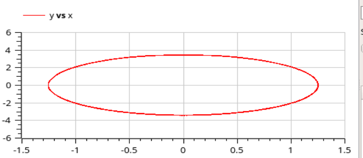

---
# Front matter
title: "Лабораторная работа №4"
author: "Лукьянова Ирина Владимировна, НФИбд-02-19"

# Generic options
lang: ru-RU
toc-title: "Содержание"

# Bibliography
bibliography: bib/cite.bib
csl: pandoc/csl/gost-r-7-0-5-2008-numeric.csl

# Pdf output format
toc: true # Table of contents
toc_depth: 2
lof: true # List of figures
lot: true # List of tables
fontsize: 12pt
linestretch: 1.5
papersize: a4
documentclass: scrreprt
## I18n
polyglossia-lang:
  name: russian
  options:
	- spelling=modern
	- babelshorthands=true
polyglossia-otherlangs:
  name: english
### Fonts
mainfont: PT Serif
romanfont: PT Serif
sansfont: PT Sans
monofont: PT Mono
mainfontoptions: Ligatures=TeX
romanfontoptions: Ligatures=TeX
sansfontoptions: Ligatures=TeX,Scale=MatchLowercase
monofontoptions: Scale=MatchLowercase,Scale=0.9
## Biblatex
biblatex: true
biblio-style: "gost-numeric"
biblatexoptions:
  - parentracker=true
  - backend=biber
  - hyperref=auto
  - language=auto
  - autolang=other*
  - citestyle=gost-numeric
## Misc options
indent: true
header-includes:
  - \linepenalty=10 # the penalty added to the badness of each line within a paragraph (no associated penalty node) Increasing the value makes tex try to have fewer lines in the paragraph.
  - \interlinepenalty=0 # value of the penalty (node) added after each line of a paragraph.
  - \hyphenpenalty=50 # the penalty for line breaking at an automatically inserted hyphen
  - \exhyphenpenalty=50 # the penalty for line breaking at an explicit hyphen
  - \binoppenalty=700 # the penalty for breaking a line at a binary operator
  - \relpenalty=500 # the penalty for breaking a line at a relation
  - \clubpenalty=150 # extra penalty for breaking after first line of a paragraph
  - \widowpenalty=150 # extra penalty for breaking before last line of a paragraph
  - \displaywidowpenalty=50 # extra penalty for breaking before last line before a display math
  - \brokenpenalty=100 # extra penalty for page breaking after a hyphenated line
  - \predisplaypenalty=10000 # penalty for breaking before a display
  - \postdisplaypenalty=0 # penalty for breaking after a display
  - \floatingpenalty = 20000 # penalty for splitting an insertion (can only be split footnote in standard LaTeX)
  - \raggedbottom # or \flushbottom
  - \usepackage{float} # keep figures where there are in the text
  - \floatplacement{figure}{H} # keep figures where there are in the text
---

# **Цель работы**

Цель работы - познакомится с моделями гармонических калебаний, построить фазовый портрет гармонического осциллятора и решение уравнения гармонического осциллятора для трех случаев в OpenModelica.

# **Задание**

**Вариант 40**

1. Колебания гармонического осциллятора без затуханий и без действий внешней силы.(рис.[-@fig:001])

{ #fig:001 width=70% }

2. Колебания гармонического осциллятора c затуханием и без действий внешней силы.(рис.[-@fig:002])

{ #fig:002 width=70% }

3. Колебания гармонического осциллятора c затуханием и под действием внешней силы.(рис.[-@fig:003]) [^1]

{ #fig:003 width=70% }

# **Теоретическое введение**

Движение грузика на пружинке, маятника, заряда в электрическом контуре, а также эволюция во времени многих систем в физике, химии, биологии и других науках при определенных предположениях можно описать одним и тем же дифференциальным уравнением, которое в теории колебаний выступает в качестве основной модели. Эта модель называется линейным гармоническим осциллятором.

Уравнение свободных колебаний гармонического осциллятора имеет следующий вид: (рис.[-@fig:004])

{ #fig:004 width=70% }

$x$ – переменная, описывающая состояние системы (смещение грузика, заряд конденсатора и т.д.), $\gamma$ – параметр, характеризующий потери энергии (трение в
механической системе, сопротивление в контуре), $\omega_0$ – собственная частота колебаний, $t$ – время.

Нам нужно рассмотреть 3 фазовых портрета гармонического осциллятора, а после построить симуляции.

У нас есть начальные условия:
$x_0=1.2$, $y_0=1$

Также дан интервал, где $t \in [0, 42]$, а шаг равен 0.05.

Благодаря этим данным, мы можем приступить к выполнению лабораторной работы.

# **Выполнение лабораторной работы**

1. Рассмотрим колебания гармонического осциллятора без затуханий и без действий внешней силы $\ddot x+7.5x=0$
2. Рассмотрим колебания гармонического осциллятора c затуханием и без действий внешней силы $\ddot x+2 \dot x+5.5x=0$
3. Рассмотрим колебания гармонического осциллятора c затуханием и под действием внешней силы $\ddot x+2.4 \dot x+5x=5.2 sin(2t)$
4. Посмотрим симуляции моделей и сравним их.

**Начнем с первого пункта, который описывает колебания гармонического осциллятора без затуханий и без действий внешней силы:**

1. Записываем начальные условия: $x_0=1.2$, $y_0=1$
2. Далее прописываем параметры осциллятора $\omega$ и $g$

3. Записсываем систему дифференциальных уравнений:(рис. [-@fig:005])

{ #fig:005 width=70% }

4. Далее строим график решений, задавая время и число интервалов:(рис. [-@fig:006])

{ #fig:006 width=70% }

**Рассмотрим второй случай, который описывает колебания гармонического осциллятора c затуханием и без действий внешней силы:**

Единственное, что нам надо изменить в нашей программе - это параметры осциллятора $\omega$ и $g$:

Далее аналогично проделываем работу для второй системы:(рис. [-@fig:007])

{ #fig:007 width=70% }

Строим график решений:(рис. [-@fig:008])

{ #fig:008 width=70% }

**Рассмотрим третий случай, который описывает колебания гармонического осциллятора c затуханием и под действием внешней силы:**

Снова меняем параметры осциллятора $\omega$ и $g$:

Далее записываем третью систему:(рис. [-@fig:009])

{ #fig:009 width=70% }

Строим график решений:(рис. [-@fig:010])

{ #fig:010 width=70% }

# Выводы

В ходе выполнения данной лабораторной работы я подробно ознакомилась с моделями гармонических калебаний, построила фазовый портрет и решила уравнения гармонического осциллятора для трех случаев.

# Список литературы

1. [Кулябов, Д.С. Модель гармонических колебаний / Д.С.Кулябов. - Москва: - 4 с.](https://esystem.rudn.ru/pluginfile.php/1343889/mod_resource/content/2/Лабораторная%20работа%20№%203.pdf)
2. [Руководство по оформлению Markdown.](https://gist.github.com/Jekins/2bf2d0638163f1294637)

[^1]: Кулябов, Д.С. Модель гармонических колебаний.
