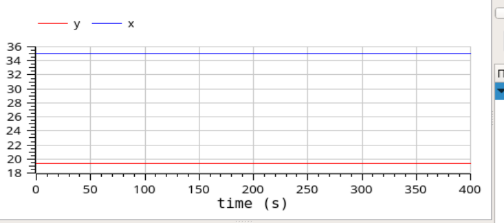

---
## Front matter
lang: ru-RU
title: Лабораторная работа №5
author: Лукьянова Ирина Владимировна
group: НФИбд-02-19
institute: RUDN University, Moscow, Russian Federation
date: 7 March 2022

## Formatting
toc: false
slide_level: 2
theme: metropolis
header-includes: 
 - \metroset{progressbar=frametitle,sectionpage=progressbar,numbering=fraction}
 - '\makeatletter'
 - '\beamer@ignorenonframefalse'
 - '\makeatother'
aspectratio: 43
section-titles: true
---
# **Прагматика выполнения лабораторной работы**

- Познакомимся с моделью хищник-жертва
- Посмотрим зависимости изменения численности хищников от изменения численности жертв
- Рассмотрим стационарное состояние системы

# **Цель лабораторной работы**

Цель работы - познакомится с моделью хищник-жертва, а также построить зависимости численности популяций хищников и жертв (фазовый портрет системы) в OpenModelica.

# **Задачи выполнения лабораторной работы**

- Построим график зависимости $x$ от $y$.
- Построим графики функций $x(t), y(t)$.
- Найдем стационарное состояние системы.
- Посмотрим симуляции моделей и сравним их.
  
# **Вариант 40**

Модель хищник-жертва:
$$
\begin{cases}
\frac{dx}{dt} = -0.83\cdot x(t)+0.043\cdot x(t)\cdot y(t) \\
\frac{dy}{dt} = 0.84\cdot y(t)-0.024\cdot x(t)\cdot y(t)
\end{cases}
$$

Начальные условия:  $x_0=10$, $y_0=20$

# **Результаты выполнения лабораторной работы**

В ходе выполнения лабораторной работы:

- я ознакомилась с моделью хищник-жертва;
- построила зависимости численности популяций хищников и жертв (фазовый портрет системы).
- посмотрела симуляции моделей.
  
# **График зависимости x от y**

{ #fig:001 width=70% }

# **Графики функций x(t), y(t)**

{ #fig:002 width=70% }

# **Стационарное состояние системы**

{ #fig:003 width=70% }
