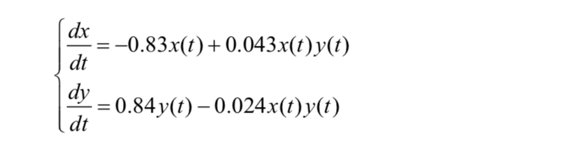
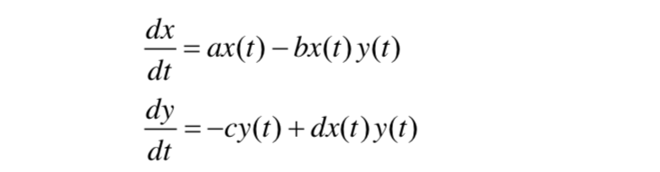
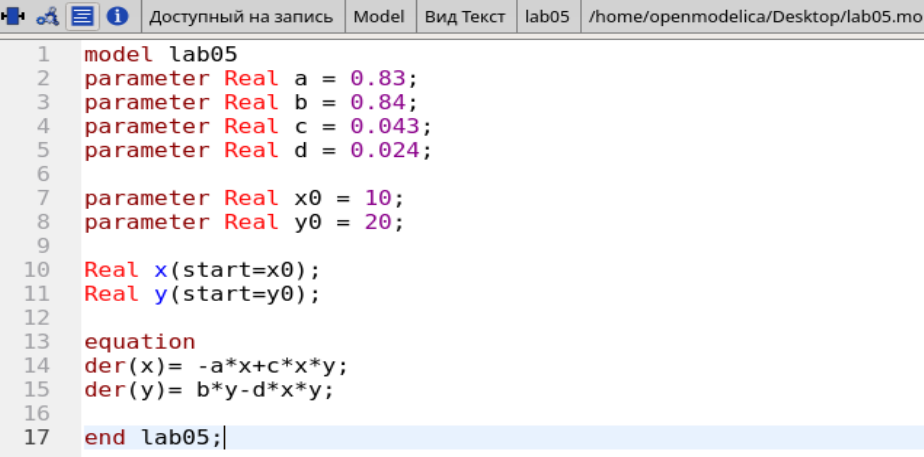
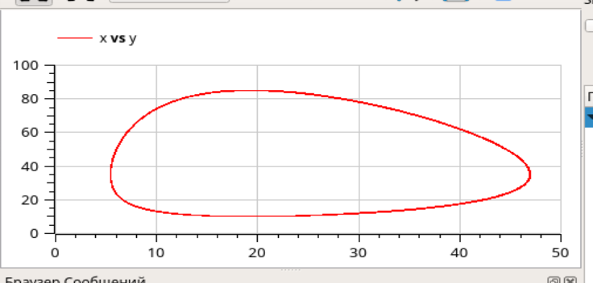
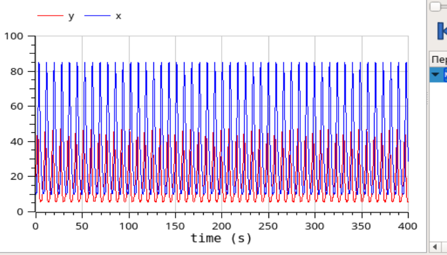
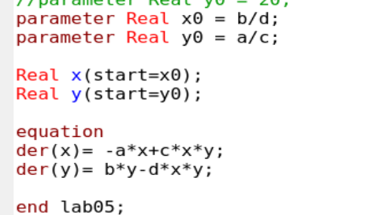
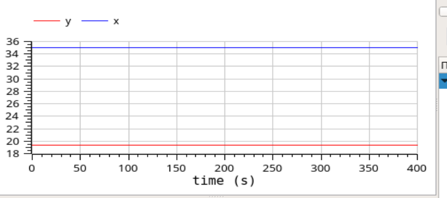

---
# Front matter
title: "Лабораторная работа №5"
author: "Лукьянова Ирина Владимировна, НФИбд-02-19"

# Generic options
lang: ru-RU
toc-title: "Содержание"

# Bibliography
bibliography: bib/cite.bib
csl: pandoc/csl/gost-r-7-0-5-2008-numeric.csl

# Pdf output format
toc: true # Table of contents
toc_depth: 2
lof: true # List of figures
lot: true # List of tables
fontsize: 12pt
linestretch: 1.5
papersize: a4
documentclass: scrreprt
## I18n
polyglossia-lang:
  name: russian
  options:
	- spelling=modern
	- babelshorthands=true
polyglossia-otherlangs:
  name: english
### Fonts
mainfont: PT Serif
romanfont: PT Serif
sansfont: PT Sans
monofont: PT Mono
mainfontoptions: Ligatures=TeX
romanfontoptions: Ligatures=TeX
sansfontoptions: Ligatures=TeX,Scale=MatchLowercase
monofontoptions: Scale=MatchLowercase,Scale=0.9
## Biblatex
biblatex: true
biblio-style: "gost-numeric"
biblatexoptions:
  - parentracker=true
  - backend=biber
  - hyperref=auto
  - language=auto
  - autolang=other*
  - citestyle=gost-numeric
## Misc options
indent: true
header-includes:
  - \linepenalty=10 # the penalty added to the badness of each line within a paragraph (no associated penalty node) Increasing the value makes tex try to have fewer lines in the paragraph.
  - \interlinepenalty=0 # value of the penalty (node) added after each line of a paragraph.
  - \hyphenpenalty=50 # the penalty for line breaking at an automatically inserted hyphen
  - \exhyphenpenalty=50 # the penalty for line breaking at an explicit hyphen
  - \binoppenalty=700 # the penalty for breaking a line at a binary operator
  - \relpenalty=500 # the penalty for breaking a line at a relation
  - \clubpenalty=150 # extra penalty for breaking after first line of a paragraph
  - \widowpenalty=150 # extra penalty for breaking before last line of a paragraph
  - \displaywidowpenalty=50 # extra penalty for breaking before last line before a display math
  - \brokenpenalty=100 # extra penalty for page breaking after a hyphenated line
  - \predisplaypenalty=10000 # penalty for breaking before a display
  - \postdisplaypenalty=0 # penalty for breaking after a display
  - \floatingpenalty = 20000 # penalty for splitting an insertion (can only be split footnote in standard LaTeX)
  - \raggedbottom # or \flushbottom
  - \usepackage{float} # keep figures where there are in the text
  - \floatplacement{figure}{H} # keep figures where there are in the text
---

# **Цель работы**

Цель работы - познакомится с моделью хищник-жертва, а также построить зависимости численности популяций хищников и жертв (фазовый портрет системы) в OpenModelica.

# **Задание**

**Вариант 40**

1. Для модели «хищник-жертва»:(рис.[-@fig:001])

{ #fig:001 width=70% }

Постройте график зависимости численности хищников от численности жертв, а также графики изменения численности хищников и численности жертв при следующих начальных условиях: $x_0=10, y_0=20$ . Найдите стационарное состояние системы.[^1]

# **Теоретическое введение**

Модель Лотки-Вольтерры - простейшая модель взаимодействия двух видов типа «хищник — жертва». Данная модель основывается на следующих предположениях:

1. Численность популяции жертв x и хищников y зависят только от времени.
2. В отсутствии взаимодействия численность видов изменяется по модели Мальтуса, при этом число жертв увеличивается, а число хищников падает.
3. Естественная смертность жертвы и естественная рождаемость хищника считаются несущественными.
4. Эффект насыщения численности обеих популяций не учитывается.
5. Скорость роста численности жертв уменьшается пропорционально численности хищников.[^1]

Рассмотрим модель:(рис.[-@fig:002])

{ #fig:002 width=70% }

В этой модели $x$ – число жертв, $y$ - число хищников. Коэффициент a описывает скорость естественного прироста числа жертв в отсутствие хищников, $с$ - естественное вымирание хищников, лишенных пищи в виде жертв. Вероятность взаимодействия жертвы и хищника считается пропорциональной как количеству жертв, так и числу самих хищников $(xy)$. Каждый акт взаимодействия уменьшает популяцию жертв, но способствует увеличению популяции хищников (члены $-bxy$ и $dxy$ в правой части уравнения).

Также хочется сказать про стационарное состояние системы - положение равновесия, не зависящее от времени решение, оно будет в точке: $x_0=c/d , y_0=a/b$.

У нас есть начальные условия:
$x_0=10$, $y_0=20$

Также дан интервал, где $t \in [0, 400]$, а шаг равен 0.1.

Благодаря этим данным, мы можем приступить к выполнению лабораторной работы.

# **Выполнение лабораторной работы**

1. Построим график зависимости $x$ от $y$ и графики функций $x(t), y(t)$.
2. Найдем стационарное состояние системы.
4. Посмотрим симуляции моделей и сравним их.

**Построим графики:**

1. Записываем начальные условия: $x_0=10$, $y_0=20$
2. Далее прописываем коэффециенты $a,b,c,d$, где

- a- коэффициент естественной смертности хищников,
- b- коэффициент естественного прироста жертв,
- c- коэффициент увеличения числа хищников,
- d- коэффициент смертности жертв
  
3. Записсываем систему дифференциальных уравнений:(рис. [-@fig:003])

{ #fig:003 width=70% }

4. Далее строим график зависимости x от y, задавая время и число интервалов:(рис. [-@fig:004])

{ #fig:004 width=70% }

5. Также строим графики функций $x(t), y(t)$ (рис. [-@fig:005])

{ #fig:005 width=70% }

**Стационарное состояние системы**

Единственное, что нам надо изменить в нашей программе - это начальные значения $x_0, y_0$. В теоретическом введении мы ознакомились с формулами, по которым можно получить стационарное состояние.

Далее аналогично проделываем работу для второй системы:(рис. [-@fig:006])

{ #fig:006 width=70% }

Строим график решений:(рис. [-@fig:007])

{ #fig:007 width=70% }

# Выводы

В ходе выполнения данной лабораторной работы я подробно ознакомилась с моделью хищник-жертва, а также построила зависимости численности популяций хищников и жертв (фазовый портрет системы) в OpenModelica.

# Список литературы

1. [Кулябов, Д.С. Модель хищник-жертва / Д.С.Кулябов. - Москва: - 5 с.](https://esystem.rudn.ru/pluginfile.php/1343893/mod_resource/content/2/Лабораторная%20работа%20№%204.pdf)
2. [Руководство по оформлению Markdown.](https://gist.github.com/Jekins/2bf2d0638163f1294637)

[^1]: Кулябов, Д.С. Модель хищник-жертва.
