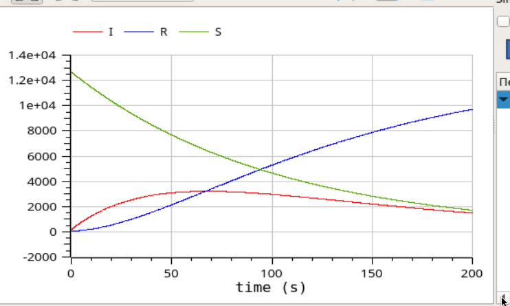

---
## Front matter
lang: ru-RU
title: Лабораторная работа №6
author: Лукьянова Ирина Владимировна
group: НФИбд-02-19
institute: RUDN University, Moscow, Russian Federation
date: 14 March 2022

## Formatting
toc: false
slide_level: 2
theme: metropolis
header-includes: 
 - \metroset{progressbar=frametitle,sectionpage=progressbar,numbering=fraction}
 - '\makeatletter'
 - '\beamer@ignorenonframefalse'
 - '\makeatother'
aspectratio: 43
section-titles: true
---
# **Прагматика выполнения лабораторной работы**

Рассмотрим простейшую модель эпидемии. У нас имеется некая популяция, состоящая из N особей, она подразделяется на три группы:

- Первая группа - это восприимчивые к болезни, но пока здоровые особи, обозначим их через S(t).
- Вторая группа – это число инфицированных особей, которые также при этом являются распространителями инфекции, обозначим их I(t).
- Третья группа, обозначающаяся через R(t) – это здоровые особи с иммунитетом к болезни.

# **Цель лабораторной работы**

Цель работы - познакомится с задачей об эпидемии, а также построить графики изменения числа особей в OpenModelica.

# **Задачи выполнения лабораторной работы**

1. Построим графики изменения числа особей в каждой из трех групп.
2. Рассмотрим два случая протекания эпидемии.
3. Посмотрим получившиеся симуляции моделей и сравним их.
  
# **Вариант 40**

На одном острове вспыхнула эпидемия. Известно, что из всех проживающих на острове ($N=12 900$) в момент начала эпидемии ($t=0$) число заболевших людей (являющихся распространителями инфекции) $I(0)=190$, А число здоровых людей с иммунитетом к болезни $R(0)=59$. Таким образом, число людей восприимчивых к болезни, но пока здоровых, в начальный момент времени $S(0)=N-I(0)- R(0)$.
Постройте графики изменения числа особей в каждой из трех групп. Рассмотрите, как будет протекать эпидемия в случае:

1) если $I(0)\leq I_*$
2) если $I(0) > I_*$

# **Результаты выполнения лабораторной работы**

В ходе выполнения лабораторной работы:

- я ознакомилась с задачей об эпидеми;
- построила графики изменения числа особей в OpenModelica для трех групп;
- посмотрела, как будет протекать эпидемия в двух разных случаях;
- сравнила симуляции моделей.
  
# **Динамики изменения числа особей №1**

{ #fig:001 width=70% }

# **Динамики изменения числа особей №1**

{ #fig:002 width=70% }

# **Динамики изменения числа особей №2**

{ #fig:003 width=70% }
