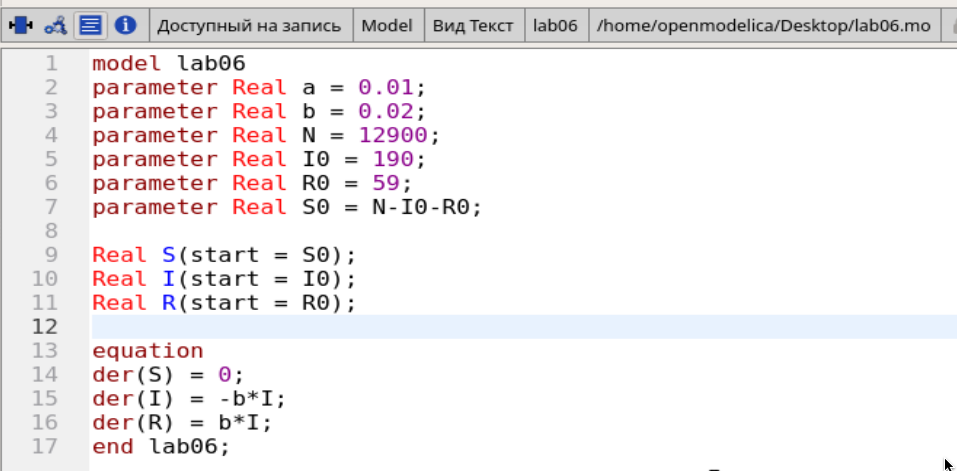
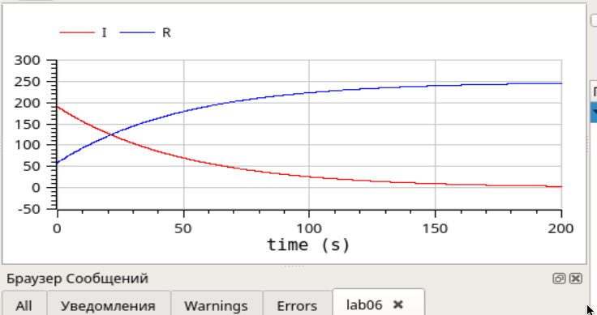
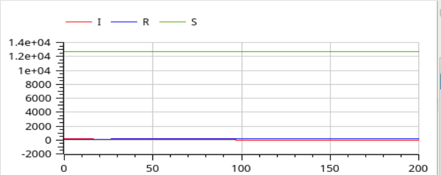
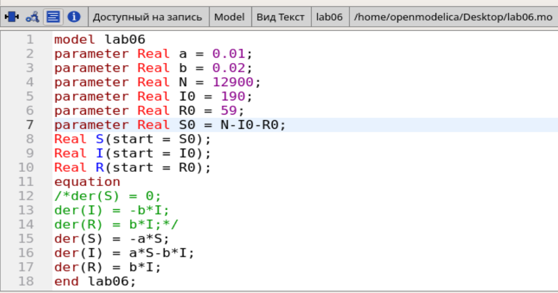
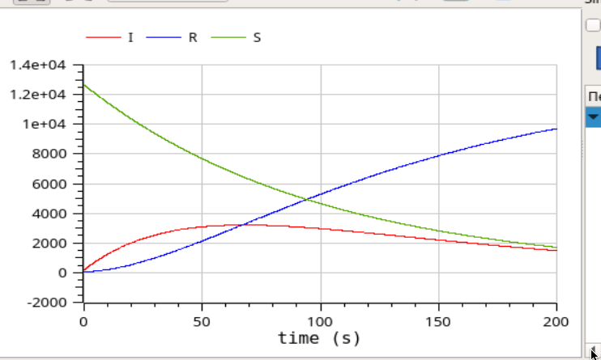

---
# Front matter
title: "Лабораторная работа №6"
author: "Лукьянова Ирина Владимировна, НФИбд-02-19"

# Generic options
lang: ru-RU
toc-title: "Содержание"

# Bibliography
bibliography: bib/cite.bib
csl: pandoc/csl/gost-r-7-0-5-2008-numeric.csl

# Pdf output format
toc: true # Table of contents
toc_depth: 2
lof: true # List of figures
lot: true # List of tables
fontsize: 12pt
linestretch: 1.5
papersize: a4
documentclass: scrreprt
## I18n
polyglossia-lang:
  name: russian
  options:
	- spelling=modern
	- babelshorthands=true
polyglossia-otherlangs:
  name: english
### Fonts
mainfont: PT Serif
romanfont: PT Serif
sansfont: PT Sans
monofont: PT Mono
mainfontoptions: Ligatures=TeX
romanfontoptions: Ligatures=TeX
sansfontoptions: Ligatures=TeX,Scale=MatchLowercase
monofontoptions: Scale=MatchLowercase,Scale=0.9
## Biblatex
biblatex: true
biblio-style: "gost-numeric"
biblatexoptions:
  - parentracker=true
  - backend=biber
  - hyperref=auto
  - language=auto
  - autolang=other*
  - citestyle=gost-numeric
## Misc options
indent: true
header-includes:
  - \linepenalty=10 # the penalty added to the badness of each line within a paragraph (no associated penalty node) Increasing the value makes tex try to have fewer lines in the paragraph.
  - \interlinepenalty=0 # value of the penalty (node) added after each line of a paragraph.
  - \hyphenpenalty=50 # the penalty for line breaking at an automatically inserted hyphen
  - \exhyphenpenalty=50 # the penalty for line breaking at an explicit hyphen
  - \binoppenalty=700 # the penalty for breaking a line at a binary operator
  - \relpenalty=500 # the penalty for breaking a line at a relation
  - \clubpenalty=150 # extra penalty for breaking after first line of a paragraph
  - \widowpenalty=150 # extra penalty for breaking before last line of a paragraph
  - \displaywidowpenalty=50 # extra penalty for breaking before last line before a display math
  - \brokenpenalty=100 # extra penalty for page breaking after a hyphenated line
  - \predisplaypenalty=10000 # penalty for breaking before a display
  - \postdisplaypenalty=0 # penalty for breaking after a display
  - \floatingpenalty = 20000 # penalty for splitting an insertion (can only be split footnote in standard LaTeX)
  - \raggedbottom # or \flushbottom
  - \usepackage{float} # keep figures where there are in the text
  - \floatplacement{figure}{H} # keep figures where there are in the text
---

# **Цель работы**

Цель работы - познакомится с задачей об эпидемии, а также построить графики изменения числа особей в OpenModelica.

# **Задание**

**Вариант 40**

На одном острове вспыхнула эпидемия. Известно, что из всех проживающих на острове ($N=12 900$) в момент начала эпидемии ($t=0$) число заболевших людей (являющихся распространителями инфекции) $I(0)=190$, А число здоровых людей с иммунитетом к болезни $R(0)=59$. Таким образом, число людей восприимчивых к болезни, но пока здоровых, в начальный момент времени $S(0)=N-I(0)- R(0)$.
Постройте графики изменения числа особей в каждой из трех групп. Рассмотрите, как будет протекать эпидемия в случае:

1) если $I(0)\leq I_*$
2) если $I(0) > I_*$ [^1]

# **Теоретическое введение**

Рассмотрим простейшую модель эпидемии. У нас имеется некая популяция, состоящая из N особей, она подразделяется на три группы.

- Первая группа - это восприимчивые к болезни, но пока здоровые особи, обозначим их через S(t).
- Вторая группа – это число инфицированных особей, которые также при этом являются распространителями инфекции, обозначим их I(t).
- Третья группа, обозначающаяся через R(t) – это здоровые особи с иммунитетом к болезни.
[^1]

Также дан интервал, где $t \in [0, 200]$, а шаг равен 0.01.

Благодаря этим данным, мы можем приступить к выполнению лабораторной работы.

# **Выполнение лабораторной работы**

1. Построим графики изменения числа особей в каждой из трех групп.
2. Рассмотрим два случая протекания эпидемии.
3. Посмотрим получившиеся симуляции моделей и сравним их.

**Построим график для первого случая:**

1. Записываем начальные условия: коэффициент заболеваемости $\alpha=0.01$ и коэффициент выздоровления $\beta =0.02$
2. Далее прописываем общую численность популяции $N=12900$
3. Количество инфицированных особей в начальный момент времени $I0$
4. Количество восприимчивых к болезни особей в начальный момент времени $S0 = N - I0 - R0$
5. Количество здоровых особей с иммунитетом в начальный момент времени $R0$
  
6. Записсываем дифференциальные уравнения:(рис. [-@fig:001])

{ #fig:001 width=70% }

7. Далее строим график динамики изменений:(рис. [-@fig:002])

{ #fig:002 width=70% }

8. Общий график динамики изменений (рис. [-@fig:003])

{ #fig:003 width=70% }

**Построим график для второго случая:**

Единственное, что нам надо изменить в нашей программе - это ДУ. Записываем формулы для второго случая.

Второй случай:(рис. [-@fig:004])

{ #fig:004 width=70% }

Строим график:(рис. [-@fig:005])

{ #fig:005 width=70% }

# Выводы

В ходе выполнения данной лабораторной работы я подробно ознакомилась с задачей об эпидемии, а также построила графики изменения числа особей в OpenModelica для трех групп. Также я посмотрела, как будет протекать эпидемия в двух разных случаях.

# Список литературы

1. [Кулябов, Д.С. Задача об эпидемии / Д.С.Кулябов. - Москва: - 4 с.](https://esystem.rudn.ru/pluginfile.php/1343897/mod_resource/content/2/Лабораторная%20работа%20№%205.pdf)
2. [Руководство по оформлению Markdown.](https://gist.github.com/Jekins/2bf2d0638163f1294637)

[^1]: Кулябов, Д.С. Задача об эпидемии.
