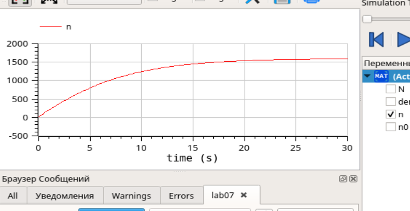
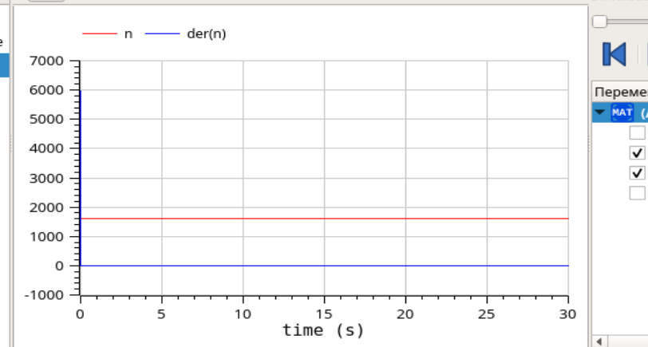
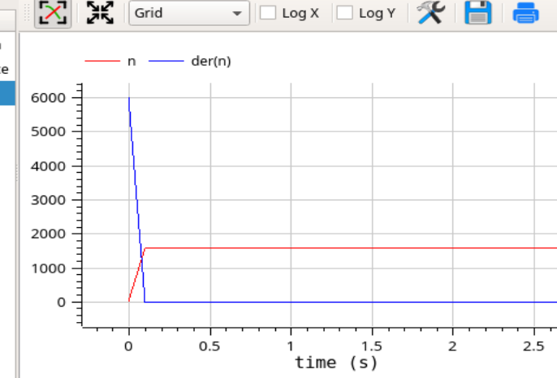
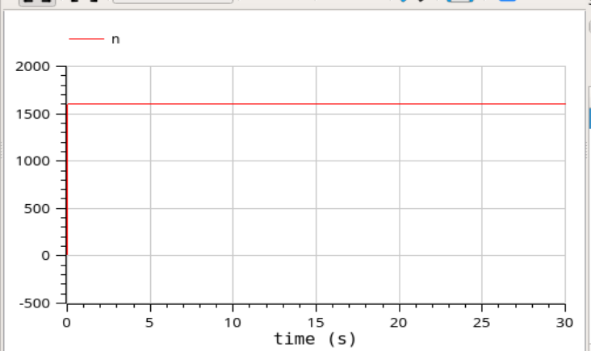
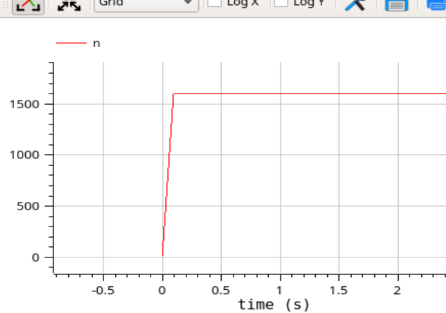

---
## Front matter
lang: ru-RU
title: Лабораторная работа №7
author: Лукьянова Ирина Владимировна
group: НФИбд-02-19
institute: RUDN University, Moscow, Russian Federation
date: 15 March 2022

## Formatting
toc: false
slide_level: 2
theme: metropolis
header-includes: 
 - \metroset{progressbar=frametitle,sectionpage=progressbar,numbering=fraction}
 - '\makeatletter'
 - '\beamer@ignorenonframefalse'
 - '\makeatother'
aspectratio: 43
section-titles: true
---
# **Прагматика выполнения лабораторной работы**

Рассмотрим модель рекламной кампании, она описывается следующими величинами.

- $\frac{dn}{dt}$ - скорость изменения со временем числа потребителей, узнавших о товаре и готовых его купить;
- t - время, прошедшее с начала рекламной кампании;
- n(t) - число уже информированных клиентов.
  
Математическая модель распространения рекламы описывается уравнением:

$\frac{dn}{dt}=( \alpha_1(t) + \alpha_2(t)n(t))(N-n(t))$

# **Цель лабораторной работы**

Цель работы - построить графики распространения рекламы о салоне красоты в OpenModelica, а также вычислить и сравнить эффективность рекламы для трех случаев.

# **Задачи выполнения лабораторной работы**

1. Построить график распространения рекламы о салоне красоты.
2. Сравнить эффективность рекламной кампании.
3. Определить в какой момент времени эффективность рекламы будет иметь максимально быстрый рост.
4. Построить решение, если учитывать вклад только платной рекламы.
5. Построить решение, если предположить, что информация о товаре
распространятся только путем «сарафанного радио».
  
# **Вариант 40**

Постройте график распространения рекламы, математическая модель которой описывается следующим уравнением:

1. $\frac{dn}{dt}=(0.12 + 0.000039n(t))(N-n(t))$
2. $\frac{dn}{dt}=(0.000012 + 0.29n(t))(N-n(t))$
3. $\frac{dn}{dt}=(0.12cos(t) + 0.29cos(t)n(t))(N-n(t))$

При этом объем аудитории $N = 1600$ , в начальный момент о товаре знает 13 человек. Для случая 2 определите в какой момент времени скорость распространения рекламы будет иметь максимальное значение.

# **Результаты выполнения лабораторной работы**

В ходе выполнения лабораторной работы:

- я построила графики распространения рекламы о салоне красоты в OpenModelica;
- вычислила эффективность рекламы для трех случаев;
- посмотрела и сравнила эффективность рекламы для трех случаев.

# **График распространения информации №1**

{ #fig:001 width=70% }

# **График распространения информации №2**

Определяем в какой момент времени эффективность рекламы будет иметь максимально быстрый рост:(рис. [-@fig:002])

{ #fig:002 width=70% }

# **График распространения информации №2**

Смотрим график вблизи:(рис. [-@fig:003])

{ #fig:003 width=70% }

# **График распространения информации №3**

Третий случай:(рис. [-@fig:004])

{ #fig:004 width=70% }

# **График распространения информации №3**

Смотрим график вблизи:(рис. [-@fig:005])

{ #fig:005 width=70% }
