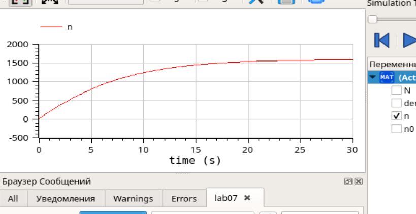
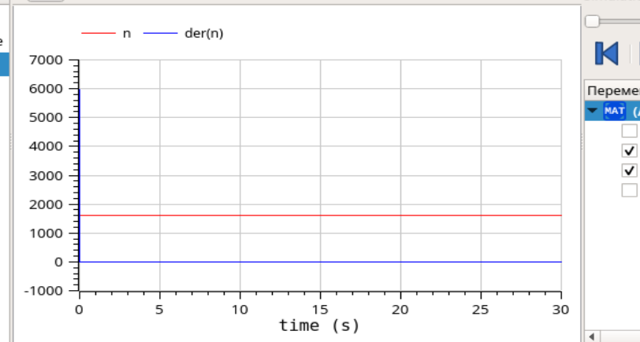
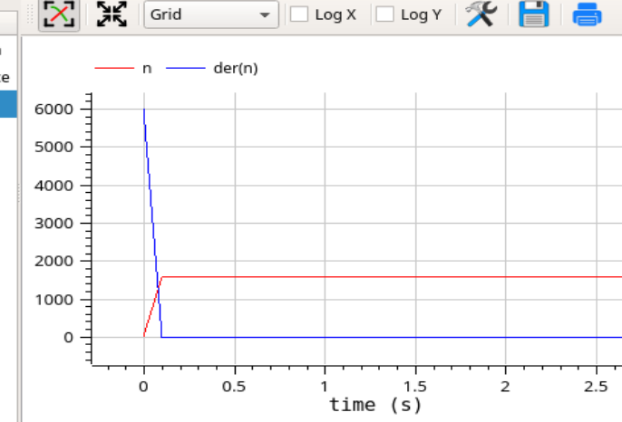

---
# Front matter
title: "Лабораторная работа №7"
author: "Лукьянова Ирина Владимировна, НФИбд-02-19"

# Generic options
lang: ru-RU
toc-title: "Содержание"

# Bibliography
bibliography: bib/cite.bib
csl: pandoc/csl/gost-r-7-0-5-2008-numeric.csl

# Pdf output format
toc: true # Table of contents
toc_depth: 2
lof: true # List of figures
lot: true # List of tables
fontsize: 12pt
linestretch: 1.5
papersize: a4
documentclass: scrreprt
## I18n
polyglossia-lang:
  name: russian
  options:
	- spelling=modern
	- babelshorthands=true
polyglossia-otherlangs:
  name: english
### Fonts
mainfont: PT Serif
romanfont: PT Serif
sansfont: PT Sans
monofont: PT Mono
mainfontoptions: Ligatures=TeX
romanfontoptions: Ligatures=TeX
sansfontoptions: Ligatures=TeX,Scale=MatchLowercase
monofontoptions: Scale=MatchLowercase,Scale=0.9
## Biblatex
biblatex: true
biblio-style: "gost-numeric"
biblatexoptions:
  - parentracker=true
  - backend=biber
  - hyperref=auto
  - language=auto
  - autolang=other*
  - citestyle=gost-numeric
## Misc options
indent: true
header-includes:
  - \linepenalty=10 # the penalty added to the badness of each line within a paragraph (no associated penalty node) Increasing the value makes tex try to have fewer lines in the paragraph.
  - \interlinepenalty=0 # value of the penalty (node) added after each line of a paragraph.
  - \hyphenpenalty=50 # the penalty for line breaking at an automatically inserted hyphen
  - \exhyphenpenalty=50 # the penalty for line breaking at an explicit hyphen
  - \binoppenalty=700 # the penalty for breaking a line at a binary operator
  - \relpenalty=500 # the penalty for breaking a line at a relation
  - \clubpenalty=150 # extra penalty for breaking after first line of a paragraph
  - \widowpenalty=150 # extra penalty for breaking before last line of a paragraph
  - \displaywidowpenalty=50 # extra penalty for breaking before last line before a display math
  - \brokenpenalty=100 # extra penalty for page breaking after a hyphenated line
  - \predisplaypenalty=10000 # penalty for breaking before a display
  - \postdisplaypenalty=0 # penalty for breaking after a display
  - \floatingpenalty = 20000 # penalty for splitting an insertion (can only be split footnote in standard LaTeX)
  - \raggedbottom # or \flushbottom
  - \usepackage{float} # keep figures where there are in the text
  - \floatplacement{figure}{H} # keep figures where there are in the text
---

# **Цель работы**

Цель работы - построить графики распространения рекламы о салоне красоты в OpenModelica, а также вычислить и сравнить эффективность рекламы для трех случаев.

# **Задание**

**Вариант 40**

Постройте график распространения рекламы, математическая модель которой описывается следующим уравнением:

1. $\frac{dn}{dt}=(0.12 + 0.000039n(t))(N-n(t))$
2. $\frac{dn}{dt}=(0.000012 + 0.29n(t))(N-n(t))$
3. $\frac{dn}{dt}=(0.12cos(t) + 0.29cos(t)n(t))(N-n(t))$

При этом объем аудитории $N = 1600$ , в начальный момент о товаре знает 13 человек. Для случая 2 определите в какой момент времени скорость распространения рекламы будет иметь максимальное значение.

# **Теоретическое введение**

Рассмотрим модель рекламной кампании, она описывается следующими величинами.
Считаем, что $\frac{dn}{dt}$ - скорость изменения со временем числа потребителей, узнавших о товаре и готовых его купить, t - время, прошедшее с начала рекламной кампании, n(t) - число уже информированных клиентов.
Математическая модель распространения рекламы описывается уравнением: 

$\frac{dn}{dt}=( \alpha_1(t) + \alpha_2(t)n(t))(N-n(t))$
[^1]

Также дан интервал, где $t \in [0, 30]$, а шаг равен 0.1.

Благодаря этим данным, мы можем приступить к выполнению лабораторной работы.

# **Выполнение лабораторной работы**

1. Построить график распространения рекламы о салоне красоты.
2. Сравнить эффективность рекламной кампании.
3. Определить в какой момент времени эффективность рекламы будет иметь максимально быстрый рост.
4. Построить решение, если учитывать вклад только платной рекламы.
5. Построить решение, если предположить, что информация о товаре
распространятся только путем «сарафанного радио».

**Построим график для первого случая:**

1. Записываем начальные условия: $n_0 =13$ - количество людей, знающих о товаре в начальный момент времени, $N = 1600$ - максимальное количество людей, которых может заинтересовать товар.
2. Далее прописываем две функции K и P для дольнейших вычислений.
3. Записсываем дифференциальное уравнение:(рис. [-@fig:001])

{ #fig:001 width=70% }

4. Далее строим график распространения рекламы:(рис. [-@fig:002])

{ #fig:002 width=70% }

**Построим график для второго случая:**

Единственное, что нам надо изменить в нашей программе - это коэффициенты в наших функциях.(рис. [-@fig:003])

{ #fig:003 width=70% }

Второй случай:(рис. [-@fig:004])

{ #fig:004 width=70% }

Определяем в какой момент времени эффективность рекламы будет иметь максимально быстрый рост:(рис. [-@fig:005])

{ #fig:005 width=70% }

Смотрим график вблизи:(рис. [-@fig:006])

{ #fig:006 width=70% }

**Построим график для третьего случая:**

Снова меняем коэффициенты в наших функциях. Коэффициентные функции теперь линейные(рис. [-@fig:007])

{ #fig:007 width=70% }

Третий случай:(рис. [-@fig:008])

{ #fig:008 width=70% }

Смотрим график вблизи:(рис. [-@fig:009])

{ #fig:009 width=70% }

# Выводы

В ходе выполнения данной лабораторной работы я построила графики распространения рекламы о салоне красоты в OpenModelica, а также вычислила и сравнила эффективность рекламы для трех случаев.

# Список литературы

1. [Кулябов, Д.С. Эффективность рекламы / Д.С.Кулябов. - Москва: - 5 с.](https://esystem.rudn.ru/pluginfile.php/1343901/mod_resource/content/2/Лабораторная%20работа%20№%206.pdf)
2. [Руководство по оформлению Markdown.](https://gist.github.com/Jekins/2bf2d0638163f1294637)

[^1]: Кулябов, Д.С. Эффективность рекламы.
