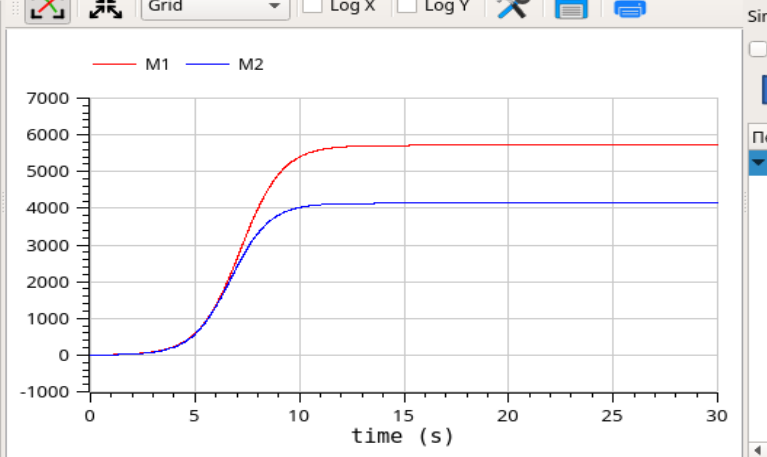
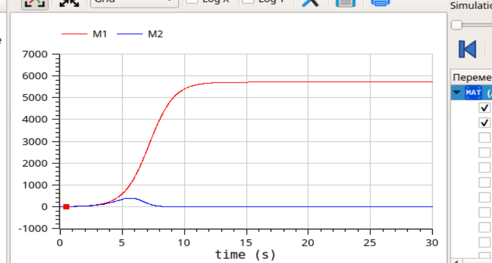

---
## Front matter
lang: ru-RU
title: Лабораторная работа №8
author: Лукьянова Ирина Владимировна
group: НФИбд-02-19
institute: RUDN University, Moscow, Russian Federation
date: 20 March 2022

## Formatting
toc: false
slide_level: 2
theme: metropolis
header-includes: 
 - \metroset{progressbar=frametitle,sectionpage=progressbar,numbering=fraction}
 - '\makeatletter'
 - '\beamer@ignorenonframefalse'
 - '\makeatother'
aspectratio: 43
section-titles: true
---
# **Прагматика выполнения лабораторной работы**

Рассмотрим модель конкуренции двух фирм, она описывается следующими величинами:

- N – число потребителей производимого продукта
- τ – длительность производственного цикла
- p – рыночная цена товара
- p̃ – себестоимость продукта, то есть переменные издержки на производство единицы продукции.
- q – максимальная потребность одного человека в продукте в единицу времени

# **Основные уравнения:**

1. $\frac{dM_1}{d\theta}=M_1 - \frac{b}{c_1}M_1M_2-\frac{a_1}{c_1}M_1^2$
2. $\frac{dM_1}{d\theta}=\frac{c_2}{c_1}M_2 - \frac{b}{c_1}M_1M_2-\frac{a_2}{c_1}M_2^2$

где

$a_1=\frac{p_cr}{\tau_1^2p_1^2Nq}$, $a_2=\frac{p_cr}{\tau_2^2p_2^2Nq}$,

$b=\frac{p_cr}{\tau_1^2p_1^2\tau_2^2p_2^2Nq}$,

$c_1=\frac{p_cr - p_1}{\tau_1p_1}$, $c_2=\frac{p_cr - p_2}{\tau_2p_2}$

# **Цель лабораторной работы**

Цель работы - познакомиться с моделью конкуренции двух фирм, а также построить графики изменения оборотных средств фирм в OpenModelica.

# **Задачи выполнения лабораторной работы**

1. Построить графики изменения оборотных средств фирмы 1 и фирмы 2 без учета постоянных издержек и с веденной нормировкой для двух случаев.
2. Проанализировать полученные результаты.
  
# **Вариант 40**

Рассмотрим две фирмы, производящие взаимозаменяемые товары одинакового качества и находящиеся в одной рыночной нише. Считаем, что в рамках нашей модели конкурентная борьба ведётся только рыночными методами. То есть, конкуренты могут влиять на противника путем изменения параметров своего производства: себестоимость, время цикла, но не могут прямо вмешиваться в ситуацию на рынке («назначать» цену или влиять на потребителей каким-либо иным способом.) Будем считать, что постоянные издержки пренебрежимо малы, и в модели учитывать не будем.

# **Вариант 40**

В этом случае динамика изменения объемов продаж фирмы 1 и фирмы 2 описывается следующей системой уравнений:

Первый случай:

1. $\frac{dM_1}{d\theta}=M_1 - \frac{b}{c_1}M_1M_2-\frac{a_1}{c_1}M_1^2$
2. $\frac{dM_1}{d\theta}=\frac{c_2}{c_1}M_2 - \frac{b}{c_1}M_1M_2-\frac{a_2}{c_1}M_2^2$

Второй случай:

1. $\frac{dM_1}{d\theta}=M_1 - \frac{b}{c_1}M_1M_2-\frac{a_1}{c_1}M_1^2$
2. $\frac{dM_1}{d\theta}=\frac{c_2}{c_1}M_2 - (\frac{b}{c_1}+0,00094)M_1M_2-\frac{a_2}{c_1}M_2^2$

# **Результаты выполнения лабораторной работы**

В ходе выполнения лабораторной работы:

- я познакомилась с моделью конкуренции двух фирм;
- построила графики изменения оборотных средств фирм в OpenModelica;
- сравнила полученные решения для двух случаев.

# **График изменения оборотных средств фирм №1**

{ #fig:001 width=70% }

# **График изменения оборотных средств фирм №2**

{ #fig:002 width=70% }
