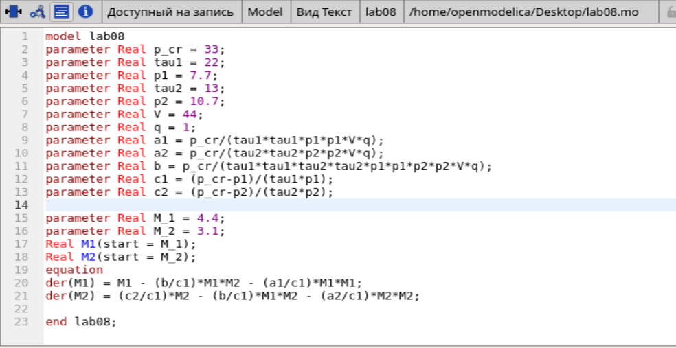
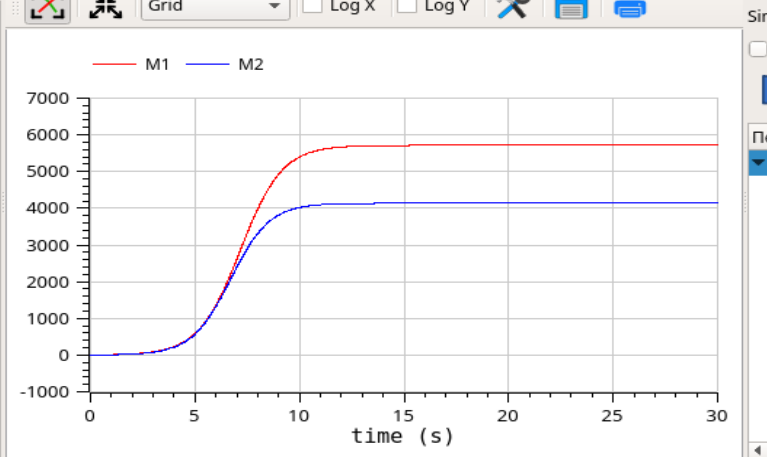
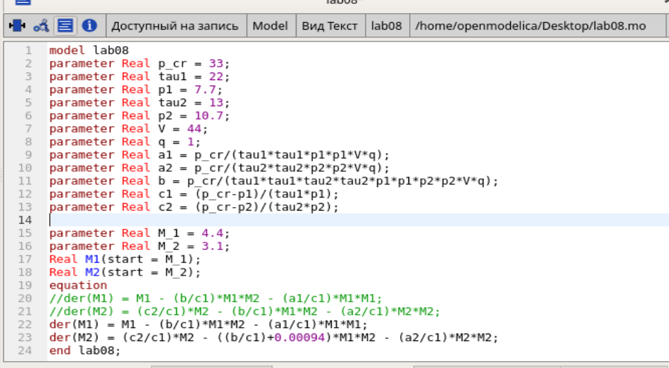
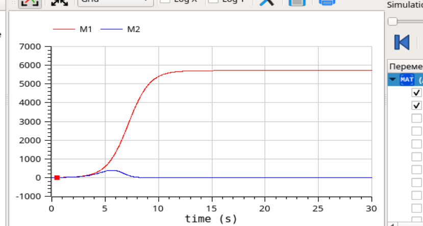

---
# Front matter
title: "Лабораторная работа №8"
author: "Лукьянова Ирина Владимировна, НФИбд-02-19"

# Generic options
lang: ru-RU
toc-title: "Содержание"

# Bibliography
bibliography: bib/cite.bib
csl: pandoc/csl/gost-r-7-0-5-2008-numeric.csl

# Pdf output format
toc: true # Table of contents
toc_depth: 2
lof: true # List of figures
lot: true # List of tables
fontsize: 12pt
linestretch: 1.5
papersize: a4
documentclass: scrreprt
## I18n
polyglossia-lang:
  name: russian
  options:
	- spelling=modern
	- babelshorthands=true
polyglossia-otherlangs:
  name: english
### Fonts
mainfont: PT Serif
romanfont: PT Serif
sansfont: PT Sans
monofont: PT Mono
mainfontoptions: Ligatures=TeX
romanfontoptions: Ligatures=TeX
sansfontoptions: Ligatures=TeX,Scale=MatchLowercase
monofontoptions: Scale=MatchLowercase,Scale=0.9
## Biblatex
biblatex: true
biblio-style: "gost-numeric"
biblatexoptions:
  - parentracker=true
  - backend=biber
  - hyperref=auto
  - language=auto
  - autolang=other*
  - citestyle=gost-numeric
## Misc options
indent: true
header-includes:
  - \linepenalty=10 # the penalty added to the badness of each line within a paragraph (no associated penalty node) Increasing the value makes tex try to have fewer lines in the paragraph.
  - \interlinepenalty=0 # value of the penalty (node) added after each line of a paragraph.
  - \hyphenpenalty=50 # the penalty for line breaking at an automatically inserted hyphen
  - \exhyphenpenalty=50 # the penalty for line breaking at an explicit hyphen
  - \binoppenalty=700 # the penalty for breaking a line at a binary operator
  - \relpenalty=500 # the penalty for breaking a line at a relation
  - \clubpenalty=150 # extra penalty for breaking after first line of a paragraph
  - \widowpenalty=150 # extra penalty for breaking before last line of a paragraph
  - \displaywidowpenalty=50 # extra penalty for breaking before last line before a display math
  - \brokenpenalty=100 # extra penalty for page breaking after a hyphenated line
  - \predisplaypenalty=10000 # penalty for breaking before a display
  - \postdisplaypenalty=0 # penalty for breaking after a display
  - \floatingpenalty = 20000 # penalty for splitting an insertion (can only be split footnote in standard LaTeX)
  - \raggedbottom # or \flushbottom
  - \usepackage{float} # keep figures where there are in the text
  - \floatplacement{figure}{H} # keep figures where there are in the text
---

# **Цель работы**

Цель работы - познакомиться с моделью конкуренции двух фирм, а также построить графики изменения оборотных средств фирм в OpenModelica.

# **Задание**

**Вариант 40**

Рассмотрим две фирмы, производящие взаимозаменяемые товары одинакового качества и находящиеся в одной рыночной нише. Считаем, что в рамках нашей модели конкурентная борьба ведётся только рыночными методами. То есть, конкуренты могут влиять на противника путем изменения параметров своего производства: себестоимость, время цикла, но не могут прямо вмешиваться в ситуацию на рынке («назначать» цену или влиять на потребителей каким-либо иным способом.) Будем считать, что постоянные издержки пренебрежимо малы, и в модели учитывать не будем. В этом случае динамика изменения объемов продаж фирмы 1 и фирмы 2 описывается следующей системой уравнений:

Первый случай:

1. $\frac{dM_1}{d\theta}=M_1 - \frac{b}{c_1}M_1M_2-\frac{a_1}{c_1}M_1^2$
2. $\frac{dM_1}{d\theta}=\frac{c_2}{c_1}M_2 - \frac{b}{c_1}M_1M_2-\frac{a_2}{c_1}M_2^2$

Второй случай:

1. $\frac{dM_1}{d\theta}=M_1 - \frac{b}{c_1}M_1M_2-\frac{a_1}{c_1}M_1^2$
2. $\frac{dM_1}{d\theta}=\frac{c_2}{c_1}M_2 - (\frac{b}{c_1}+0,00094)M_1M_2-\frac{a_2}{c_1}M_2^2$

# **Теоретическое введение**

Рассмотрим модель конкуренции двух фирм, она описывается следующими величинами:

- N – число потребителей производимого продукта
- $\tau$ – длительность производственного цикла
- p – рыночная цена товара
- $p^-$ – себестоимость продукта, то есть переменные издержки на производство единицы продукции.
- q – максимальная потребность одного человека в продукте в единицу времени

Основные уравнения:

1. $\frac{dM_1}{d\theta}=M_1 - \frac{b}{c_1}M_1M_2-\frac{a_1}{c_1}M_1^2$
2. $\frac{dM_1}{d\theta}=\frac{c_2}{c_1}M_2 - \frac{b}{c_1}M_1M_2-\frac{a_2}{c_1}M_2^2$

где 

$a_1=\frac{p_cr}{\tau_1^2p_1^2Nq}$, $a_2=\frac{p_cr}{\tau_2^2p_2^2Nq}$,

$b=\frac{p_cr}{\tau_1^2p_1^2\tau_2^2p_2^2Nq}$, 

$c_1=\frac{p_cr - p_1}{\tau_1p_1}$, $c_2=\frac{p_cr - p_2}{\tau_2p_2}$
[^1]

Также дан интервал, где $t \in [0, 30]$, а шаг равен 0.01.

Благодаря этим данным, мы можем приступить к выполнению лабораторной работы.

# **Выполнение лабораторной работы**

1. Построить графики изменения оборотных средств фирмы 1 и фирмы 2 без учета постоянных издержек и с веденной нормировкой для двух случаев.
2. Проанализировать полученные результаты.

**Построим график для первого случая:**

1. Записываем начальные условия:

- $p_cr = 33$ - критическая стоимость продукта
- $tau1 = 22$ - длительность производственного цикла фирмы 1
- $p1 = 7.7$ - себестоимость продукта у фирмы 1
- $tau2 = 13$ - длительность производственного цикла фирмы 2
- $p2 = 10.7$ - себестоимость продукта у фирмы 2
- $V = 44$ - число потребителей производимого продукта
- $q = 1$ - максимальная потребность одного человека в продукте в единицу времени
  
2. Далее прописываем параметры $a1, a2, b, c1, c2$ для дальнейших вычислений.
3. Записываем дифференциальные уравнения для первого случая:(рис. [-@fig:001])

{ #fig:001 width=70% }

4. Далее строим график изменения оборотных средств фирм:(рис.[-@fig:002])

{ #fig:002 width=70% }

**Построим график для второго случая:**

Единственное, что нам надо изменить в нашей программе - это второе ДУ.(рис. [-@fig:003])

{ #fig:003 width=70% }

Второй случай:(рис. [-@fig:004])

{ #fig:004 width=70% }

# Выводы

В ходе выполнения данной лабораторной работы я познакомилась с моделью конкуренции двух фирм и построила графики изменения оборотных средств фирм для двух случаев в OpenModelica.

# Список литературы

1. [Кулябов, Д.С. Модель конкуренции двух фирм. / Д.С.Кулябов. - Москва: - 7 с.](https://esystem.rudn.ru/pluginfile.php/1343905/mod_resource/content/2/Лабораторная%20работа%20№%207.pdf)
2. [Руководство по оформлению Markdown.](https://gist.github.com/Jekins/2bf2d0638163f1294637)

[^1]: Кулябов, Д.С. Модель конкуренции двух фирм.
